# Object Detections (basis)

## Background

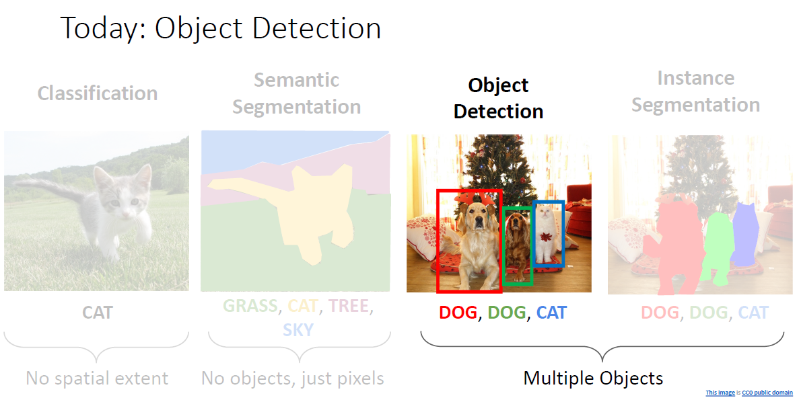

### Task Definition

目标检测是计算机视觉领域除了图像分类以外最核心的一个任务之一，其任务定义如下：

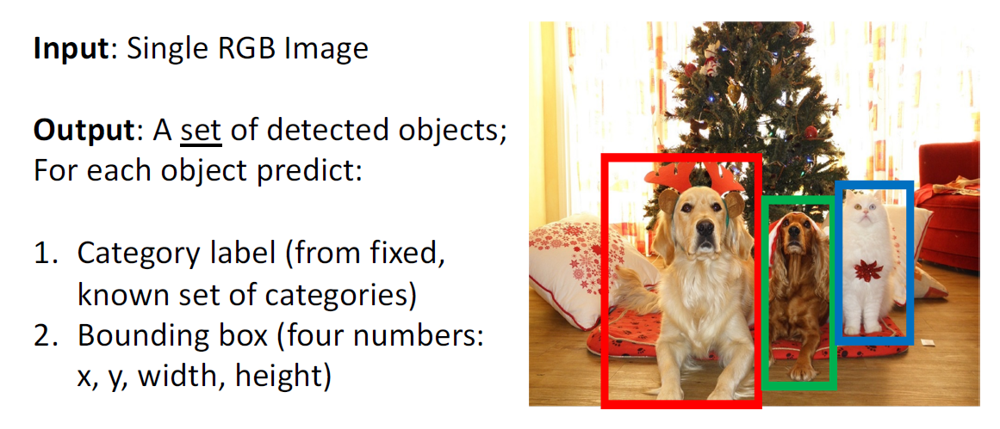

即输入一张图像，输出图像中有的目标以及目标区域的边界框（Bounding box）。

### Challenges

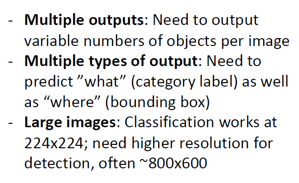

相比于图像分类来说目标检测任务要复杂很多，首先一张图片上可能有多个需要检测出的对象；另外对于每个对象我们不仅需要给出他的位置还需要同时判断它的类别；目标检测任务往往运行在较高分辨率的图像上，对于计算的负担也更重。

## Solution

### Vanilla Method

我们逐一考虑上述挑战，首先是从图像分类单个预测label的输出到多种类型的输出的转换，很自然的我们可以想到使用两个全连接层，一个用于预测位置，而另一个用于预测类别，将它们的loss结合起来就得到了所谓Multi-task loss：

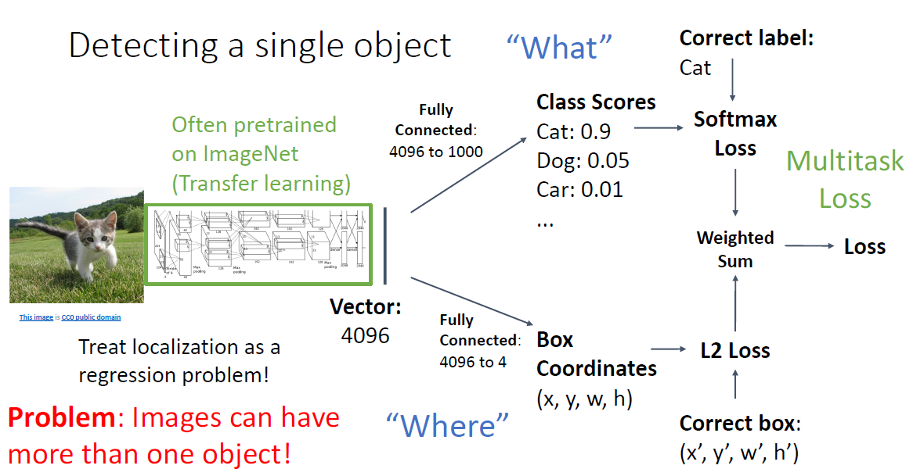

这种简单的方法在只需要检测单个目标的时候（通常称为定位任务，Object Localization)实际上工作的不错，但是仅仅这样无法检测出图像中的多个目标，即无法解决多输出的问题：

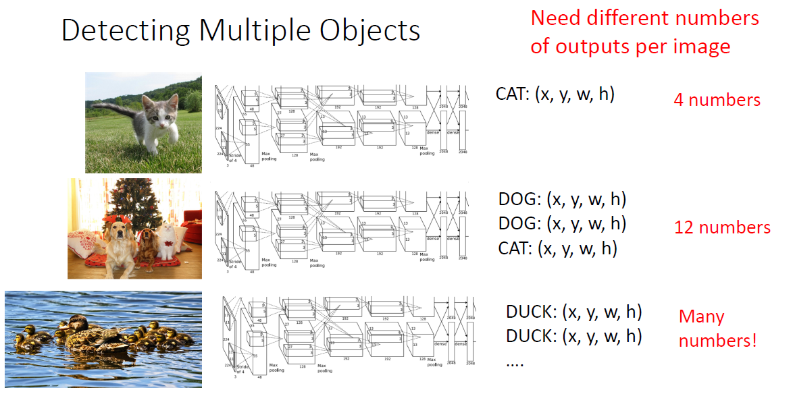

### Sliding Window

一个简单的策略是使用滑动窗口将目标检测任务转换成图像分类任务，用一个滑动窗口在图像上移动，每次移动都判断框内类别是否为目标：

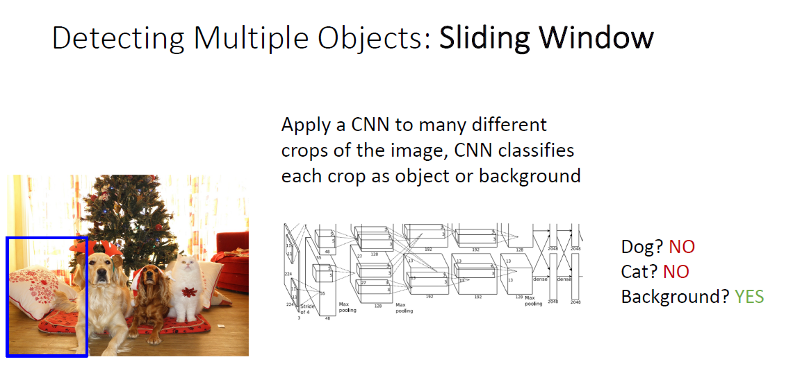

但是所有大小和位置的矩形框的数量是 $O(n^4)$ 的，显然不可能全部枚举一遍：

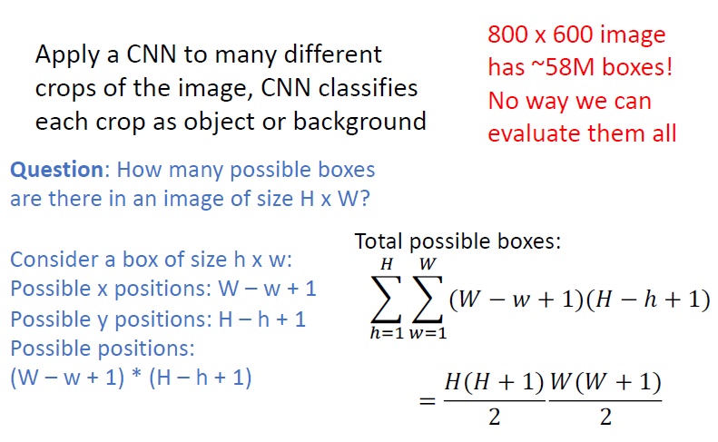

### Region Proposals

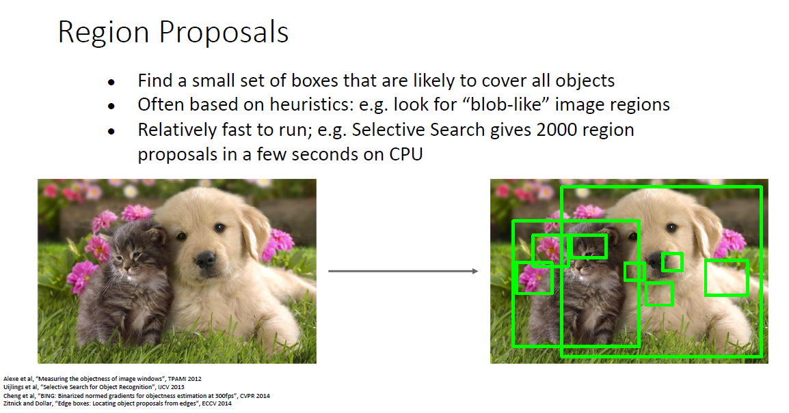

为了解决上述问题，我们可以选择性地对一些区域进行检测，即给出所谓**候选区域（Region Proposals）**，然后判断这些区域中是否包含我们感兴趣的目标，并调整区域边界从而更准确地预测目标的*真实边界框*（ground-truth bounding box）， 不同的模型使用的区域采样方法可能不同，后面会介绍几种常用的方式。

### 选择性搜索（Selective Search）

有许多传统方法可以用来快速生成候选区域，不过目前用的多的还是基于神经网络的方式，因而这里只介绍Selective Search。

选择性搜索算法用于为物体检测算法提供候选区域，它速度快，召回率高。其需要先使用《Efficient Graph-Based Image Segmentation》论文里的方法产生初始的分割区域：

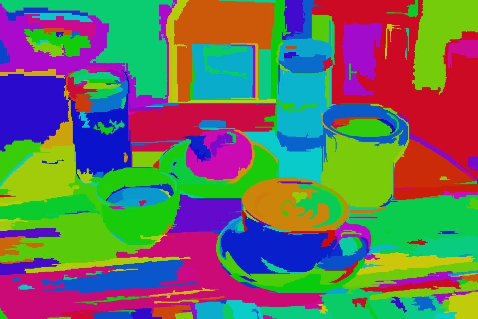

我们不能使用原始分割图的区域作为候选区域，原因如下：

- 大部分物体在原始分割图里都被分为多个区域

- 原始分割图无法体现物体之间的遮挡和包含。

如果我们试图通过进一步合并相邻的区域来解决第一个问题，我们最终会得到一个包含两个对象的分段区域，这是可以接受的，因为我们不要需要完美的的分割区域，我们只想要和实际物体高度重合的区域就行了，具体步骤如下：

1. 首先将所有分割区域的外框加到候选区域列表中；
2. 基于相似度合并一些区域（相似度主要是通过颜色、纹理、大小和形状交叠四个方面的结合）；
3. 将合并后的分割区域作为一个整体，跳到步骤1。

### 锚框（Anchor ）

这里我们介绍另一种常用的方法：以每个像素为中心，生成多个缩放比和宽高比（aspect ratio）不同的边界框。 这些边界框被称为**锚框（anchor box）**。

> 也有些地方把候选框也叫作锚框。

假设输入图像的高度为 $h$，宽度为 $w$，我们以图像的每个像素为中心生成不同形状的锚框：缩放比为 $s \in (0,1]$，那么锚框的宽度和高度分别是 $ws \sqrt{r}$ 和 $hs / \sqrt{r}$。

要生成多个不同形状的锚框, 让我们设置许多缩放比 (scale) 取值 $s_{1}, \ldots, s_{n}$ 和许多宽高比 (aspect ratio）取值 $r_{1}, \ldots, r_{m}$ 。 当使用这些比例和长宽比的所有组合以每个像素为中心时, 输入图像将总共有 $w h n m$ 个锚框。尽管这些锚框可能会覆盖所有真实边界框, 但计算复杂性很容易过高。在实践中, 我们只 考虑包含 $s_{1}$ 或 $r_{1}$ 的组合:
$$
\left(s_{1}, r_{1}\right),\left(s_{1}, r_{2}\right), \ldots,\left(s_{1}, r_{m}\right),\left(s_{2}, r_{1}\right),\left(s_{3}, r_{1}\right), \ldots,\left(s_{n}, r_{1}\right) .
$$
也就是说, 以同一像素为中心的锚框的数量是 $n+m-1$ 。对于整个输入图像, 我们将共生成 $w h(n+m-1)$ 个锚框。

### 交并比（IoU）

通常使用交并比来判断两个框的接近程度：

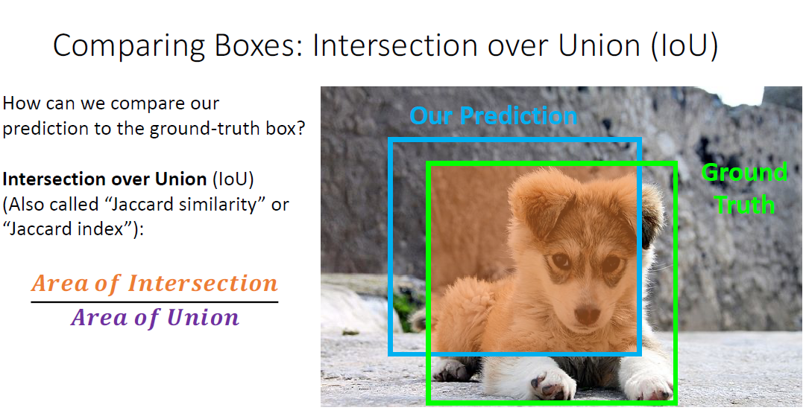

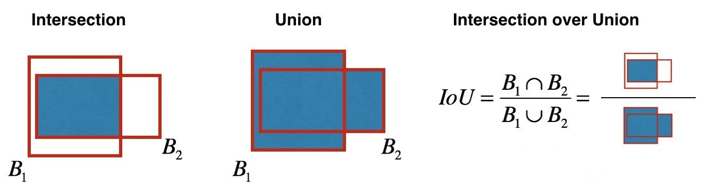

### No-Max Suppression（NMS）

我们可能会产生很多类似的结果，即许十分接近的检测框，我们常常使用NMS解决：

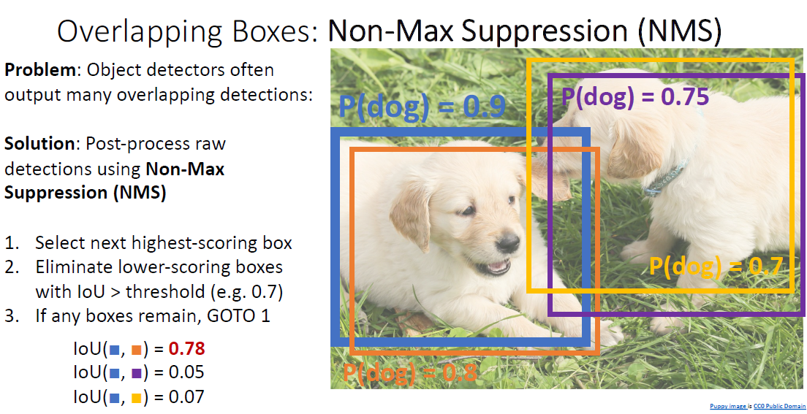

但是在某些目标特别密集的图像上使用NMS可能会消除掉很多正确的结果：

### Mean Average Precision（mAP）

mAP是最常用的目标检测评估指标：

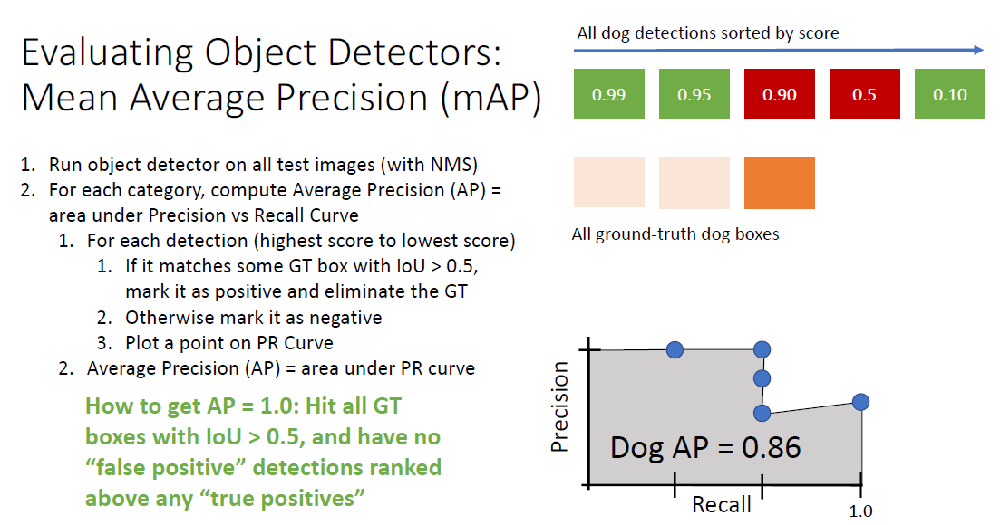

