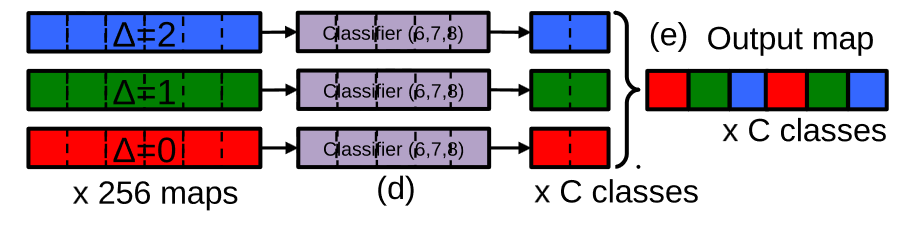

# Object Detections (one stage)

## OverFeat

> 参考：https://cloud.tencent.com/developer/article/1125559

OverFeat是早期经典的one-stage Object Detection的方法，基于AlexNet，**实现了识别、定位、检测共用同一个网络框架**；获得了2013年ILSVRC定位比赛的冠军。

OverFeat方法的主要创新点是 **multi-scale 、sliding window、offset pooling**，以及基于AlexNet的识别、定位和检测方法的融合。

OverFeat网络前面的卷积部分可以看作是一种特征提取算子，就相当于SIFT，HOG等这些算子一样。这篇文献充分利用了卷积神经网络的特征提取功能，它把分类过程中，提取到的特征，同时又用于定位检测等各种任务，只需要改变网络的最后几层，就可以实现不同的任务，而不需要从头开始训练整个网络的参数。

### Multi-scale

OverFeat的网络结构类似于AlexNet的网络结构，只是前五层的conv层在OverFeat里被描述成**特征提取层**，后三层全连接层变成**全卷积层**，被描述成**分类器（classifier）**。OverFeat与AlexNet的其他几个区别在于：没有LRN；没有用overlap pooling；第一二层卷积使用了更小的stride，stride=2。

OverFeat的训练方法与AlexNet的训练方法类似（对Classifcation而言），其主要创新之处在于测试阶段。测试阶段OverFeat没有采用AlexNet的multi-crop (10 view)方法，**而是直接采用了六种不同尺度的测试图像输入（每个尺度的图像还增加了水平翻转），**结合**全卷积网络结构**，最终输出的维度是不同的，体现了不同尺寸输入图像的实际候选区域数目的不同。（Class种类数目这个维度是一致的，最后一个维度是1000，代表1000种分类预测），即所谓特征金字塔：

> 也就是说Overfeat的时候就已经有全卷积架构了。

### Sliding window

OverFeat实现滑动窗口的方式与之前的方法有所不同，之前多是对于每一个窗口都进行一遍完整的预测pipeline，显然这样的效率很低，而OverFeat利用了卷积神经网络本身就使用滑动窗口的特点，使用全卷积网络，通过调整图像的大小自然地对不同位置图像分别产生输出：

#### Offset max-pooling

采用一维作为示例，来讲解原理：

如上图所示，我们在x轴上有20个神经元，如果我们选择池化size=3的非重叠池化，那么根据我们之前所学的方法应该是：对上面的20个，从1位置开始进行分组，每3个连续的神经元为一组，然后计算每组的最大值(最大池化)，19、20号神经元将被丢弃，如下图所示：

我们也可以在20号神经元后面，人为的添加一个数值为0的神经元编号21，与19、20成为一组，这样可以分成7组:[1,2,3]，[4,5,6]……,[16,17,18],[19,20,21]，最后计算每组的最大值就是经典的max-pooling。可是如果我们只分6组的话，我们除了以1作为初始位置进行连续组合之外，也可以从位置2或者3开始进行组合。也就是说我们其实有3种池化组合方法：

A、$△=0$分组:[1,2,3]，[4,5,6]……,[16,17,18]；

B、$△=1$分组:[2,3,4]，[5,6,7]……,[17,18,19]；

C、$△=2$分组:[3,4,5]，[6,7,8]……,[18,19,20]；

示意图如下：

以往的CNN中，一般我们只用了$△=0$，得到池化结果后，就送入了下一层。于是文献的方法是，把上面的$△=0、△=1、△=2$ 的三种组合方式的池化结果，分别送入网络的下一层。这样的话，我们网络在最后输出的时候，就会出现3种预测结果了。

如果是2维图片的话，那么 $(△x,△y)$ 就会有9种取值情况 (3*3)；如果我们在做图片分类的时候，在网络的某一个池化层加入了这种offset 池化方法，然后把这9种池化结果，分别送入后面的网络层，最后我们的图片分类输出结果就可以得到9个预测结果(每个类别都可以得到9种概率值，然后我们对每个类别的9种概率，取其最大值，做为此类别的预测概率值)。优中选优，避免因为池化而漏掉某些信息，尤其是边缘的信息。

> 其实有点像stride为1的Max pooling去掉了一些输出，这个做法同样在FCN中有用到。

### 实现Localization和Detection

分类任务太简单，这里就不展开了，主要讲讲怎么用OverFeat进行定位和检测的。

分类任务中已经训练好了分类网络，而预测网络复用了原网络前面用于特征提取的部分（冻结参数迁移学习），对每个类都分别使用l2损失即MSE训练定位框位置的回归器（即在ImageNet上训练了1000个回归器，但是后面发现可能由于数据不足，用一个回归器应付1000类反而效果更好）。

预测阶段，因为multi-scale & offset pooling 策略，一张图我们可以得到多个分类预测结果和bbox回归预测结果。通过以下方式处理多个结果：

1. $s$ 个尺度中，选出每个尺度top k个分类结果，计作 $C_s$；
2. $C_s$ 中的每个分类，从对应尺度中找到每个对应分类的全部bbox预测结果，记作 $B_s$，
3. 重复以下步骤，直到满足5
4. 全部尺度的 $B_s$ 结果的并集记作 $B$，对 $B$ 中任意两个bbox预测结果计算中心点距离，取最小值；
5. 任意两个bbox中心点最小值大于阈值 $t$ 时，停止重复，否则，合并最小的两个bbox为一个（取四个坐标平均值）。

正是因为能产生多个定位结果，因而能够完成detection的任务。

## YOLOv1

非常著名的模型，来源于论文："You Only Look Once: Unified, Real-Time Object Detection"，相对于之前的模型，它主要有以下几个优点：

- 速度非常快；
- 使用端到端的架构，同时预测出所有bbox和对应的类别概率，相较于R-CNN等只能看到图像部分数据（bbox内）的模型，YOLO能看到整个图像，因而有更低的假正例（False Positive）率，但是总体精度相较于两阶段方法还是有差距；
- 泛化性能更强，在当前数据集上训练的模型迁移到其他数据集上时能表现出比其他模型更强的性能。

### Unified Detection

YOLO将目标检测的所有组件合并成了一个单独的神经网络，从而可以进行端到端训练的同时获得很高的精度。

首先我们将输入图像划分为 $S \times S$ 的网格，如果目标落入了**其中某个网格的中心**，那么该网格单元就负责检测该目标。

> YOLO的聪明之处在于，它只要求这个物体的中心落在这个框框之中。这意味着，我们不用设计非常非常大的框，因为我们只需要让物体的中心在这个框中就可以了，而不是必须要让整个物体都在这个框中。
>
> 另外每个网格单元都**预测 $B$ 个边界框（$x, y, w, h$）以及对应的置信分数（confidence）**，其中 $x, y$ 是物体的中心位置相对网格的位移，$w, h$ 则是边界框宽高，其中 $(x, y, w, h)$ 都在 $[0, 1]$ 区间。

> $x, y$ 是目标中心位置相对于网格的位移，之前已经假设目标中心在网格中，因而可以用 $[0, 1]$ 区间的数表示，$w, h$ 是相对于整个图像的宽高，因而也可以用 $[0, 1]$ 区间的数表示。
>
> 
>
> 我们通常做回归问题的时候都会将输出进行归一化，否则可能导致各个输出维度的取值范围差别很大，进而导致训练的时候，网络更关注数值大的维度。因为数值大的维度，算loss相应会比较大，为了让这个loss减小，那么网络就会尽量学习让这个维度loss变小，最终导致区别对待。

我们定义置信分数为：
$$
\mathrm{Pr(Object)*IOU_{pred}^{truth}}
$$
如果网格单元中不存在目标，置信分数应该为0，否则我们希望执行分数接近predicted box和ground truth间的交并比。

> 这里置信分数也就是confidence的意义在于预测有多大把握确定该物体在该网格单元中，为什么要用 $\mathrm{Pr(Object)*IOU_{pred}^{truth}}$ 而不直接用 $\mathrm{Pr(Object)}$​ 呢？这是为了利用到定位框的信息：**真正的最中间的grid的confidence往往会比较大**，这是因为我们的bounding boxes是用中点坐标+宽高表示的，每个grid预测的bounding box都要求其中心在这个grid内，那么如果不是最中间的grid，其他的grid的*IOU自然而言就会比较低了，因此相应的confidence就降下来了。

对于每个包含目标的网格单元，我们还预测 $C$ 个条件类别概率 $\mathrm{Pr(Class_i|Object)}$，注意对于每个网格我们只预测一次类别概率，尽管我们有 $B$ 个边界框。

> 也就是说一个网格单元只能预测一个目标。当物体占画面比例较小，如图像中包含畜群或鸟群时，每个网格单元负责多个物体，但却只能检测出其中一个。这是YOLO v1方法的一个缺陷。

我们将类别概率和每个框的置信分数相乘：
$$
\mathrm{Pr(Class_i|Object)}*\mathrm{Pr(Object)*IOU_{pred}^{truth}} \\
= \mathrm{Pr(Class_i)*IOU_{pred}^{truth}}
$$
从而我们对每个框都有了一个类别置信分数，它同时表达了对应类别目标出现在该框内的概率以及该框对于目标位置的贴合程度。

#### Network Design

如图所示是为PASCAL VOC数据集设计的YOLO模型，其有20个不同的类别，即 $C=20$ ，我们令 $S = 7, B=2$，因而对每个样本我们的模型输出一个 $7\times 7 \times 30$ 的张量。

模型的结构借鉴GoogleNet，开始使用大卷积核降采样，不过之后不是Inception模块而是类似NiN中的1x1卷积和3x3卷积的结合，激活函数则都使用leaky ReLU。

#### Training

首先在ImageNet上预训练前20层卷积层，另外4层卷积层和两层全连接层则采用随机初始化。YOLO将整个问题视作一个回归问题，损失函数如下：
$$
\begin{gathered}
\lambda_{\text {coord }} \sum_{i=0}^{S^{2}} \sum_{j=0}^{B} \mathbb{1}_{i j}^{\text {obj }}\left[\left(x_{i}-\hat{x}_{i}\right)^{2}+\left(y_{i}-\hat{y}_{i}\right)^{2}\right] \\
+\lambda_{\text {coord }} \sum_{i=0}^{S^{2}} \sum_{j=0}^{B} \mathbb{1}_{i j}^{\text {obj }}\left[\left(\sqrt{w_{i}}-\sqrt{\hat{w}_{i}}\right)^{2}+\left(\sqrt{h_{i}}-\sqrt{\hat{h}_{i}}\right)^{2}\right] \\
+\sum_{i=0}^{S^{2}} \sum_{j=0}^{B} \mathbb{1}_{i j}^{\text {obj }}\left(C_{i}-\hat{C}_{i}\right)^{2} \\
+\lambda_{\text {noobj }} \sum_{i=0}^{S^{2}} \sum_{j=0}^{B} \mathbb{1}_{i j}^{\text {noobj }}\left(C_{i}-\hat{C}_{i}\right)^{2} \\
+\sum_{i=0}^{S^{2}} \mathbb{1}_{i}^{\text {obj }} \sum_{c \in \text { classes }}\left(p_{i}(c)-\hat{p}_{i}(c)\right)^{2}
\end{gathered}
$$
其中 
$$
\lambda_{\mathrm{coord}}=5,\lambda_{\mathrm{noobj}}=0.5\\C_i=\mathrm{Pr(Object)*IOU_{pred}^{truth}}\\ p_i(c)=\mathrm{Pr(Class_i|Object)}
$$
$\mathbb{1}_{i}^{\text {obj }}$ 代表的是第 $i$ 个网格单元里有没有目标，$\mathbb{1}_{ij}^{\text {obj }}$ 则表示第 $i$ 个网格单元中第 $j$ 个bounding box predictor是否负责此次预测（**训练时选择和ground truth交并比最高的负责预测**，所以每次训练时对每个网格单元产生的预测框集合 $B$ 中只会有一个发挥作用）。

> 每次只选择一个predictor进行预测，这导致bbox和predictor之间的特化（specialization），即不同的predictor对应于不同的目标大小、横纵比，目标类别，这提升了YOLO整体的泛化能力。

可以看到YOLO使用多项平方和误差作为损失函数，其针对任务目标作出了以下设计：

- 使用 $\lambda_{\mathrm{coord}}$ 来赋予分类损失和定位损失不同的重要性，这是因为8维的定位损失和20维的分类损失都用l2损失度量显然量级是不同的；

- 使用 $\lambda_{\mathrm{noobj}}$ 来赋予有目标网格单元和无目标网格单元不同的重要性，显然无目标的网格单元数量要多于有目标的网格单元；

- 额外添加了宽高的平方根 $\sqrt{w},\sqrt{h}$ 来计算损失，这是因为从直觉上来看，对于相同数值的误差，大的边界框对于其容忍程度应该要高于小的边界框：

  

- 有物体中心落入的cell，需要计算分类loss， $B$ 个predictor都要计算confidence loss，预测的bounding box与ground truth IOU比较大的那个predictor需要计算localization loss。没有物体中心落入的cell，则只需要计算confidence loss。

最后再讲一下训练阶段怎么打标签，对于前面那张有大雁的图，我们假定大雁的类别的one-hot为100，另外两个是火鸡和特朗普，分别是010和001，我们对每个网格单元都要打上标签我们规定每个grid的ground truth的顺序是confidence, x, y, w, h, c1, c2, c3

- 那么第一个（左上角）grid的ground truth应该是：0, ?, ?, ?, ?, ?, ?, ?，实际上除了最中间的grid以外，其他的grid的ground truth都是这样的。这里的"?"的意思是，随便是多少都行，我不在乎。在下面我们会看到，我们**不会**对这些值计算损失函数。

- 中间的ground truth应该是：iou, 0.48, 0.28, 0.50, 0.32, 1, 0, 0，iou要根据x, y, w, h的预测值现场计算。

#### Inference

推理时使用NMS去除多余的重复框。

#### Limitations of YOLO

- 结构设计使得一个网格单元只能预测两个boxs而且只能预测一种类别；
- 模型是从数据中学会如何预测边界框的，因而难以推广到一些不寻常的边界框（比如不寻常的纵横比等），而且预测边界框的方式也比较粗糙；
- 大边界框的小误差通常是良性的，但小边界框的小误差对IOU的影响要大得多。但YOLO会同样的对待小边界框与大边界框的误差，虽然做了一定的处理，但是物体的大小对仍有很大的影响。

## SSD

SSD即**单发多框检测模型（Single Shot MultiBox Detector）**，在ECCV2016上提出：

- 相比YOLO，SSD采用CNN来直接进行检测，而不是像YOLO那样在全连接层之后做检测；

- 另外还有两个重要的改变，一是SSD提取了不同尺度的特征图来做检测，大尺度特征图（较靠前的特征图）可以用来检测小物体，而小尺度特征图（较靠后的特征图）用来检测大物体；

- 二是SSD采用了不同尺度和长宽比的先验框（Prior boxes, Default boxes，在Faster R-CNN中叫做锚框，Anchors）。

YOLO算法缺点是难以检测小目标，而且定位不准，但是这几点重要改进使得SSD在一定程度上克服这些缺点。对于输入图像大小300x300的版本在VOC2007数据集上达到了72.1%mAP的准确率并且检测速度达到了惊人的58FPS（ Faster RCNN：73.2%mAP，7FPS； YOLOv1： 63.4%mAP，45FPS  ），500x500的版本达到了75.1%mAP的准确率。

## RetinaNet

