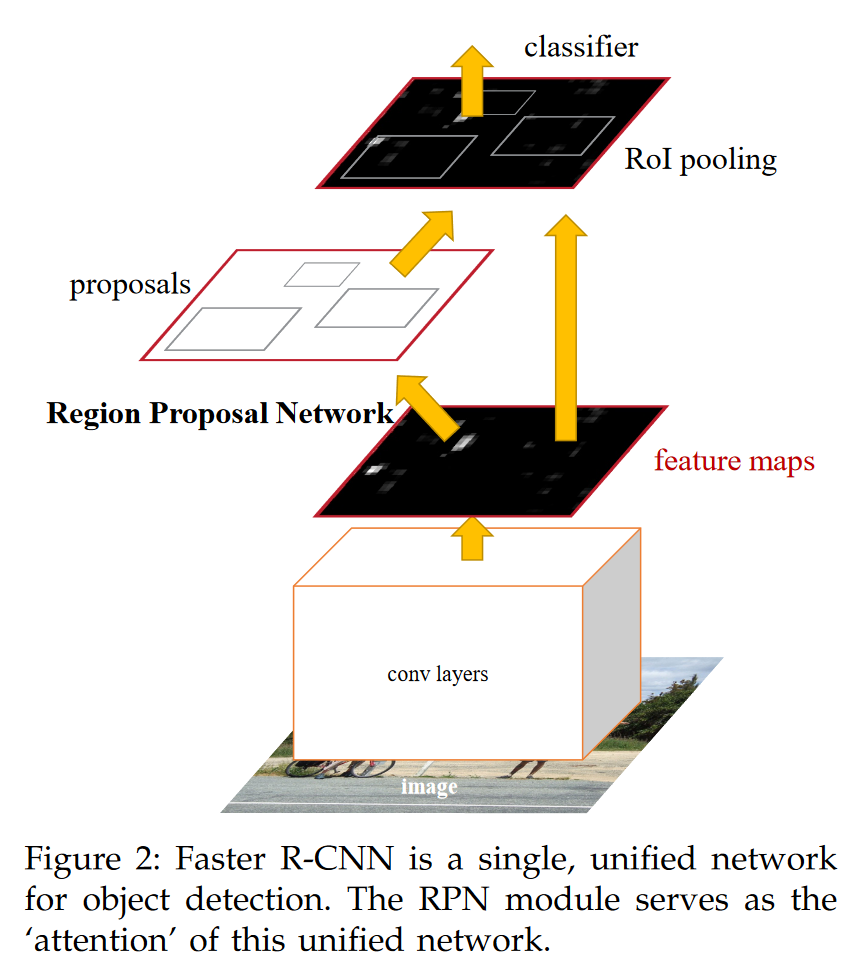

# Object Detections (two stage)

## R-CNN

> Pytorch实现：https://medium.com/codex/implementing-r-cnn-object-detection-on-voc2012-with-pytorch-b05d3c623afe

R-CNN在2014年由目标检测领域的大神Ross Girshick提出，在权威数据集PASCAL VOC2012上,RCNN将mAP提高了30%以上，达到了—53.3%。这也使得RCNN成为了第一个工业级的目标检测算法。之所以R-CNN能得到如此优秀的效果，主要得益于如下两个方面：

1. 在候选区域（Region proposal）上自下而上使用大型卷积神经网络(CNNs)进行提取图像特征，之后用于定位和分割物体；
2. 当带标签的训练数据不足时，先针对辅助任务进行有监督预训练，再进行特定任务的调优，即微调(fine-tuning)，就可以产生明显的性能提升。


如图所示，R-CNN的整个流程很简单：

1. 首先在输入图像中提取近2000个候选区域；
2. 之后分别将这些区域送入CNN提取深度特征；
3. 最后利用这些深度特征进行目标的分类与定位两大任务。

### Region proposals

在2014年R-CNN被提出之前，目标框的提取主要分为三种：

- 第一种就是滑动窗口。滑动窗口本质上就是穷举法，利用不同的尺度和长宽比把所有可能的大大小小的块都穷举出来，然后送去识别，识别出来概率大的就留下来。很明显，这样的方法复杂度太高，产生了很多的冗余候选区域，在现实当中不可行。

- 第二种是规则块。在穷举法的基础上进行了一些剪枝，只选用固定的大小和长宽比。但是对于普通的目标检测来说，规则块算法依然需要访问很多的位置，复杂度高。

- 第三种是选择性搜索（selective search，ss）。从机器学习的角度来说，前面的方法召回是不错了，但是精度差强人意，所以问题的核心在于如何有效地去除冗余候选区域。其实冗余候选区域大多是发生了重叠，选择性搜索利用这一点，自底向上合并相邻的重叠区域，从而减少冗余。

因此在R-CNN中选取了选择性搜索算法来生成后序后续送入CNN的推荐区域（Region Proposal）。

### Feature extraction

在2014年R-CNN提出之前，AlexNet夺得了ImageNet竞赛的冠军，展现出了强大的图像特征提取能力。因此，R-CNN采用了AlexNet作为提取图像特征的主干网络。不同的是，我们将AlexNet最后的ImageNet专用的1000-way分类层舍弃，采用了一个21维的分类层（20个目标分类+1个背景）。

同时由于AlexNet对于输入图像必须要求是227*227的RGB彩色图像，因此在R-CNN中，作者是将选择性搜索得到的推荐区域的图像尺寸首先进行了区域的转化成227 x 227。

> 注意是微调而不是直接作为特征提取器。

### 训练和测试

#### 训练阶段


由于分类与定位两大任务在训练和测试阶段有所区别，因此这两部分我们将分别在训练和测试两个任务中进行描述。首先我们来看下训练阶段。训练阶段AlexNet的模型训练采用的有监督预训练和特定领域内参数微调的训练方式。梯度下降算法采用的SGD，学习率为0.001，小批量样本规模是128，其中正例32个（包括所有类别的推荐区域以及真实框），反例96个（即背景）。区分正例与反例的标准为候选框与真实框（Ground Truth）之间的IoU>=0.5，即IoU>=0.5则记作正例，反之记作反例（即背景）。

在提取特征完成之后，我们要做的还有就是训练每个类别SVM分类器将提取得到的特征向量用于优化每个类别的SVM二分类器。这个时候每个目标框标签的就要从物体分类的多变量one-hot标签转化成二分类的0/1标签。标签制定标准为目标框与真实框之间IoU是否小于0.3。若IoU<0.3则记作负样本即标签为0，真实框作为正例，其余的（IoU0.3-1之间的候选框）全部舍弃。

R-CNN不仅要完成AlexNet、SVM的训练，而且还要完成定位任务。在这里我们将AlexNet获得特征向量按类别送入x,y,w,h这四个分量回归器，利用梯度下降算法进行训练每个分量回归器的权重，在这里特征向量的选择必须是与真实框(Ground Truth)之间IoU大于0.6的对应推荐区域提取出来的特征向量。R-CNN的训练流程图如下图所示。


#### 测试阶段

在测试阶段我们，我们首先使用选择性搜索进行获取目标检测框，并将目标框填充至正方形然后转换尺寸到227*277，之后通过AlexNet进行提取特征，然后利用每个类别训练好的SVM二分类器对AlexNet提取得到的特征向量的每个类别进行打分。接下来分别将每个类别的特征向量送入已经训练好的每个类别的边界框回归器进行定位预测。得到分类打分和定位信息之后，可能会出现多个目标框之间IoU较高，即产生了目标框重叠，因此我们需要利用非极大抑制（NMS）算法进行去除IoU大于阈值的重复目标框。测试阶段的流程图如下图所示。


### 重要问题

#### 图像缩放问题

第一个问题是**为什么必须选用各向异性缩放与填充的图像尺度变换？**作者在附录中指出：

- (A) 各向同性缩放1：直接在原始图片中，把推荐区域的边界进行扩展延伸成正方形，然后再进行裁剪；如果已经延伸到了原始图片的外边界，那么就用推荐区域中的颜色均值填充；
- (B) 各向同性缩放2：先把推荐区域图片裁剪出来，然后用固定的背景颜色填充成正方形图片(背景颜色也是采用推荐区域的像素颜色均值)，结果如下图第三列；
- (C) 各向异性缩放：简单粗暴对图像就行缩放至227×227的结果如下图第四列；
- (D) 变形前先进行边界像素填充（padding）处理，即向外扩展建议框边界，以上三种方法中分别采用padding=0，如下图第一行，padding=16如下图第二行；


经过作者一系列实验表明采用padding=16的各向异性缩放即下图第二行第四列效果最好，能使mAP提升3-5%。

#### 正负样本阈值问题

第二个问题是**为什么微调时和训练SVM时所采用的正负样本阈值和策略不一致？**

微调阶段是由于CNN对小样本容易过拟合，需要大量训练数据，故对样本限制宽松。在微调时，与Ground Truth相交IoU>0.5的候选框为正样本，反之为负样本，也就是说候选框都用上了。

而SVM属于强分类器，适用于小样本训练，故对样本限制严格：Ground Truth为正样本，与Ground Truth相交IoU＜0.3的候选框为负样本，即只有Ground Truth和部分候选框用上了。

#### 为什么使用SVM

第三个问题是**为什么不直接在微调结束后，在AlexNet后直接加上21维的Softmax分类层而是采用SVM进行分类？**

作者在附录中指出，因为微调时和训练SVM时所采用的正负样本阈值不同，微调阶段正样本定义并不强调精准的位置，而SVM正样本只有Ground Truth；并且微调阶段的负样本是随机抽样的，而SVM的负样本是经过hard negative mining方法筛选的；导致在采用Softmax会使PSACAL VOC 2007测试集上mAP从54.2%降低到50.9%。改变分类器的训练策略可能可以弥补Softmax和SVM的差距。

#### 为什么用微调而不是特征提取

 第四个问题是**为什么必须利用特定领域的数据集进行微调？**直接使用AlexNet预训练的网络参数进行特征提取进而训练SVM不可以吗?

作者设计了没有进行微调的对比实验，分别就AlexNet的pool5、fc6、fc7层进行特征提取，将提取的特征输入SVM进行训练，这相当于把AlexNet CNN网络当做类似于HOG、SIFT一样的特征提取器，不针对特定提取任务。实验结果发现f6层提取的特征比f7层的mAP还高，pool5层提取的特征与f6、f7层相比mAP差不多；在PASCAL VOC 2007数据集上采取了微调后fc6、fc7层特征较pool5层特征用于SVM训练提升mAP十分明显。

由此作者得出结论：不针对特定任务进行微调，而将CNN当成特征提取器，pool5层得到的特征是基础（共性）特征，从fc6和fc7等全连接层中所学习到的特征是针对特征任务特定样本的特征。因此在有监督预训练(迁移学习)之后利用特定任务特定样本对网络参数进行微调时非常有必要的。

### 缺点

1. 很明显，最大的缺点是对一张图片的处理速度慢，这是由于一张图片中由选择性搜索算法得出的约2000个推荐区域都需要经过变形处理后再由AlexNet提取深度特征，这约2000个推荐区域可能出现大量重复区域，产生了大量重复计算。
2. R-CNN的训练过程不是连续的，分成了两个部分。一个是AlexNet模型参数的微调，另一个是SVM的训练和边界框回归的训练。这样就导致无法共享权重，训练过程不连续。同时训练过程的不连续必然导致特征存储和磁盘空间浪费的情况。
3. 每次都需要计算不同图片中不同建议框CNN特征，无法共享同一张图的CNN特征，训练速度很慢。
4. 整个测试过程很复杂，要先提取推荐区域，之后提取每个推荐区域CNN特征，再用SVM分类，做非极大值抑制，最后做边界框回归才能得到图片中物体的分类以及定位信息。

## SPP-Net

R-CNN需要对图像的每一个候选区域都提一次特征，而对一张图像来说大约有2000个候选框，这显然极大地增加了计算复杂度。

### SPP for Objection Detection


SPP-Net则直接在卷积层提取到的特征图上对候选区域进行处理，即运行一次只需要使用CNN提取一次特征，然后使用SPP处理不同size的候选区域。从而SPP-Net可以在同等性能下比R-CNN快上几十倍。

### 缺点和不足

- **训练过程复杂：**和RCNN一样，SPP也需要训练CNN提取特征，然后训练SVM分类这些特征。需要巨大的存储空间，并且分开训练也很复杂。而且selective search的方法提取特征是在CPU上进行的，相对于GPU来说还是比较慢的。针对这些问题的改进，我们将在Fast RCNN以及Faster RCNN中介绍；
- **只fine-tuning了全连接层**：作者为了简化训练只fine-tuning了全连接层，这自然会对精度造成一定的影响。

## Fast R-CNN


> 如图所示并非Fast R-CNN的原始结构，只是说提供了一种范式：通过一个backbone来对原图提取特征，然后在特征图上对于候选区域resize送入Per-Region完成下游分类和回归任务。

SPP-Net通过在特征图上做目标检测降低了R-CNN的计算量，但是仍然存在一些缺点，前面也已经提到了，主要是训练过程复杂以及没有fine-tuning卷积层。

Fast R-CNN则克服了以上缺点，其主要贡献如下：

- 拥有比R-CNN，SPPnet更高的mAP，其在用VGG16作为backbone的情况下训练速度比R-CNN快9倍，比SPP-Net快3倍，推理速度比R-CNN快213倍，比SPP-Net快10倍；
- 通过一个multi-task loss完成single-stage的训练；
- 训练可以更新所有的网络层；
- 不需要额外的硬盘空间用于特征缓存。

### Fast R-CNN architecture


#### The RoI pooling layer

相当于是SPP的简化版，即one-level的SPP，给定网格数量（比如 $7\times7$），获得固定大小的输出：


但是由于特征图大小和原图不一样，常常会出现像素点无法对齐的情况，在后面的Mask R-CNN中会提出RoI align来解决该问题。

#### Initializing from pre-trained networks

1. 先在ImageNet上训练backbone，然后将最后一层最大池化层替换成RoI pooling layer；
2. 再将1000分类的全连接层换成用于此任务的分类器和回归器（a fully connected layer and softmax over K + 1 categories and category-specific bounding-box regressors）；
3. 最后将网络的输入改成两个：图像以及该图像对应的RoIs。

### Fine-tuning


可以看到，Faster R-CNN的性能提升很大程度上来自于fine-tuning了卷积层，没有fine-tuning的情况比SPPnet精度还差些（很正常，RoI Pooling相当于是低配的SPP）。

#### Hierarchical sampling

Fast R-CNN能够使用反向传播来更新训练所有的网络权重。SPPnet不能更新所有的权重，不能更新spp之前层的参数。（**注意**：这里不是说不能更新，而是由于在finetune的过程中反向传播非常低效。）

根本原因是当每个训练样本（即RoI）来自不同的图像时，通过SPP层的反向传播是非常低效的，这正是训练R-CNN和SPPnet网络的方法。低效的部分是因为每个RoI可能具有非常大的感受野，通常跨越整个输入图像。由于正向传播必须处理整个感受野，训练输入很大（通常是整个图像）。

> 其实就是RoI-centric sampling和image-centric sampling的区别：SPP-net是先把所有图像用SS计算的RoIs存起来，再从中每次随机选128个RoIs作为一个batch进行训练，这128个RoIs最坏的情况来自128张不同的图像，那么，要对128张图像都送入网络计算其特征，同时内存就要把128张图像的各层feature maps都记录下来（反向求导时要用），所以时间和空间上开销都比较大；而Fast R-CNN虽然也是SS计算RoIs，但每次只选2张图像的RoIs(一张图像上约2000个RoIs)，再从中选128个作为一个batch，那么训练时只要计算和存储2张图像的Feature maps，所以时间和内存开销更小）

论文提出了一种更有效的训练方法，利用训练期间的特征共享。在Fast R-CNN网络训练中，随机梯度下降（SGD）的小批量是被分层采样的，首先采样$N$个图像，然后从每个图像采样$R/N$个 RoI。关键的是，来自同一图像的RoI在向前和向后传播中共享计算和内存。减小$N$，就减少了小批量的计算。例如，当$N = 2$和$R = 128$时，得到的训练方案比从128幅不同的图采样一个RoI（即R-CNN和SPPnet的策略）快64倍。

这个策略的一个令人担心的问题是它可能导致训练收敛变慢，因为来自相同图像的RoI是相关的。这个问题似乎在实际情况下并不存在，当$N = 2$和$R = 128$时，我们使用比R-CNN更少的SGD迭代就获得了良好的结果。

#### Multi-task loss

除了分层采样，Fast R-CNN在fine-tuning阶段联合优化Softmax分类器和检测框回归，而不是分别在三个独立的阶段训练softmax分类器，SVM和回归器。

每个 training RoI 都标记了一个 ground-truth class $u$ 和一个 ground-truth bounding-box regression target $v$. 我们使用 multi-task loss $L$对每个标记好的 RoI 进行分类和回归的联合训练:
$$
L\left(p, u, t^{u}, v\right)=L_{\mathrm{cls}}(p, u)+\lambda[u \geq 1] L_{\mathrm{loc}}\left(t^{u}, v\right),
$$
其中 $L_{\mathrm{cls}}(p, u)=-\log p_{u}$ 为对于true class $u$ 的log loss。

对于定位任务的损失 $L_{\mathrm{loc}}$, is defined over a tuple of true bounding-box regression targets for class $u, v=$ $\left(v_{\mathrm{x}}, v_{\mathrm{y}}, v_{\mathrm{w}}, v_{\mathrm{h}}\right)$, and a predicted tuple $t^{u}=\left(t_{\mathrm{x}}^{u}, t_{\mathrm{y}}^{u}, t_{\mathrm{w}}^{u}, t_{\mathrm{h}}^{u}\right)$, again for class $u$. The Iverson bracket indicator function $[u \geq 1]$ evaluates to 1 when $u \geq 1$ and 0 otherwise. By convention the catch-all background class is labeled $u=0$. For background RoIs there is no notion of a ground-truth bounding box and hence $L_{\mathrm{loc}}$ is ignored.

对于 bounding-box regression, 我们使用：
$$
L_{\mathrm{loc}}\left(t^{u}, v\right)=\sum_{i \in\{\mathrm{x}, \mathrm{y}, \mathrm{w}, \mathrm{h}\}} \operatorname{smooth}_{L_{1}}\left(t_{i}^{u}-v_{i}\right),
$$
其中
$$
\operatorname{smooth}_{L_{1}}(x)= \begin{cases}0.5 x^{2} & \text { if }|x|<1 \\ |x|-0.5 & \text { otherwise }\end{cases}
$$
is a robust $L_{1}$ loss that is less sensitive to outliers than the $L_{2}$ loss used in R-CNN and SPPnet. When the regression targets are unbounded, training with $L_{2}$ loss can require careful tuning of learning rates in order to prevent exploding gradients. Eq. 3 eliminates this sensitivity.

The hyper-parameter $\lambda$ in Eq. 1 controls the balance between the two task losses. We normalize the ground-truth regression targets $v_{i}$ to have zero mean and unit variance. All experiments use $\lambda=1$.

> 懒得翻了，先这样吧。

### Truncated SVD for faster detection

对于图像分类的处理过程， 时间消耗主要在卷积层，全连接层时间花费会很少，但是对于目标检测算法，由于需要处理大量的ROI，因此需要花费一般以上的时间在全连接层上，利用截断的奇异值分解很容易实现对与大的全连接层的加速。

利用这项技术，如果一层的权重矩阵W为$u \times v$维，那么对W执行奇异值分解：
$$
W \approx U\Sigma_tV^T
$$
在这种分解中，$U$是一个$u \times t$的矩阵，包括$W$的前$t$个左奇异向量，$\Sigma_t$是$t \times t$对角矩阵，其包含$W$的前$t$个奇异值，并且$V$是$v \times t$矩阵，包括$W$的前$t$个右奇异向量。截断SVD将参数计数从$uv$减少到$t(u + v)$个，如果$t$远小于$\min(u, v)$，则SVD可能是重要的。 为了压缩网络，对应于$W$的单个全连接层由两个全连接层替代，在它们之间**没有非线性**。这些层中的第一层使用权重矩阵$\Sigma_tV^T$（没有偏置），并且第二层使用$U$（其中原始偏差与$W$相关联）。当RoI的数量大时，这种简单的压缩方法给出良好的加速。


如图所示，损失了很小部分精度但是换来了不小的加速。

## Faster R-CNN


Fast R-CNN大大缩小了Region Proposal之外的时间，导致现在测试阶段主要时间都花在了Selective Search上面，因而Faster R-CNN针对这一点，提出了使用 Region Proposal Network（RPN）进行候选框的获取，它和dectection network共享backbone提取出的特征，因此几乎不需要花多余的时间，RPN和Fast R-CNN结合后就像attention机制一样，RPN组件告诉detection组件应该关注那些部分。



### Region Proposal Networks


RPN是一个全卷积网络，先使用一个 $n\times n$ 的滑动窗口提取低维特征（实际上就是一个卷积操作），将特征图通道数变为256维（ZF为256，VGG是512），然后对提取到的特征分别用 $1\times 1$ 卷积得到分类和定位的输出结果，具体实现代码如下：

```python
# define the convrelu layers processing input feature map
self.RPN_Conv = nn.Conv2d(self.din, 512, 3, 1, 1, bias=True)
self.relu = nn.ReLU()
# define bg/fg classifcation score layer
self.nc_score_out = len(self.anchor_scales) * len(self.anchor_ratios) * 2 # 2(bg/fg) * 9 (anchors)
self.RPN_cls_score = nn.Conv2d(512, self.nc_score_out, 1, 1, 0)
# define anchor box offset prediction layer
self.nc_bbox_out = len(self.anchor_scales) * len(self.anchor_ratios) * 4 # 4(coords) * 9 (anchors)
self.RPN_bbox_pred = nn.Conv2d(512, self.nc_bbox_out, 1, 1, 0)
```
> 分类是2k是因为这里用了两个输出神经元处理二分类，实际上用一个神经元做逻辑回归也是可以的。

注意到网络结构中有个参数 $k$，这是预设anchor的数量，也就是说RPN的回归实际上是用于预测相对于预设锚框（也叫参考框）的偏移。

锚框根据预设的scale和aspect ratio决定，比如有3个scales和3个aspect ratios就可以生成 $k=9$ 个锚框，对于 $W\times H$ 的特征图，共生成 $WHk$ 个锚框（RPN并不会改变特征图的宽高）。


而使用不同多个预设属性的anchor也正是Faster R-CNN实现多尺度特征提取的手段。

### 缺点和不足

1. 卷积提取网络
   不论使用VGGNet还是ResNet，其提取到的特征图都是单层的，分辨率也比较小。因此对于那些多尺度、小目标的问题，使用多层融合的特征图或者增大特征图的分辨率都是可以优化的方向。

2. NMS
   在RPN产生Proposal时候为了避免重叠的候选框，以分类得分为标准，使用了NMS进行后处理。事实上，该方法对于遮挡的目标很不友好，即有可能是两个目标的Proposal很可能会被过滤掉一个，造成漏检，因此改进这个NMS模式也是可以带来检测性能提升。

3. RoI Pooling
   Faster RCNN的原始RoI pooling两次取整会带来精度的丢失，因此改变这个定位池化或者特征尺度输出的问题也需要改进，后续的Mask RCNN针对这点，提出了RoI Align，提升了精度。

4. 全连接
   原始的Faster RCNN最后使用的全连接层，占据了很大一部分的参数量，并且所有保留的RoI pooling处理过RoI都会经过这个全连接，并且都是单独计算的，他们之间并没有共享计算。如何取代这部分全连接网络，实现更加轻量的网络是需要研究的方向。

5. 正负样本
   在RPN和RCNN都会通过超参数来限制正负样本的个数来保证样本的均衡。筛选Proposal得到RoI时候，会选择不超过64个正样本，负样本比例基本满足是正样本的3倍。在RCNN时也最多存在64个正样本进行回归计算，负样本不参与回归。事实上，对于不同任务和数据，这种直接限定正、负样本数量的均衡方法是否都是最有效的也值得研究。

6. 两阶段网络
   Faster RCNN的RPN和RCNN两阶段分工明确，带来精度提升，但是两阶段的速度明显相较于单阶段是慢的，实际运用并未实时。因此网络阶数也值得讨论，单阶是否可以使网络更快，更多阶能否使网络精度更高等。

针对的改进网络可以见：https://blog.csdn.net/qq_41214679/article/details/114595001

## Mask R-CNN

