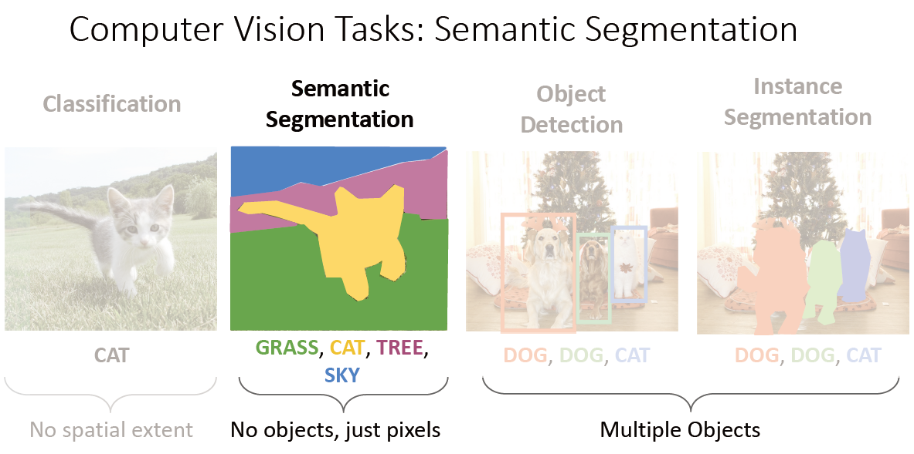
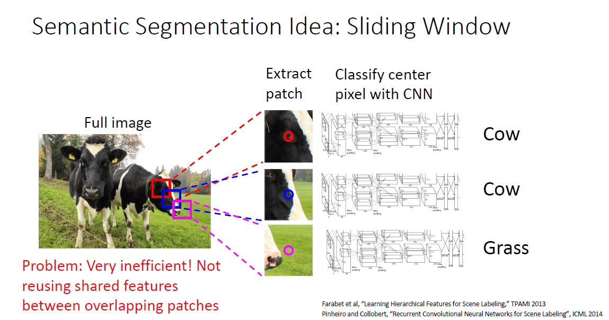
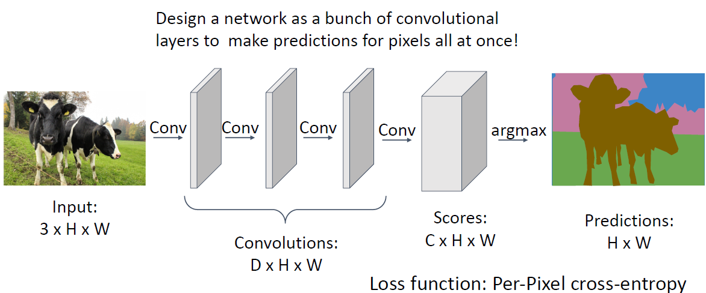
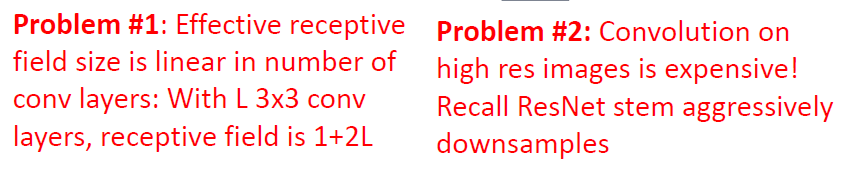
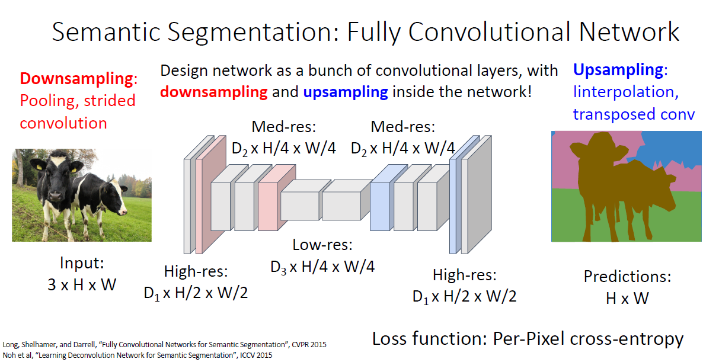

# Semantic Segmentation

## Background

语义分割是计算机视觉领域的主要任务之一，和目标检测不同，它不关心不同的目标实例，只关心图像中每个像素的类别，即只区分不同类别而不区分同一类别。

## Solution

### Vanilla Method

我们可以用滑动窗口的方式对每个像素点进行分类，但显然这计算效率很低：

很自然的一个想法是使用不改变特征图大小的网络架构直接对图像的各个像素进行分类：

但是这样对于高分辨率的图像计算巨大，而且需要堆叠较深的层数以使得深层网络获得较大的感受野：

### Fully Convolutional Network

借鉴ResNet等网络中用一个stem组件进行快速下采样的做法，FCN给出了先下采样再上采样的语义分割解决方案：

