# Instance Segmentation

## Background

回顾目标检测和语义分割，目标检测可以将不同的目标分辨出来，语义分割则是提供像素级的分类但无法分辨同类目标，结合两种任务的特点就得到了实例分割：

## Solution

### Mask R-CNN

实例分割拥有目标检测和语义分割两个任务的特点，因而可以先做目标检测，然后对目标框坐语义分割来解决：

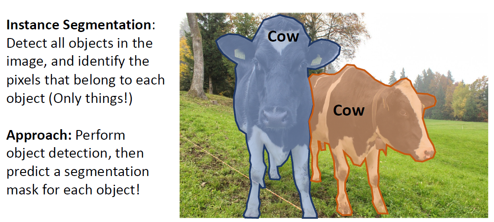

事实上这正是Mask R-CNN所采用的方式，它仅仅在Faster R-CNN的基础上加了一个额外的Mask Prediction：

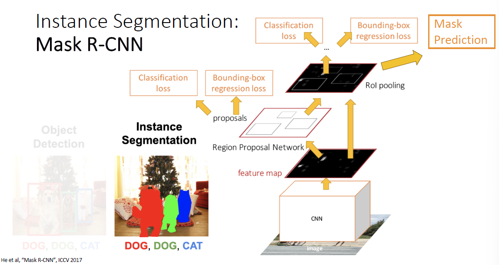

在当时Mask R-CNN无论是在Object detection任务上还是Instance detection任务上都取得了SOTA的结果。

#### Mask Representation

Mask R-CNN采用全卷积的方式对RoI进行分割，值得注意的是它并没有像FCN等常见分割方法一样同时进行分割和分类，而是对每一个类别都预测一个Binary Mask，然后根据分类器的结果选择Mask，训练时对每个类别分别采用sigmoid + binary loss的组合，即它将分类和分割解耦，在实验部分证明了该策略带来的提升：

> 我个人认为能获得更好的效果的原因可能是：对于不同类别的对象之间来说它们的部分像素可能是类似的，因而在预测时单独看这个像素或者是一小部分可能既属于类别A又属于类别B，因而不如对每个类别分别做分割，最后由分类器来定夺属于哪一类。

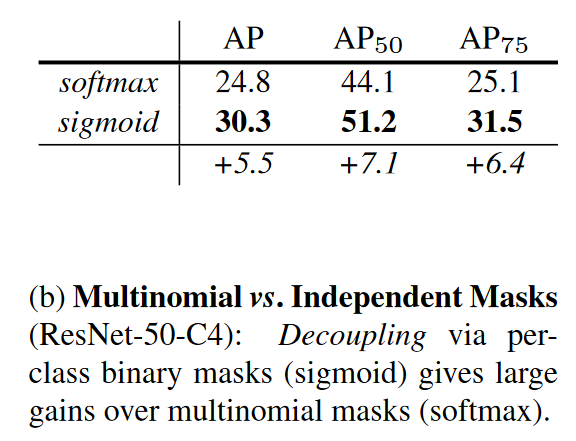

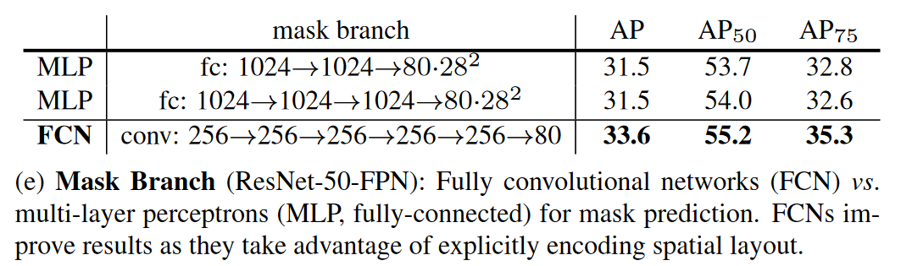

#### RoI Align

RoI Align相对于RoI Pool改进了对准确未落在feature map区域的RoI的处理问题（基本不可能准确）。

RoI Pool做了两次取整：

- 一次是从原图降采样到特征图，RoI由于图像变小了位置可能无法完美落在feature map上，比如 [5, 5, 10, 10] 的bbox在图像缩小4倍后就无法和特征图像素点对齐：

  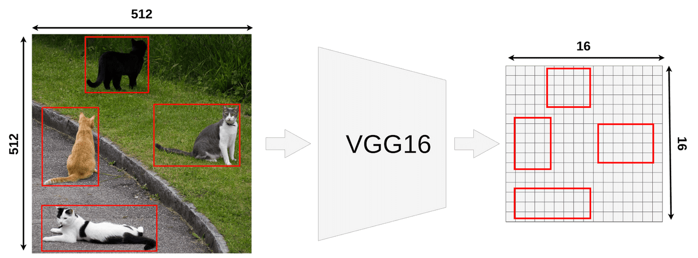

- 另外在划分bin的时候也可能无法均匀将RoI划分到我们设计的bin中：

  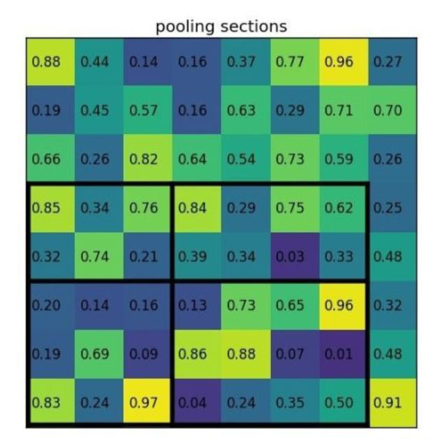

对于第二次取整，我们可以采用双线性插值采样来避免取整：

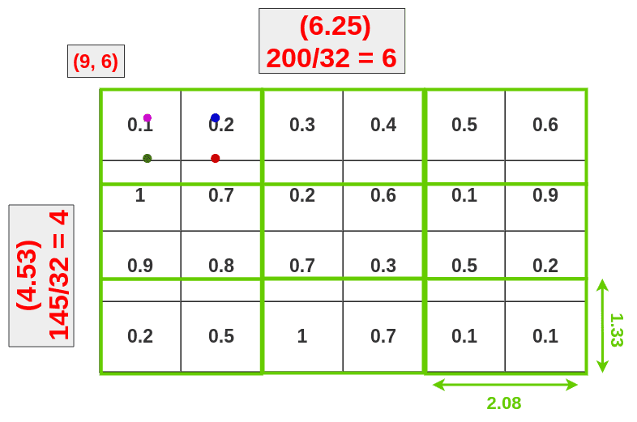

即选择离当前点最近的四个像素顶点作插值近似获得当前点像素值，如图所示，每个RoI bin取四个采样点，然后对这四个点最池化，这就是所谓**RoI Warp**。

RoI Warp虽然解决了第二次取整造成的误差，但是忽略了第一次取整的误差，事实上既然已经可以用双线性插值解决均匀划分bin的问题了，那么也不需要第一次取整了，直接获得浮点数bbox就行，这就是RoI Align：

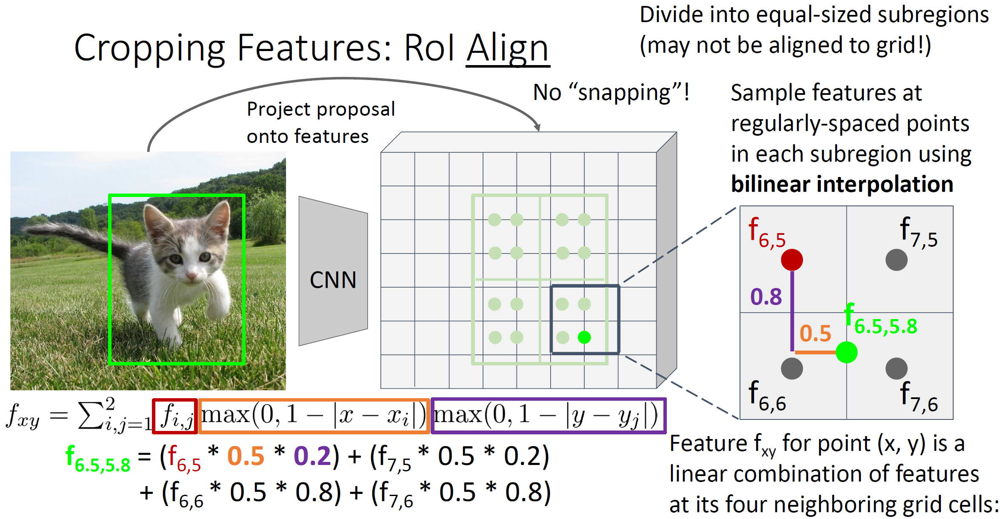

从结果也可以看出RoI Align对精度提升较大：

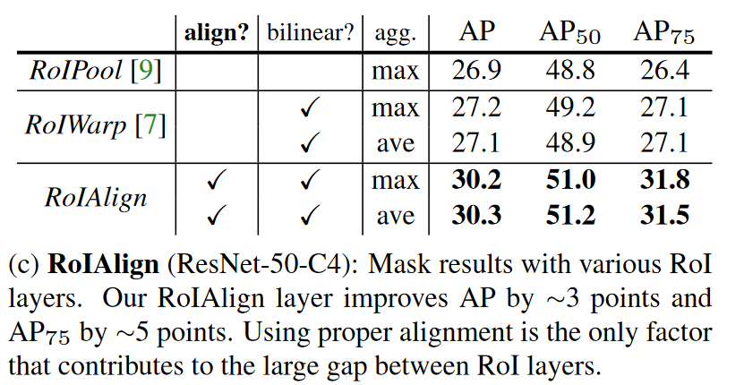

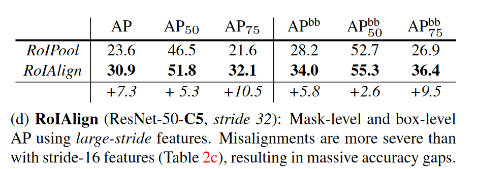

## Beyond Instance Segmentation

### Panoptic Segmentation（全景分割）

实例分割其实可以看作目标检测的扩展，它不在乎背景的分割，而全景分割可以看作是语义分割的扩展：

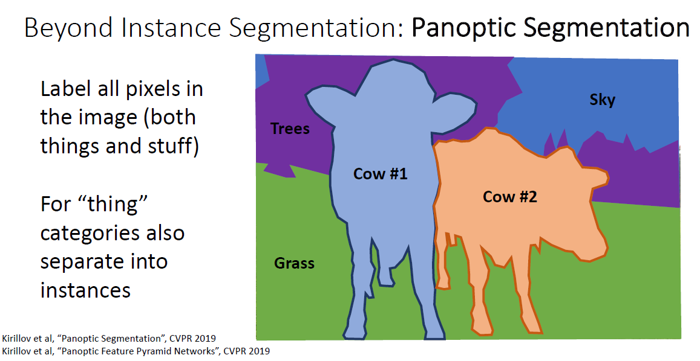

### Human Keypoints

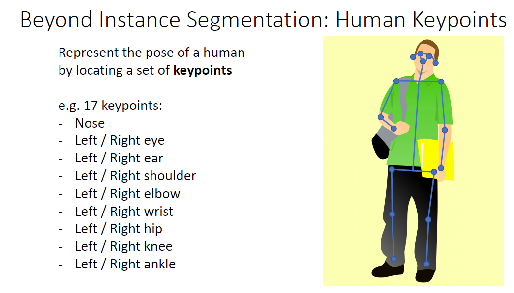
