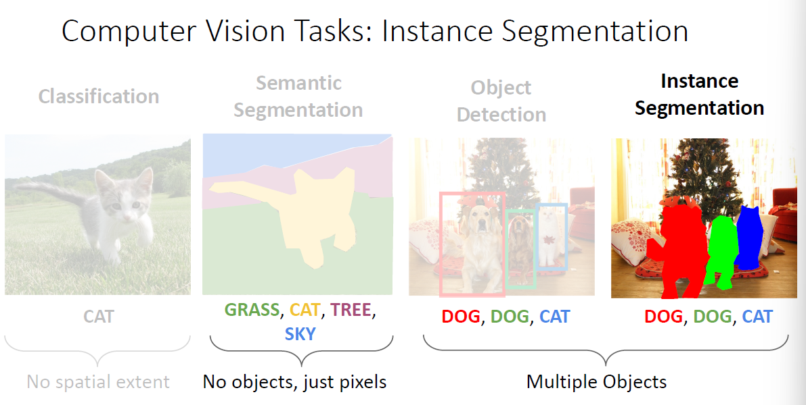
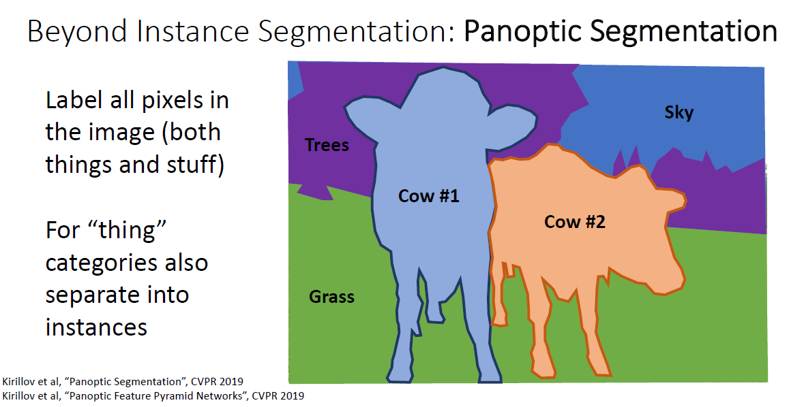

# Instance Segmentation

## Background

回顾目标检测和语义分割，目标检测可以将不同的目标分辨出来，语义分割则是提供像素级的分类但无法分辨同类目标，结合两种任务的特点就得到了实例分割：

## Solution

### Mask R-CNN

实例分割拥有目标检测和语义分割两个任务的特点，因而可以先做目标检测，然后对目标框坐语义分割来解决：

事实上这正是Mask R-CNN做的，他加了一个额外的Mask Prediction：

## Beyond Instance Segmentation

### Panoptic Segmentation（全景分割）

实例分割其实可以看作目标检测的扩展，它不在乎背景的分割，而全景分割可以看作是语义分割的扩展：

### Human Keypoints

