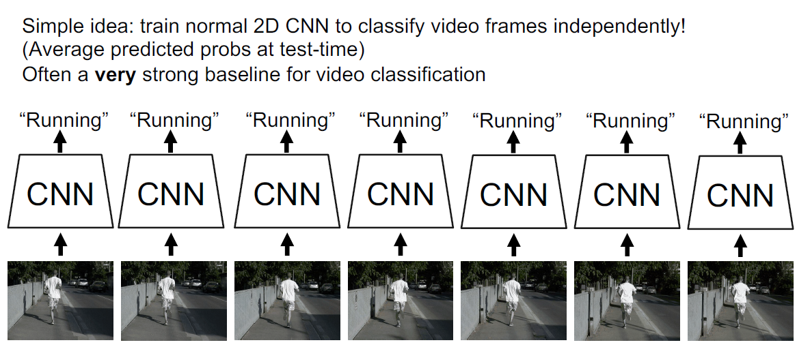

# Video Understanding

## Background

视频是我们日常生活中最常见的数据来源之一，我们人眼观察到的数据就是以视频的形式，视频在计算机中就是一阵一阵的图像时间序列，图像中最基础的任务是分类，我们同样可以对视频进行分类（可用于推荐、画像等）：

但是显然相较于图像，视频所需的存储空间要大得多，这也是在目前的硬件条件下视频理解的一大挑战：

目前的解决策略主要是使用更低的帧率和更小的帧大小：

接下来我们将以视频分类这一基础任务讲解如何使用深度学习技术做视频理解。

## Video Classification

### Datasets

> 这里是很早时候的结果（2014)，受限于当时的CNN架构发展，实际上后面各种科技加上就不是这样了，不过起码可以说名Single Frame真的是一个strong baseline。

### Single-Frame CNN

最粗暴的进行视频分类的方法就是对视频的每一帧使用CNN进行推理然后取平均预测结果，这虽然很简单粗暴，但是往往可以取得不错的效果：

### Late Fusion

很直接的一个改进就是将平均融合换成全连接层融合：

当然全连接层可能带来较大的参数量和计算量，可以参照一些图像分类架构使用全局池化层：

但是很显然的一个问题就是将融合步骤放在最后一步很难捕捉图像帧low-level的细节变化。

### Early Fusion

于是我们可以在一开始就融合各帧，直接将时间维并入通道维：

不过这么做的问题是在第一层就将时间维的信息融合了可能太过激进了，虽说可以通过增加卷积核的数量来增加信息保留的程度，但是仍不够自然。

### 3D CNN

更自然的方式我们直接在3D视觉中也有提到过，即使用3D CNN，这里是将时间维（temporal）和当作和空间维（spatial）一样来处理，这样能更好地利用时间维的信息：

我们可以从感受野的角度将3D CNN和之前讲的两种方法进行对比，可以看到三个方法在空间维上感受野都是缓慢增长，但是在时间维度上Early Fusion和Late Fusion分别在开始和最后时刻激增，只有3D CNN是缓慢增长，回想卷积神经网络这种随着网络深度增加感受野逐渐增长的方式取得的巨大成功，直觉上3D CNN应该也是处理时间维更好的方式。

我们进一步对比2D卷积和3D卷积，我们先看二维卷积，它可以理解成将channel维“融入”了temporal维，可以将下面的3D grid的每个点当作是 $C_{in}$ 维的向量：

这么做的问题是在时间维上损失了“平移不变性”：

如图所示，假设我们有一个时间维上的特征是画面由蓝色变为黄色，对于二维卷积来说，在前面变色和后面变色需要当作是两种特征去处理，即需要两个卷积核，显然对于出现时间不定的特征，二维卷积需要用很多个卷积核才能捕捉。

显然三维卷积可以很好地解决这个问题：

> 这里应该是假设设计好了padding和stride使得输入输出特征图大小不变。

另一间有趣的事情是由于3D卷积核包含时间维，因而我们可以将他们可视化成视频片段：

可以看到第一层卷积层的卷积核实际上学习到的可能是斑点或者纹理的变化。

### C3D

C3D是著名的视频分类架构， 就是从VGG改过来的，除了第一个池化层没有对temporal维下采样其余设计和VGG都十分类似：

### Optical Flow and Two-Stream Networks

我们人很容易通过移动的轨迹和趋势猜测出动作的类型，受此启发我们往往会利用这些信息来辅助视频理解。光流法是利用图像序列中像素在时间域上的变化以及相邻帧之间的相关性来找到上一帧跟当前帧之间存在的对应关系，从而计算出相邻帧之间物体的运动信息的一种方法。

**光流（optical flow）**是空间运动物体在观察成像平面上的像素运动的瞬时速度。通常将二维图像平面特定坐标点上的灰度瞬时变化率定义为光流矢量，在时间间隔很小（比如视频的连续前后两帧之间）时，就等同于目标点的位移。

每个像素点都用一个二维向量 $(dx, dy)$ 表示它的光流，光流体现了物体的局部动作信息：

视频分类领域著名的双流模型正是利用了光流信息，它利用视频中的光流信息和单帧视频进行分类：

单帧图像只需要用2D CNN即可提取信息；$T$ 帧连续图像可以获得 $(T-1)$ 帧光流，故光流信息输入通道数为 $2\times (T-1)$，故而也是用2D CNN进行提取信息，最后再将并行提取的双流信息进行融合进行最终的分类。

可以看到在当时双流网络取得了一个显著的效果提升：

## Modeling Long-term Temporal Structure

之前讨论过的用CNN处理视频的方式只能建模较短的视频片段（很长的片段可能需要很深的卷积网络才能提取到长时间的时序特征），因而我们可以考虑使用之前的RNN来建模视频数据。

### Using RNN

最直接的方式就是使用CNN提取特征然后送入RNN中，与使用RNN处理时间序列类似，也分为多对一和多对多输出：

有时也会直接将预训练的CNN用作特征提取器而不参与训练（也是，这个架构看起来就很难train）：

考虑CNN能提取局部的时序机结构而RNN能提取长时的时序结构，可以将他们结合：

参考多层RNN的结构，我们把其中的MLP换成CNN就得到了Recurrent Convolutional Network：

尽管将两者结合解决了诸多问题，但是实际上并不那么常使用RNN，主要是因为其**无法并行计算**的问题：

### Using Attention

回顾三种处理时间序列的方式：

应用在video上面，RNN之前已经介绍过，1D卷积在video中就相对于是3D卷积，自注意力机制的应用其实也很简单，把 $C \times T \times H \times W$ 看成是有 $THW$ 个 $C$ 维向量的集合即可。

一种常用的结构是Nonlocal Block：

Nonlocal Block由于有残差结构，初始化的时候将最后一个卷积块全0初始化就等价于恒等映射，再接CNN进行微调，可以获得进一步的效果提升：

## Inflating 2D Networks to 3D (I3D)

显然我们可以尝试将2D图像上的成功架构复用到视频上：

甚至权重也可以复制：

事实证明使用在图像数据集上预训练的模型进行微调可以提高在视频任务上的精度：

## Vision Transformers for Video

Transformer同样在视频理解领域也大放异彩：

## Other Tasks

视频理解领域还有很多其他任务，比如时序动作定位、时空目标检测，还有一些结合其他模态的工作。
