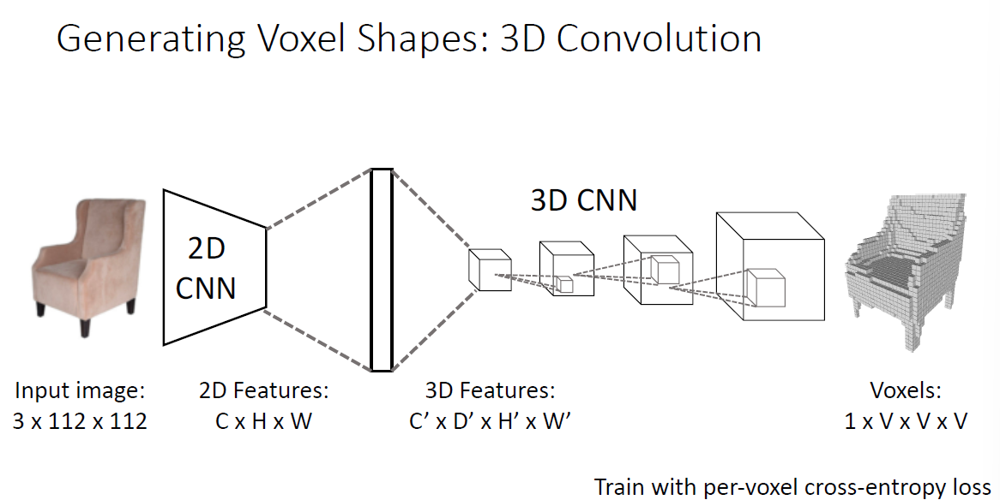
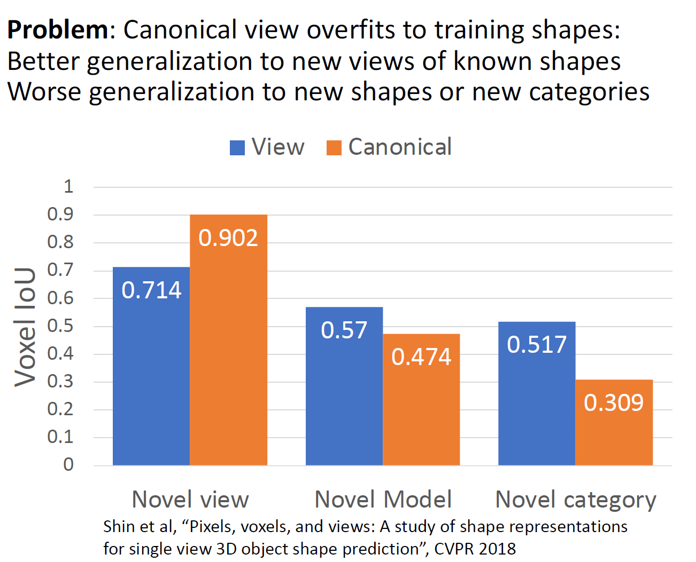

# 3D Vision

## 3D Shape Prediction

3D视觉中相对二维图像要多上一个spatial维来表示，与二维物体大多以rgb图像表示，3D物体的表示形式较为丰富：

### Depth Map and Surface Normal（2.5D Representions）

#### Depth Map

深度图是对二维图像的扩展，它提供了图像中每个像素点的深度信息，当然这样无法表示被前景物体遮挡的区域，因而无法完整的建模3D场景，所以也叫2.5D图像。

显然图像的深度估计任务类似于语义分割任务，我们同样可以用全卷积网络来处理，不过深度图估计有个问题是视觉中“近小远大”：

因而需要设计巧妙的损失函数对预测map不同像素点的相对深度与对应真实标签的不同像素点的相对深度之间计算损失：

#### Surface Normal

另一种方式是用物体表面的法线表示物体的朝向：

法线需要用3个参数确定，因而输出 $3 \times H \times W$ 的surface normals，同样可以用全卷积网络处理，当然损失函数也是根据法线的性质设计的：

## Voxel

Voxel表示很简单，就是游戏《我的世界》中那样，使用一个3维的grad来近似表示物体，很显然的缺点就是太粗糙了：

我们用二维卷积处理pixel组成的图像，那么很自然想到用三维卷积处理voxel：

这里的输入通道数为1，表示的是最基础的输入为二进制体素块的情况，但是voxel有时候也可能有不同类型（比如在《我的世界》游戏中那样），当然一个通道也能表示不同类型，但是有时候可能需要多个通道，比如不同的voxel有不同的颜色。

> 事实上把voxel的第三维当作channel维也同样可以用二维卷积来处理，后面会简单介绍2维卷积在voxel上的应用。

上面那幅图的任务是对voxel分类，另一个常见的任务是输入2D图像，输出3D voxels，可以使用全连接层作为2D和3D卷积的过渡：

当然这样的计算量很大，事实上我们用2D卷积也可以处理该问题：

当然二维卷积在减少计算量的同时也减弱了在z轴上的平移不变性。

Voxels一个大问题是显存的占用，这使得我们几乎不可能直接存储和操作高分辨率的voxels对象：

因而也有相关研究通过特殊的数据结构来近似获得高分辨率的voxels对象：

### Implicit Surface

通过神经网络学到3D表面的隐式表达，通过这个隐式表达判断当前点相对于表面的位置：

可以处理像Oct-Trees这样的多尺度输出：

### Point Cloud

点云是非常接近原始传感器的数据，激光雷达扫描之后的直接就是点云它相较于voxel相对无规则，它由一个三维点集组成：

其优点是可以更加精细的表示三维形状，而且很灵活，比较粗糙的地方就用更少的点表示而比较细致的地方就用更密集的点来表示，我们可以用神经网络处理点云：

这里要注意的是由于点云集合的无序性，设计的神经网络往往使用全局最大池化等方式获得平移不变性，同样也可以使用神经网络将2D图像转换为3D点云：

值得注意的是衡量点云之间相似性的损失函数chamfer distance：

### Mesh

Mesh是最常见的3D表示之一，它有非常多的优点，例如可以显式表示3D形状，方便提高分辨率等：

美中不足的是没法直接用传统的神经网络处理，需要用到很多额外的技巧：

这里先不展开了，提一下怎么计算chamfer loss，其实就是采样成点云算：

## Metrics

## Camera Systems

## Datasets

