# Generative Models

## Background

### Supervised vs Unsupervised Learning

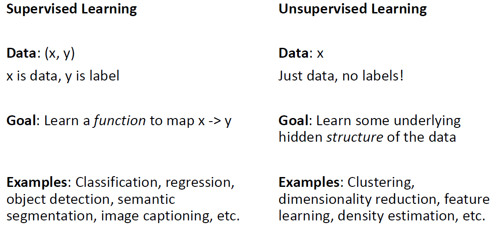

### Discriminative vs Generative Models

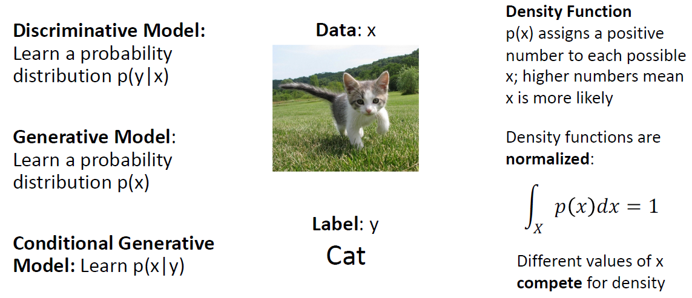

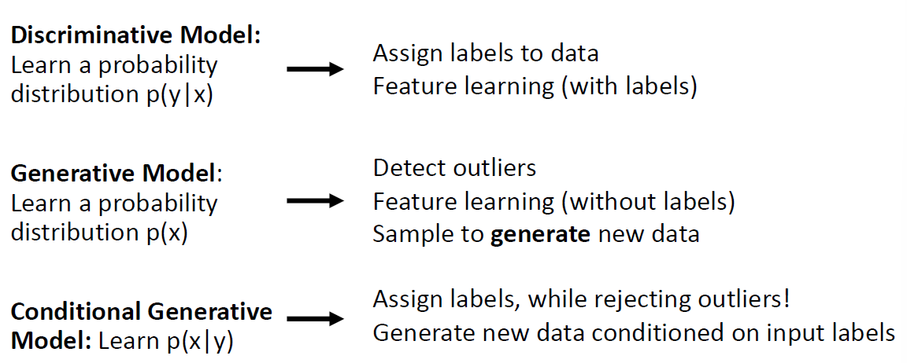

#### Discriminative Model

判别式模型对 $p(y|x)$ 进行建模，形象地说就是对于每个输入image，可能的labels在相互为probability mass “竞争”，但是输入图像之间没有竞争：

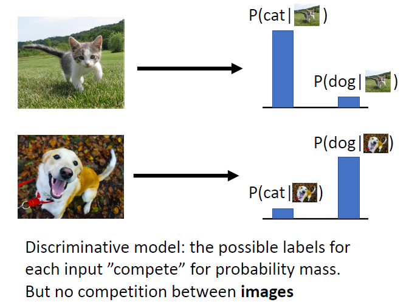

不过即使对于不合理的输入，仍然会给其分配一个可能的label概率密度：

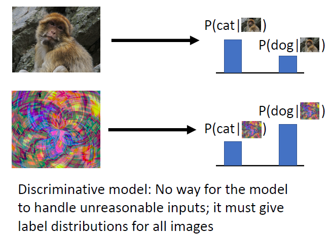

#### Generative Model

生成式模型则是需要学习到图像的分布规律，即是所有可能的image之间在“竞争”概率：

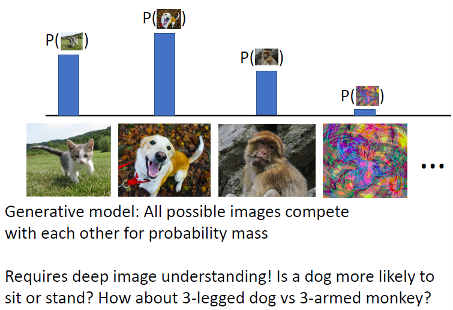

可以通过生成模型对模拟近似得到的分布进行采样：

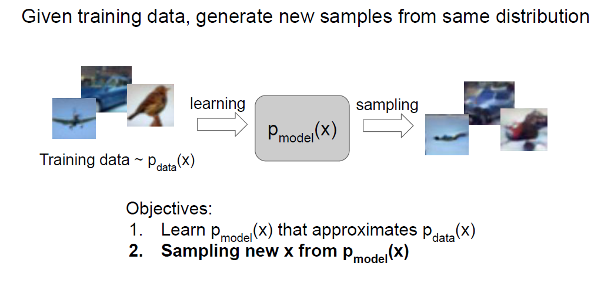

#### Conditional Generative Model

条件生成模型则加了标签限制，即对不同类别的分布分别进行建模：

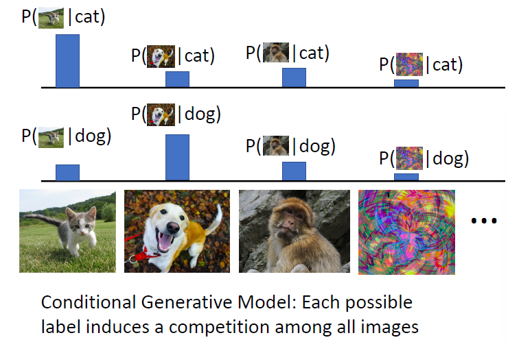

我们可以通过贝叶斯公式构建条件生成模型：

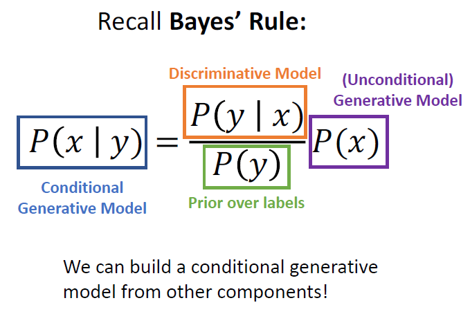

### Taxonomy of Generative Models

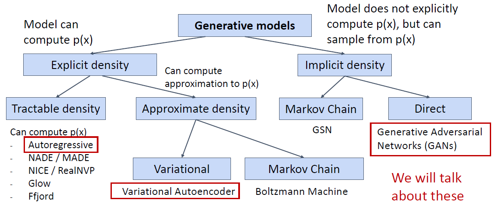

## Autoregressive Models

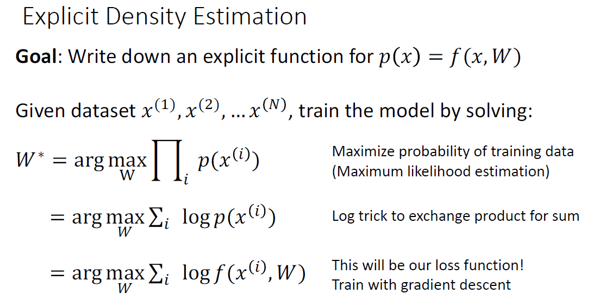

要显式地学习出数据的分布，首先写出显式的概率密度函数，然后使用最大似然估计求解参数，概率密度函数可以很自然地拆成自回归之积的形式，而自回归又很自然的能用RNN建模：

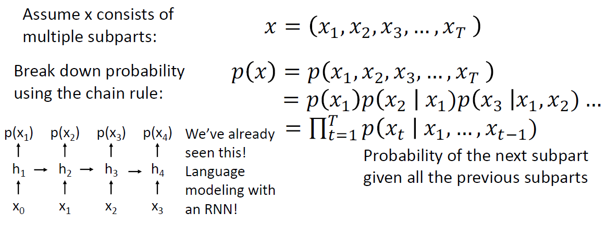

### Pixel RNN

Pixel RNN就是上述自回归模型的一种实现形式，它从图像的左上角开始，每个像素点的预测都受它左上角之前已经见过的像素点的影响：

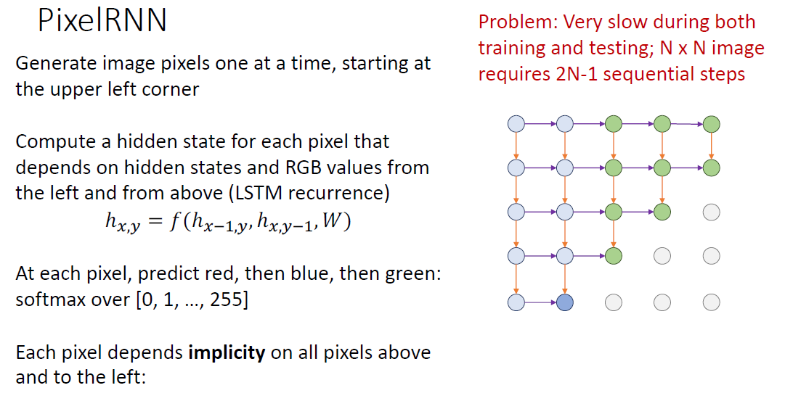

这里有点像监督学习，每个像素点的标签就是图像的真实像素值，由于每个像素点都计算损失，因而训练的目标就类似：
$$
\max \prod_{t=1}^T p(x_t|x_1, \cdots, x_{t-1})
$$
使用RNN最大的问题是训练和测试的时候都无法并行计算，因而速度很慢。

### Pixel CNN

可以使用Mask卷积代替RNN，从而可以在训练时并行计算，不过测试的时候仍然是串行的：

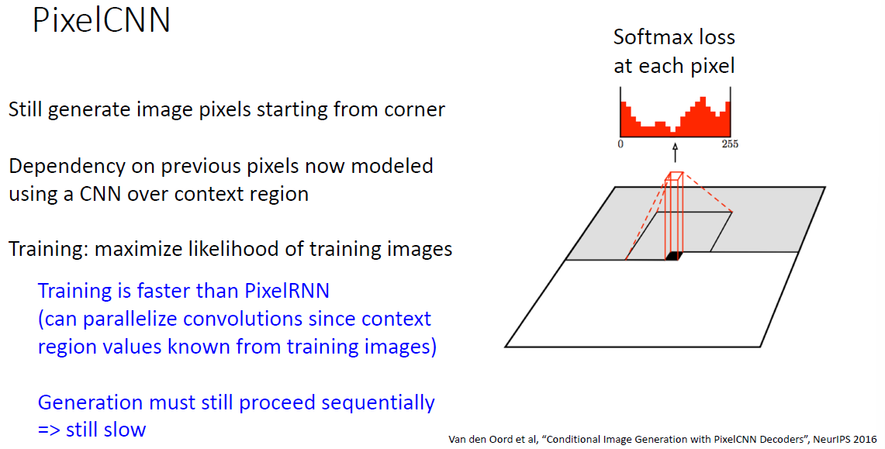

## Variational Autoencoders（未完成）

用神经网络做变分推断，然后原理说复杂不复杂，暂时不想搞懂先空着。

## Generative Adversarial Networks

GAN不直接对 $p(x)$ 进行建模，只希望能够对 $p(x)$ 进行采样：

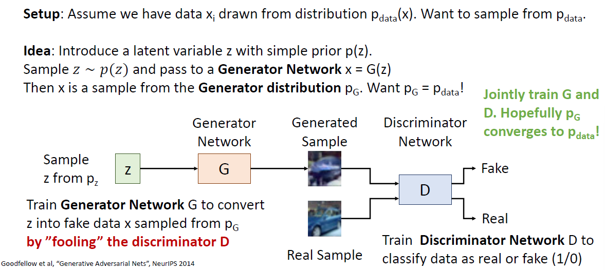

### Training Objective

生成器和判别器的优化目标正好相反（当然生成器不care判别器是否能正确识别真实样本）：

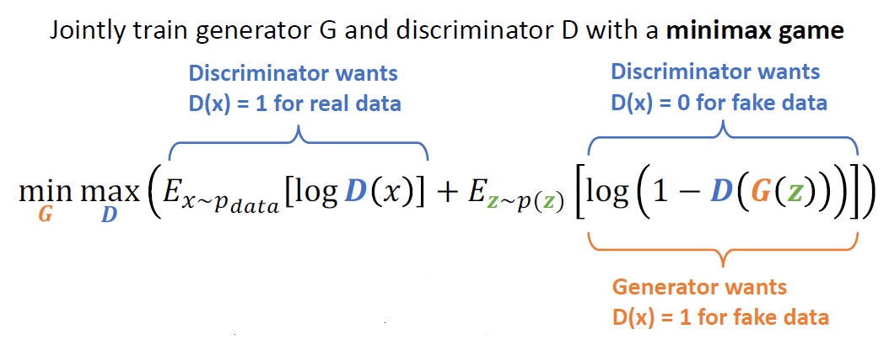

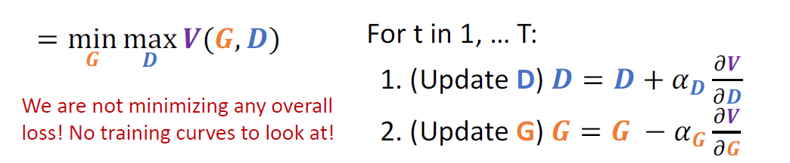

由于是对抗训练，生成器和判别器的loss总是“此消彼长”，我们无法直观地通过训练loss观察训练情况，另外由于生成器初始时效果非常的差，有可能出现梯度消失的情况，因而往往会该别生成器的损失函数形式以在值较小时获得更大的梯度：

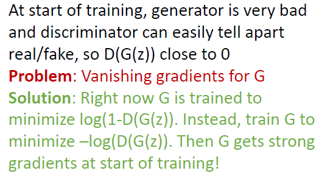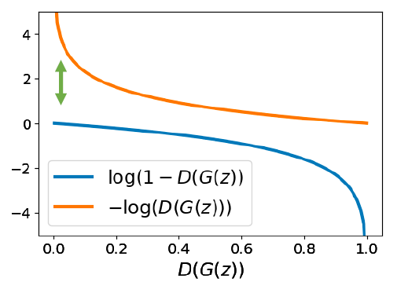

### Optimality

可以证明当 $p_G = p_{data}$ 时我们的优化目标取得全局极小值：

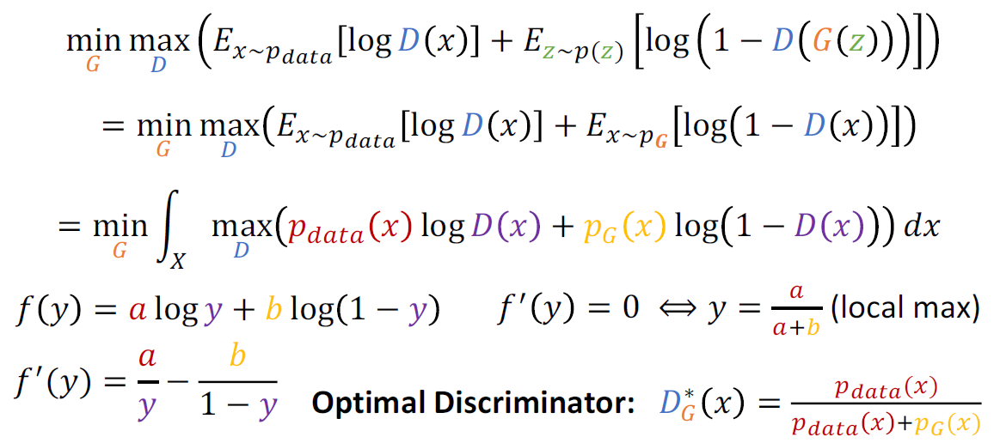

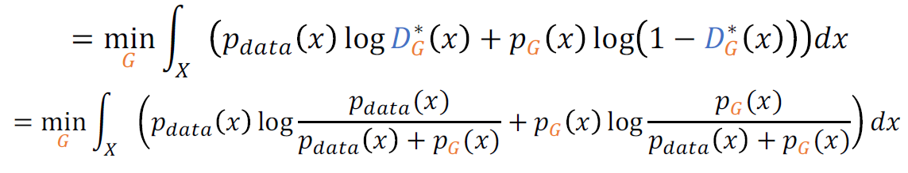

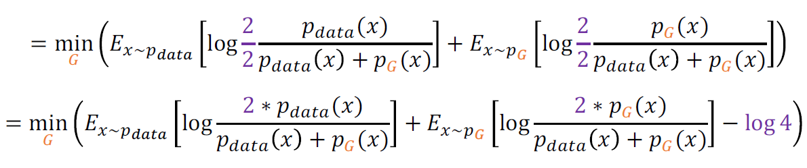

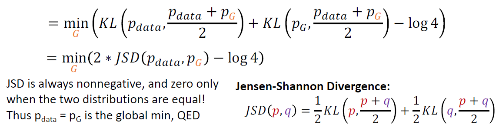

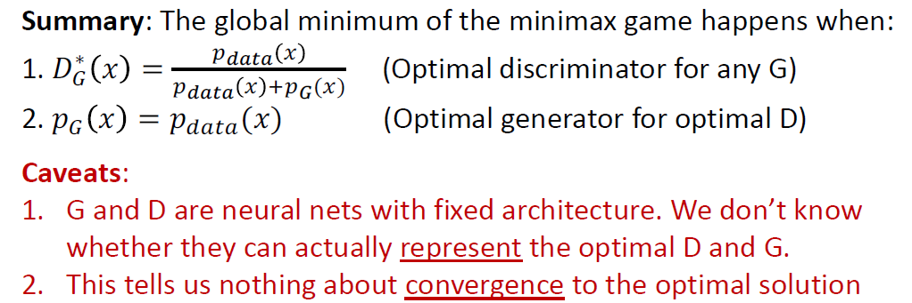

可以看到有非常漂亮的数学证明，不过上面的证明没有解决以下问题：

- 无法保证G和D的假设空间有上述最优解；
- 没有证明上式的敛散性（原文是有写一些关于敛散性证明的）。

