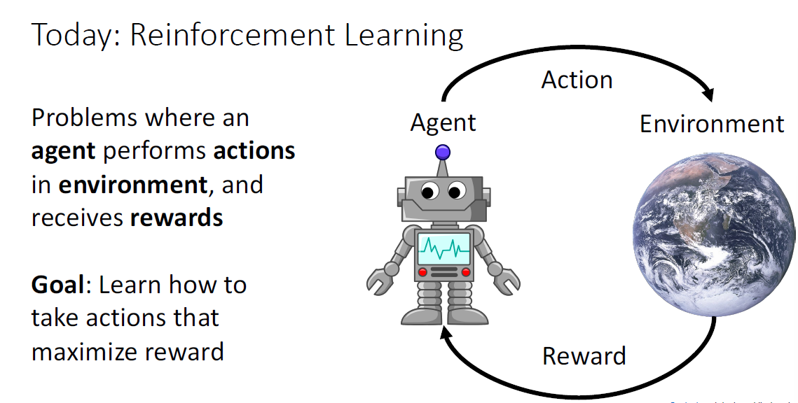
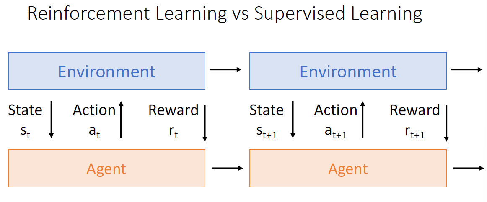
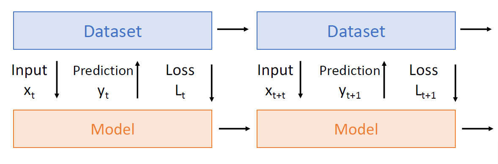
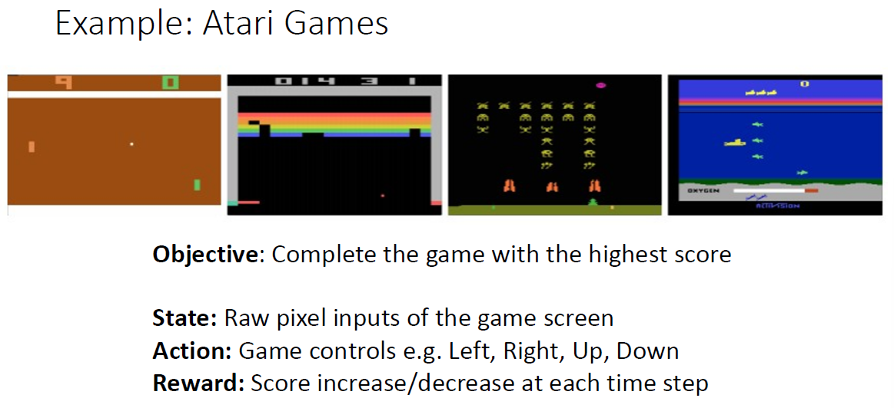
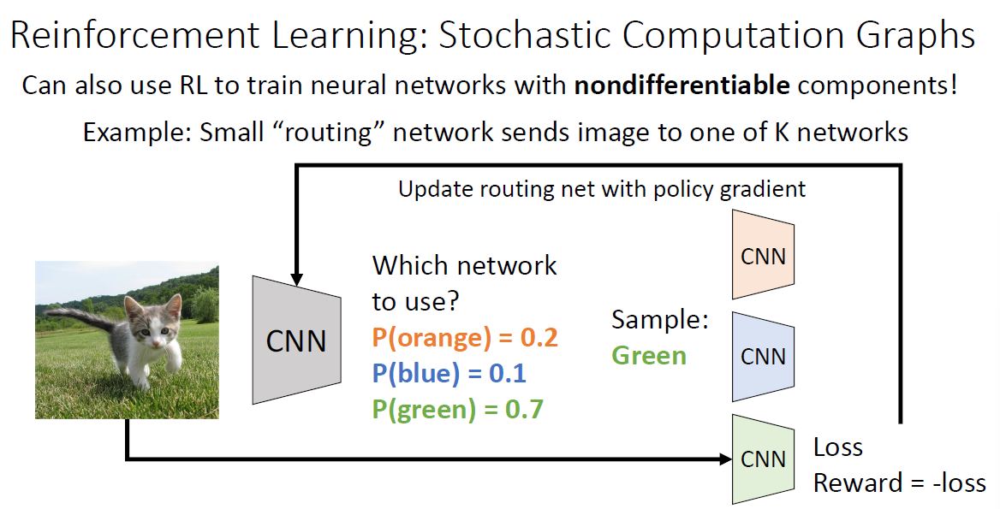
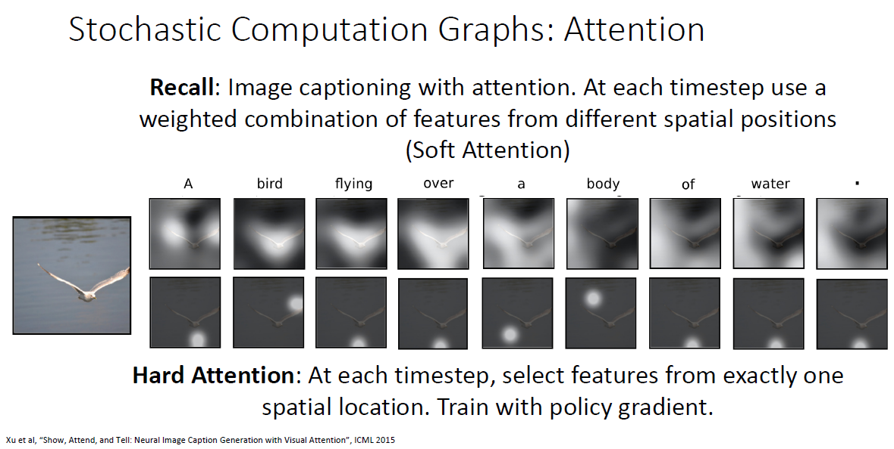

# Reinforcement Learning

## Background

强化学习是和有监督学习、无监督学习不同的另一种机器学习范式，它的学习方式是通过优化自己的行为来尽可能从环境中获得最大奖励：

而且这个学习的过程是持续的，因为当前action也会改变环境，从而环境给出不同的反馈：

其实光凭上面的描述会让人觉得强化学习和监督学习似乎区别不大，这里主要是以下几点区别：

- **Stochasticity: **强化学习的随机性更强，环境噪声更多，体现在它的reward和state转移都可能是随机的（当前的行为影响到了环境从而发生改变，或者环境本身就可能发生变化）；
- **Credit assignment: **监督学习中loss直接依赖于当前prediction，但是强化学习中奖励或者惩罚可能是有时延的，可能当前的行为会对未来某一时刻的reward造成影响；
- **Non-differentiable: **最大的区别是强化学习的行为和反馈都是离散的，因而无法求导，自然也无法使用梯度下降；
- **Non-stationary**：其训练是非稳态的，其实前面也说到了，当前行为可能会影响到环境，从而影响它之后的行为，其实GAN的对抗训练也是这样非稳态的，因而训练难度比较大。

强化学习最直观的应用场景是一些简单的小游戏：

## 训练算法（未完成）

这里Policy Gradients可能比较有用。

## 在CV的应用

可以用强化学习算法来训练一些不可微分的组件：

