# Self-Supervised Learning

## Background

> 参考：https://zhuanlan.zhihu.com/p/108906502

### 自编码器和表征学习

之前我们无监督学习常常利用自动编码器来在没有标签的情况下学习数据的特征：编码器将输入的样本映射到低维隐藏层向量，解码器再将该隐层向量映射回样本空间，从而可以利用训练好的自编码器进行降维，使用降维后的隐层向量可以使聚类等下游任务更简单高效。

对于如何学习隐层向量的研究，可以称为**表征学习（Representation learning）**，而自编码器这种简单的编码-解码结构仍然存在很多问题，基于像素的重构损失通常假设各个像素之间是相互独立，从而降低了它对像素间相关性的建模能力，过分关注像素级别的细节可能会使得模型忽略了更为重要的语义特征。

我们希望网络不仅仅简单地只是将高维向量映射到低维，而希望学习到包含更多**语义级别特征**的向量，从而更好地帮助下游任务，而自监督学习最主要的目的就是学习到更丰富的语义表征。

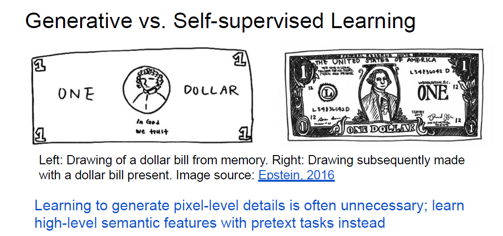

### 基本定义

自监督学习主要是利用**辅助任务（pretext task）**从大规模的无监督数据中挖掘自身的监督信息，通过构造的监督信息对网络进行训练，从而可以学习到对下游任务有价值的表征。

所以对于自监督学习来说，存在三个挑战：

- 对于大量的无标签数据，如何进行表征学习？
- 从数据的本身出发，如何设计有效的辅助任务 pretext？
- 对于自监督学习到的表征，如何来评测它的有效性？

对于第三点，评测自监督学习的能力，主要是通过 Pretrain - Fintune 的模式。 我们首先回顾下监督学习中的 Pretrain - Finetune 流程：我们首先从大量的**有标签数据**上进行训练，得到预训练的模型，然后对于新的下游任务（Downstream task），我们将学习到的参数进行迁移，在新的有标签任务上进行「微调」，从而得到一个能适应新任务的网络。而自监督的 Pretrain -Finetune 流程：首先从大量的**无标签数据**中通过 pretext task 来训练网络，得到预训练的模型，然后对于新的下游任务，和监督学习一样，迁移学习到的参数后微调即可。所以自监督学习的能力主要由下游任务的性能来体现。

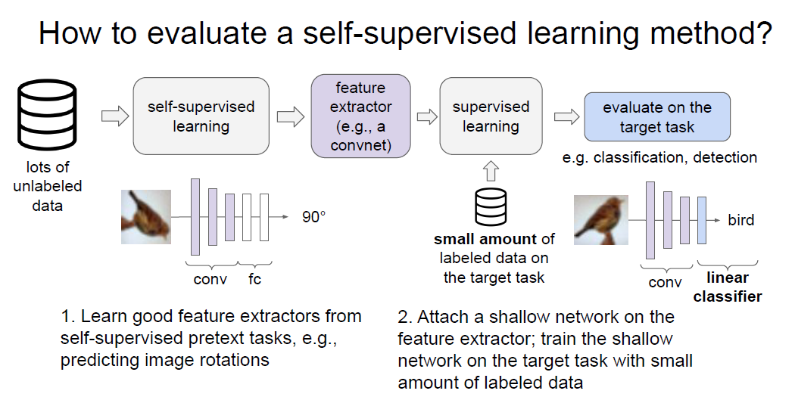

### 主要方法

自监督学习的方法主要可以分为基于上下文（Context based）、基于时序（Temporal based）、基于对比（Contrastive based）三类。

#### 基于上下文（Context based）

基于数据本身的上下文信息，我们其实可以构造很多任务，比如在 NLP 领域中最重要的算法 Word2vec 。 Word2vec 主要是利用语句的顺序，例如 CBOW 通过前后的词来预测中间的词，而 Skip-Gram 通过中间的词来预测前后的词。

此外在图像中同样也是有很多应用，即利用旋转、裁剪、色彩等设计pretext task，详见后面第二节。

#### 基于时序（Temporal based）

基于上下文的方法主要是基于单个样本本身的信息，而不同样本间其实也可能有关联信息，比如视频的不同图像帧之间存在的时序信息，下面我们来介绍利用时序约束进行自监督学习的方法。

最简单的一种思想是基于**相邻帧之间的相似性**，简单来说就是认为视频中相邻帧的特征是相似的而相隔较远的视频帧是不相似的，我们可以由此构建相似和不相似的样本即可以进行自监督约束：

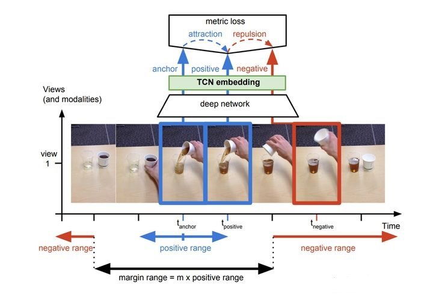

另外，对于同一个物体的拍摄是可能存在**多个视角（multi-view）**，对于多个视角中的同一帧，可以认为特征是相似的，对于不同帧可以认为是不相似的：

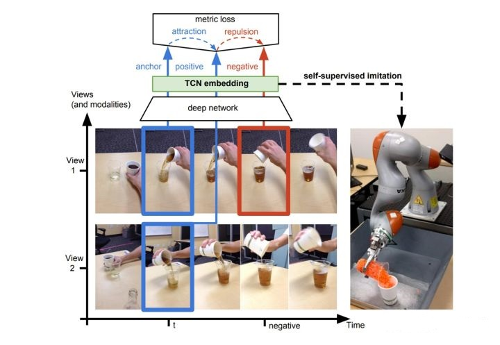

还有一种想法是来自 [@Xiaolong Wang](https://www.zhihu.com/people/20416a0babc2f6d9b3932335b1a99a76) 大佬在 ICCV 2015 发表的**基于无监督追踪的方法**，首先在大量的无标签视频中进行无监督追踪，获取大量的物体追踪框。那么对于一个物体追踪框在不同帧的特征应该是相似的，而对于不同物体的追踪框中的特征应该是不相似的：

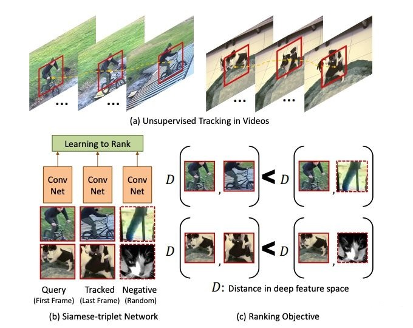

除了基于特征相似性外，**视频的先后顺序**也是一种自监督信息。比如ECCV 2016, Misra, I. 等人提出基于顺序约束的方法，可以从视频中采样出正确的视频序列和不正确的视频序列，构造成正负样本对然后进行训练。简而言之，就是设计一个模型，来判断当前的视频序列是否是正确的顺序：

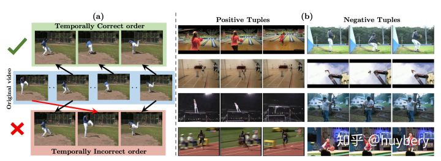

基于顺序的约束还被应用了到了对话系统中，ACL 2019 提出的自监督对话学习就是基于这种思想。这篇文章主要是想解决对话系统中生成的话术连贯性的问题，期待机器生成的回复和人类交谈一样是符合之前说话的风格、习惯等等。从大量的历史预料中挖掘出顺序的序列（positive）和乱序的序列（negative），通过模型来预测是否符合正确的顺序来进行训练。训练完成后就拥有了一个可以判断连贯性的模型，从而可以嵌入到对话系统中，最后利用对抗训练的方式生成更加连贯的话术。

而 BERT 的另一种训练方式，Next Sentence Prediction 也可以看作是基于顺序的约束，通过构造大量的上下文样本，目的是让模型理解两个句子之间的联系。这一任务的训练语料可以从语料库中抽取句子对包括两个句子A和B来进行生成，其中50%的概率B是A的下一个句子，50%的概率B是语料中的一个随机句子。该任务预测B是否是A的下一句。

#### 基于对比（Contrastive based）

第三类自监督学习的方法是基于对比约束，它通过学习对两个事物的相似或不相似进行编码来构建表征，这类方法的性能目前来说是非常强的，从最近的热度就可以看出，很多大牛的精力都放在这个方向上面。

其实我们上一小节所介绍的基于时序的方法已经涉及到了这种基于对比的约束，通过构建正样本（positive）和负样本（negative），然后度量正负样本的距离来实现自监督学习。核心思想样本和正样本之间的相似度远远大于样本和负样本之间的相似度，第三小节将详细介绍这类方法。

## Pretext tasks from image transformations

这一节介绍前面说过的基于上下文（Context based）的方法在图像中的应用。

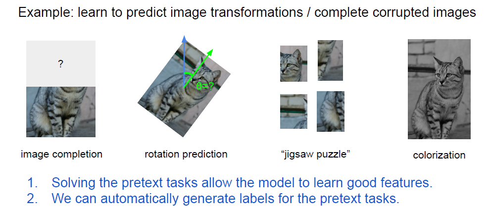

### Predict rotations

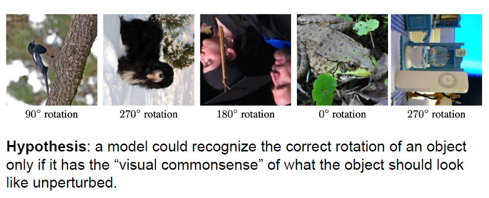

利用将样本旋转不同的角度可以构造一个4分类的pretext task：

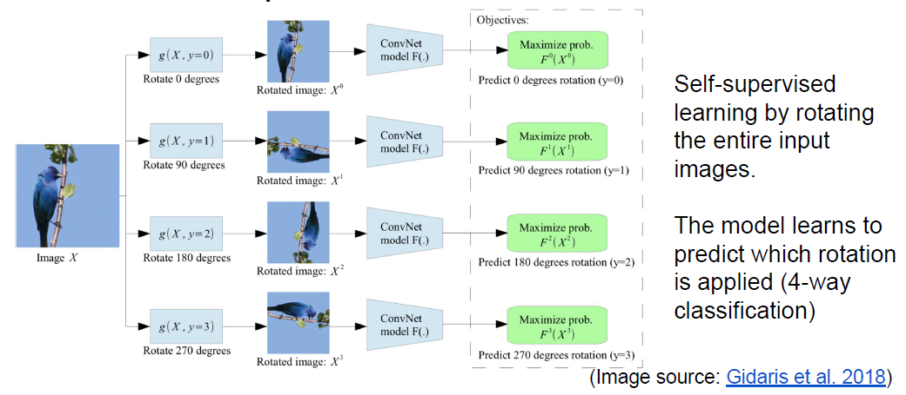

这也可以理解成是在从**数据增广**的角度做自监督，这也启示我们数据增广方法不止可以用在提高模型泛化能力上，也可以用在设计自监督pretext task上。

### Predict relative patch locations (jigsaw puzzles)

我们可以将一张图分成 9 个部分，然后通过预测这几个部分的相对位置来产生损失。比如我们输入这张图中的小猫的眼睛和右耳朵，期待让模型学习到猫的右耳朵是在脸部的右上方的，如果模型能很好的完成这个任务，那么我们就可以认为模型学习到的表征是具有语义信息的。

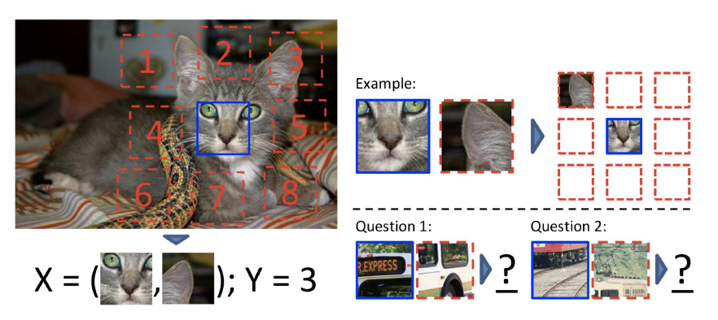

我们还可以拓展这种拼图的方式，首先我们依然将图片分为 9 块，我们预先定义好 64 种排序方式。模型输入任意一种被打乱的序列，期待能够学习到这种序列的顺序属于哪个类，和上个工作相比，这个模型需要学习到更多的相对位置信息。这个工作带来的启发就是使用更强的监督信息，或者说**辅助任务越难，最后的性能越好**。

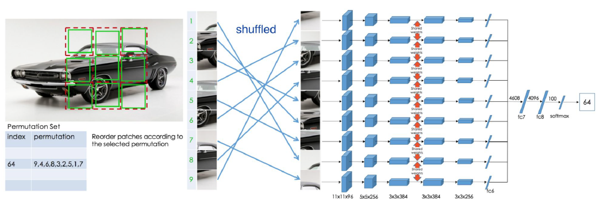

### Predict missing pixels (inpainting)

除了上面拼图的模式，还有一种方式是抠图。想法其实也很简单粗暴，就是我们随机的将图片中的一部分删掉，然后利用剩余的部分来预测扣掉的部分，只有模型真正读懂了这张图所代表的含义，才能有效的进行补全。这个工作表明自监督学习任务不仅仅可以做表征学习，还能同时完成一些神奇的任务。

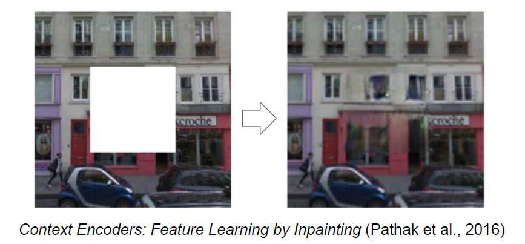

而对于这种抠图的方式，其实和 nlp 中的 BERT 的 MASK LM 训练方式有异曲同工之妙，BERT 在训练时也可以是看做随机扣掉一些词，然后来预测扣掉的词，从而让模型读懂句子。

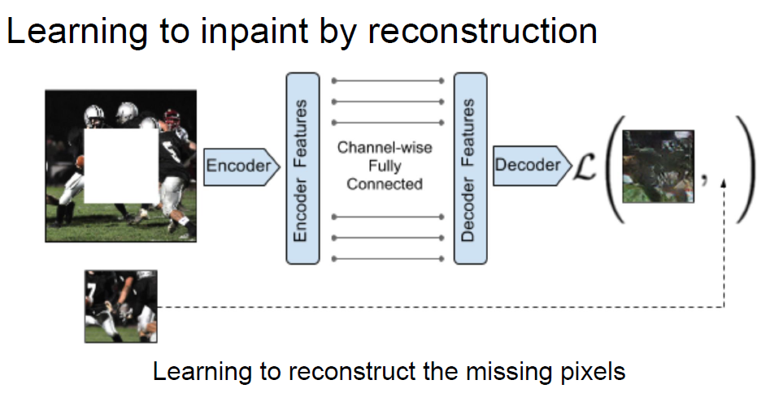

该方法在训练时不仅考虑了重构误差，还借鉴GAN考虑了对抗分类误差，即使用判别器来分别真实和补全图像以获得更好的生成效果。

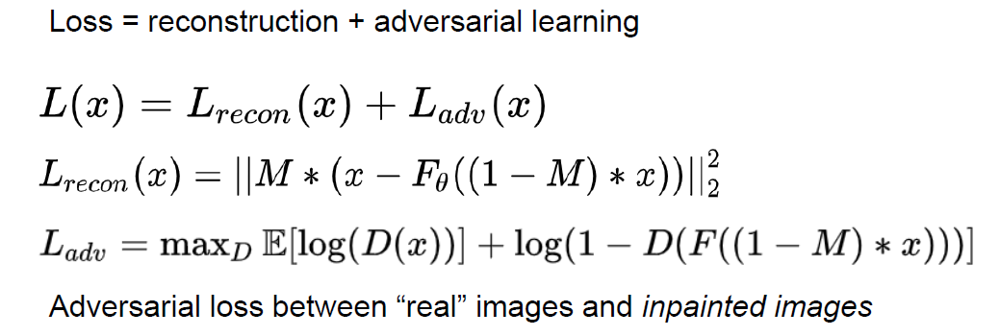

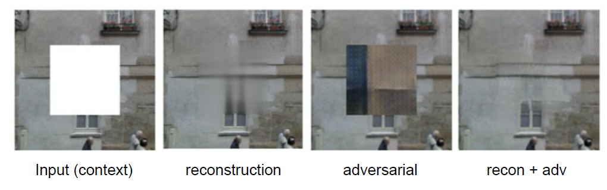

### Image coloring

还有一种思路是通过图片的颜色信息，比如给模型输入图像的灰度图，来预测图片的色彩。只有模型可以理解图片中的语义信息才能得知哪些部分应该上怎样的颜色，比如天空是蓝色的，草地是绿色的，只有模型从海量的数据中学习到了这些语义概念，才能得知物体的具体颜色信息。同时这个模型在训练结束后就可以做这种图片上色的任务：

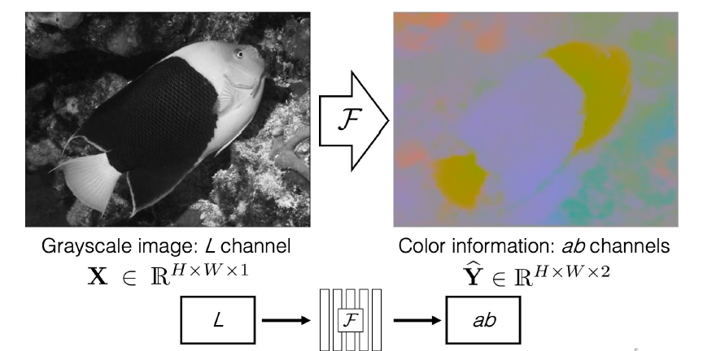

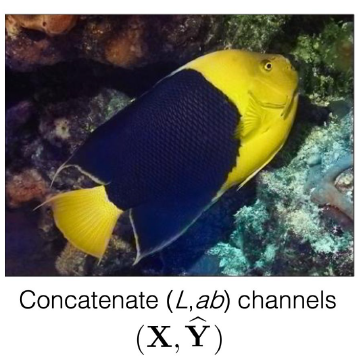

这种基于预测颜色的生成模型带给了人们新的启发，其实这种灰度图和 ab 域的信息我们可以当做是一张图片的**解耦表达**，所以只要是解耦的特征，我们都可以通过这种方式互相监督的学习表征，著名的 Split-Brain Autoencoders 就在做这样一件事情。对于原始数据，首先分成两部分，然后通过一部分的信息来预测另一部分，最后再合成完成的数据。和传统编码器不同的是，这种预测的方式可以促使模型真正读懂数据的语义信息才能够实现，所以相当于间接地约束编码器不单单靠 pixel-wise 层面来训练，而要同时考虑更多的语义信息。

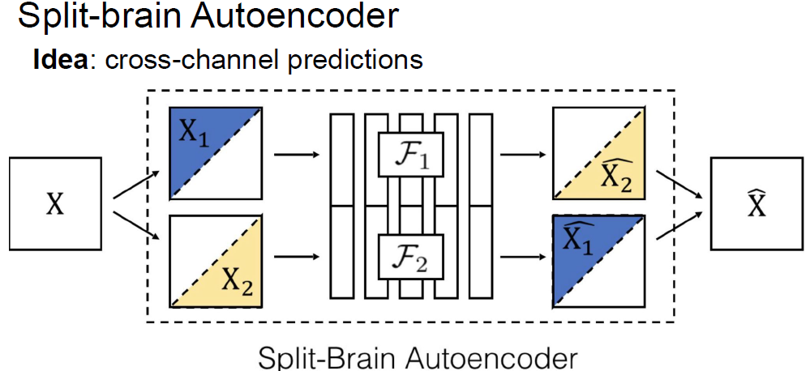

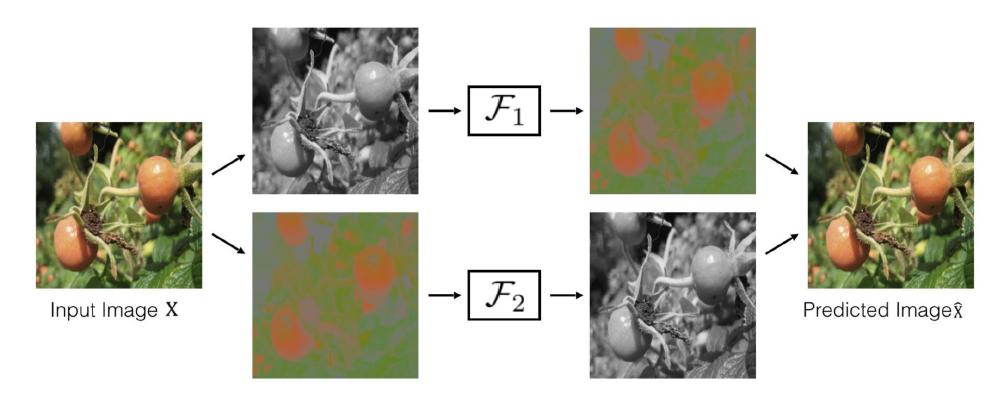

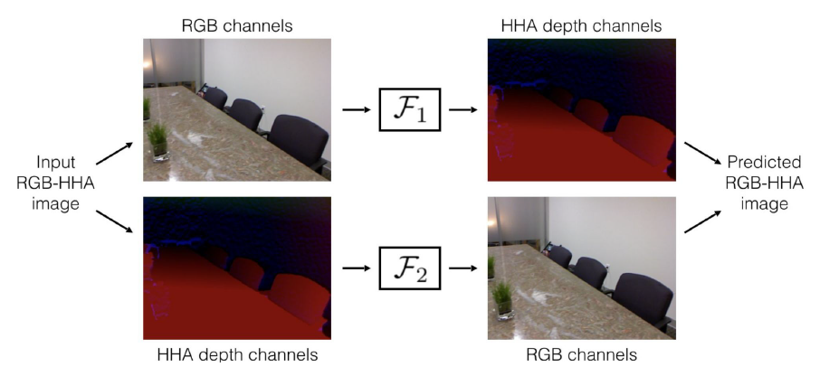

### Video coloring

给视频着色其实也可以看作是基于时序的方式，其基本方式就是给定有颜色信息的参考frame，让模型去预测其他帧的frame：

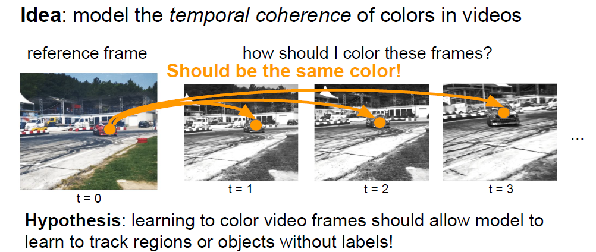

另外可以通过巧妙的设计获得更直观的特征比如attention map：

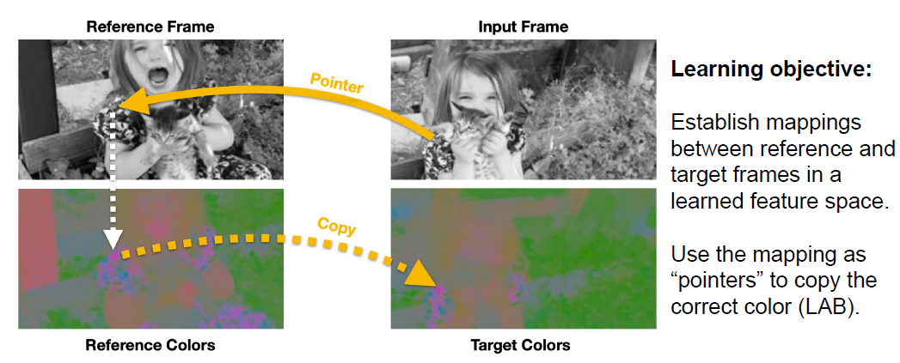

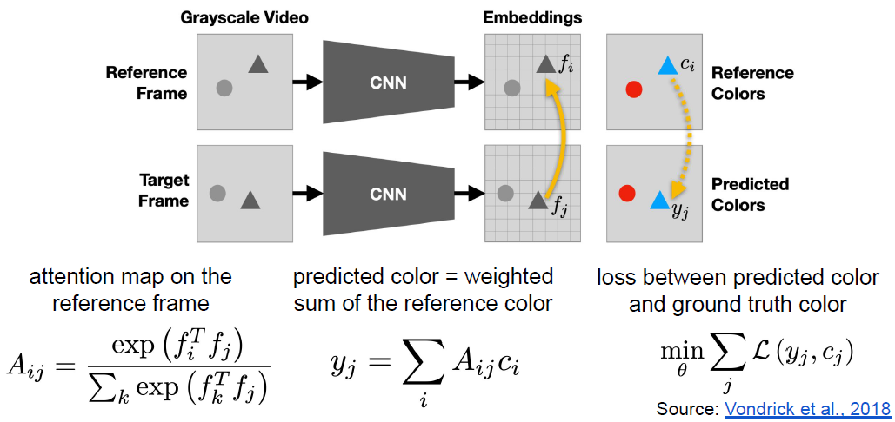

我们可以直接利用这些更直观的特征去完成一些下游任务：

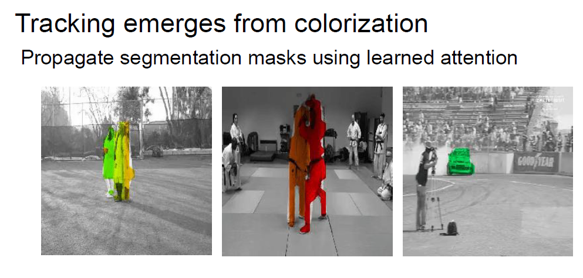

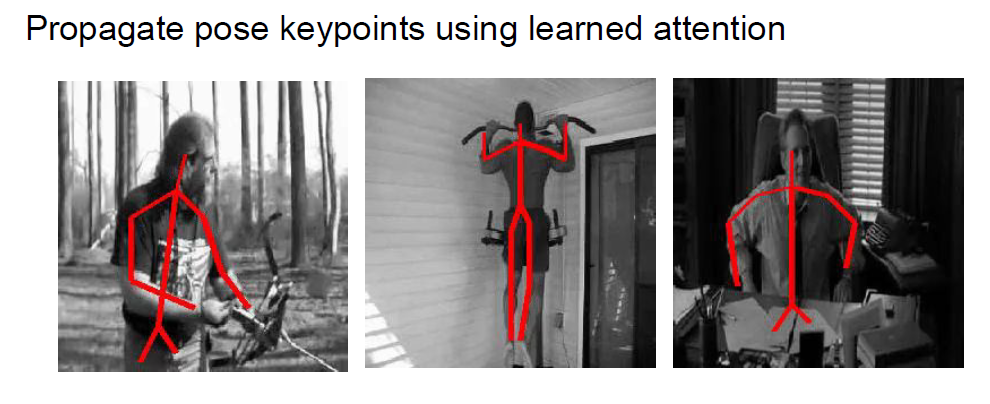

### Summary

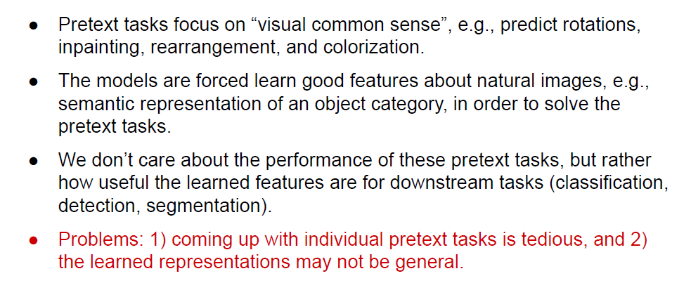

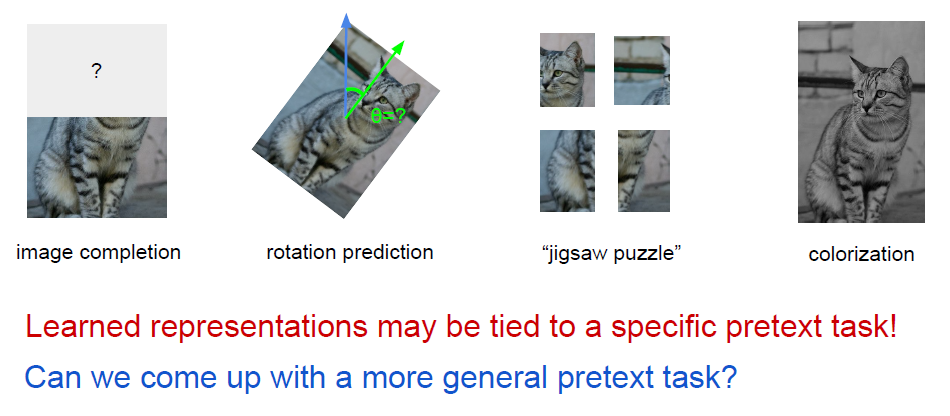

## Contrastive representation learning

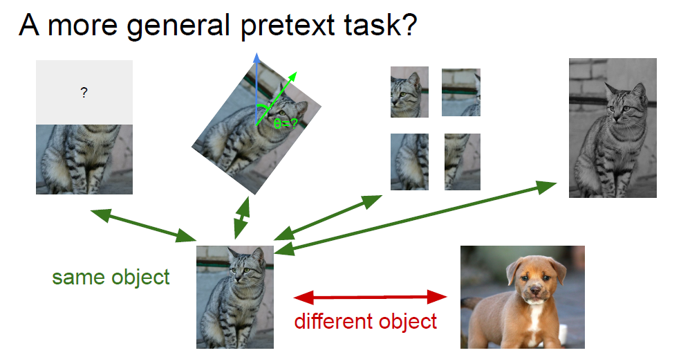

## Frontier

### Contrastive Language Image Pre-training (CLIP)

