# Image Classification with Linear Classifier

## Background of Image Classification

图像分类是计算机视觉中的核心任务，预先给定一些可能的类别，对于输入图像，我们需要判断其属于哪一类：

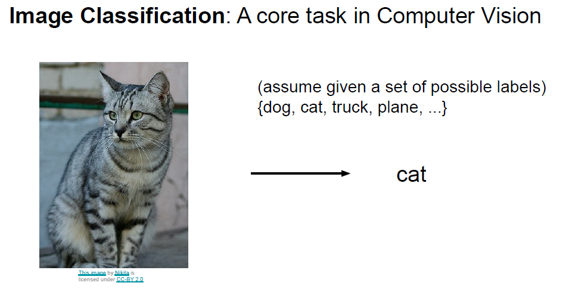

首先我们需要认识到图像它就是像素点的集合：

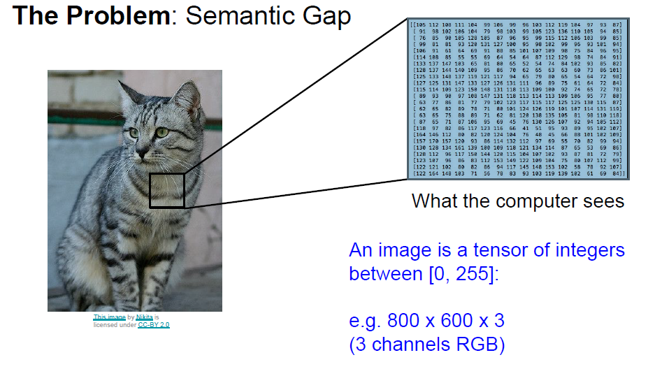

因而从计算机的角度理解图像的语义就和人理解图像有所不同，因而需要面临许多挑战。

- **Viewpoint varation**: 和人眼察觉到的有所不同，稍微变一个拍摄角度，肉眼看上去可能没有什么不同，但是图像的像素可能发生了很大的变化（比如向右平移一位）；

  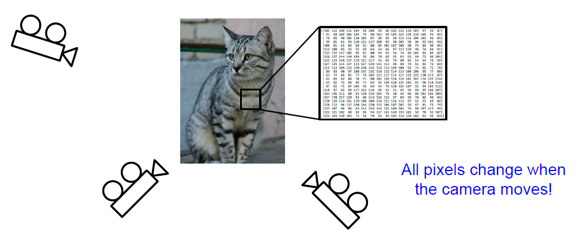

- **Illumination**：自然图像往往有着不同的光照条件，这对于像素值的影响也很大；

  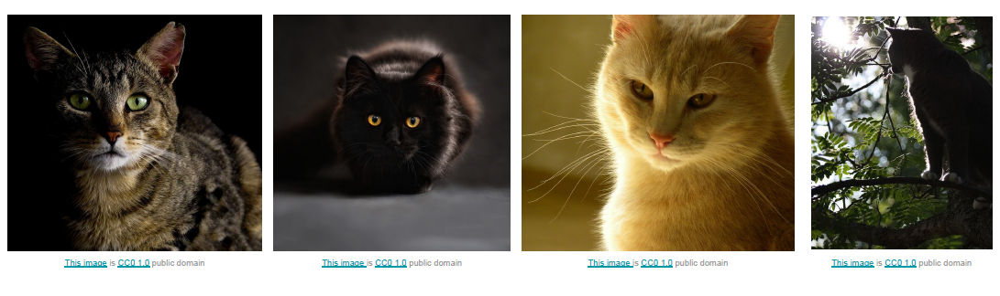

- **Background Clutter**：图像分类的本意是识别出图像中感兴趣的对象（例如猫），但是不可避免地会受图像背景杂物的影响；

  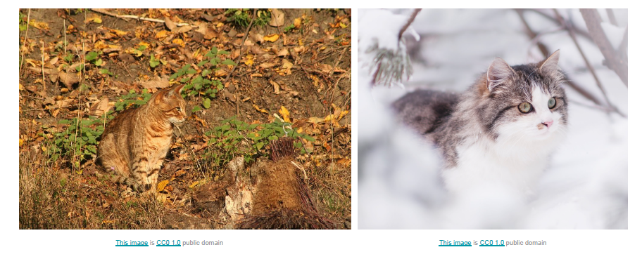

- **Oclusion**：不仅是背景，有时候我们的识别对象可能会被其他物体遮蔽；

  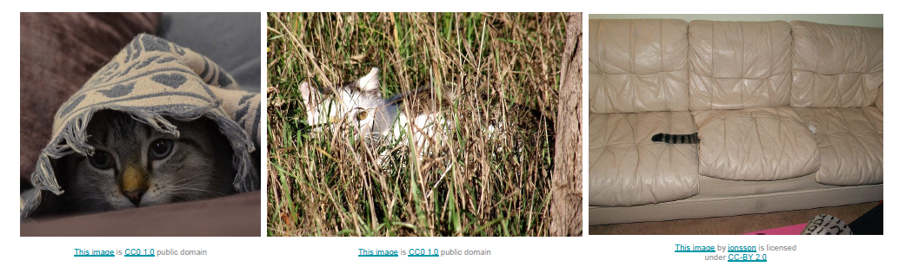

- **Deformation**：识别对象比如猫的姿势可能很奇怪；

  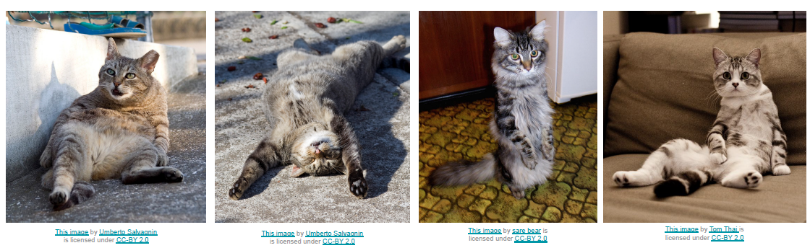

- **Intraclass variation**：要识别的对象可能有很多品种，外观各异；

  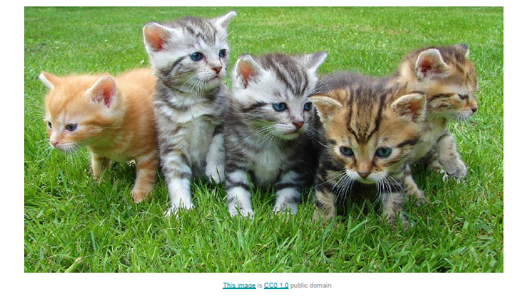

- **Context**：识别对象的外观可能受环境影响。

  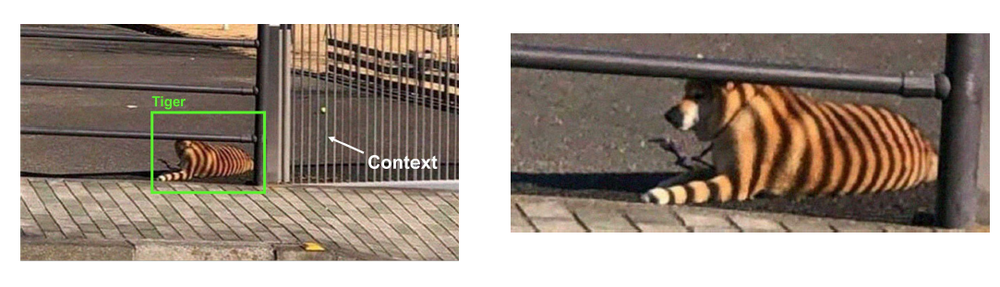

上面很多挑战对肉眼识别同样存在，但不能称为我们不试图克服他们的理由，我们希望能开发出达到甚至强于人类水平的分类器。

考虑到上述特点，通过**硬编码（hard-code）**的方式进行图像分类显然是难以完成的，目前最流行的是基于机器学习的**数据驱动（Data-Driven）**式方法：

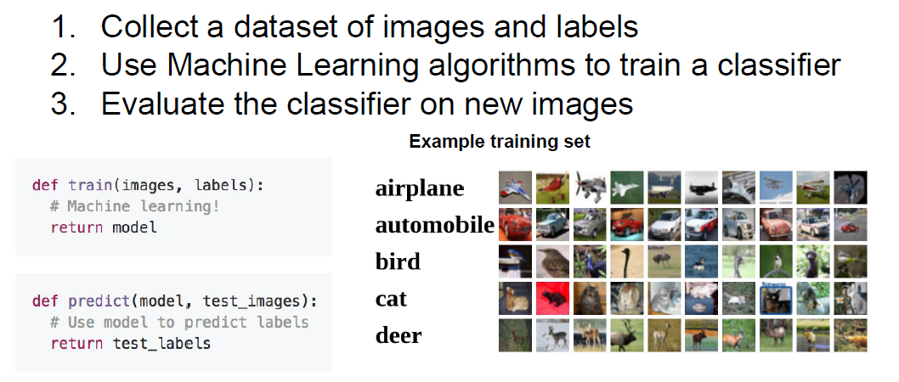

本节将会介绍最简单的K近邻分类器和几个线性分类器。

## Nearest Neighbor Classifier

### 基本思想

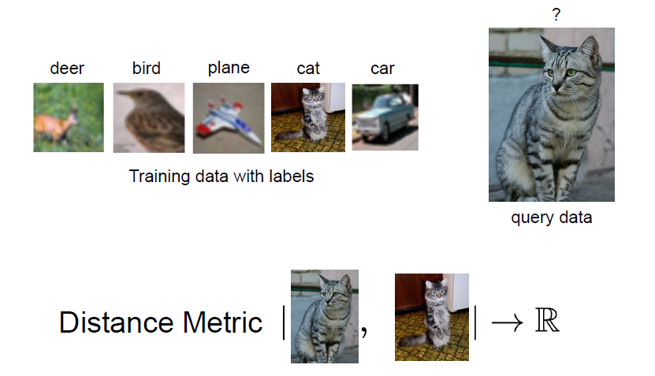

K近邻算法的思想非常朴素：

- 训练时直接将训练集保存下来不作任何计算；
- 预测找与测试样本**最相似**的K个样本，根据他们的类别投票得到预测结果。

该算法训练和测试流程的时间复杂度分别是 $O(1)$ 和 $O(N)$，这显然不是一个理想的算法，我们通常希望预测（或者说推理）时花的时间尽可能少，而训练时间稍微长一点是可以容忍的。

> 有许多方法可以实现快速的近似K近邻算法，可以参考：https://github.com/facebookresearch/faiss。

### K值对结果的影响

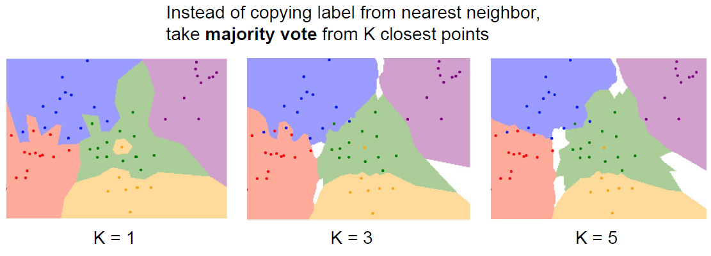

白色区域应该是投票打平无法判断的区域，直观上看，K值越大，受训练数据中噪声点的影响就越小。

### 距离度量

该算法另一个关键部分是**如何度量样本间的相似性**：

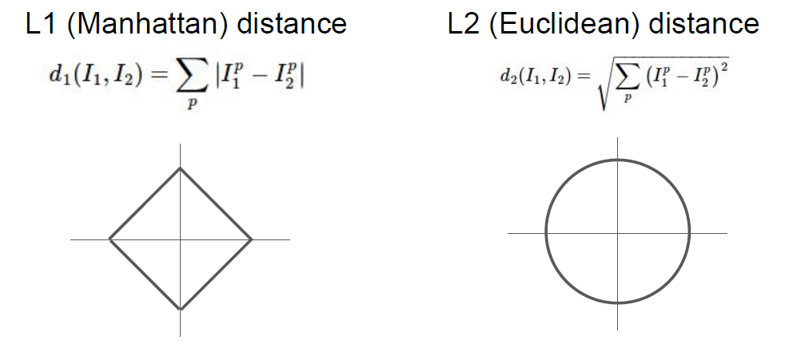

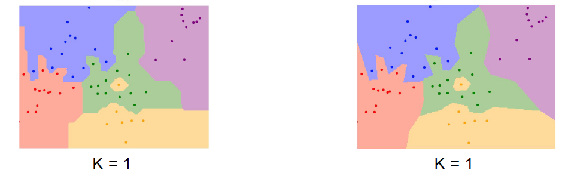

主要区别体现在分类边界上。

### 超参数的选择

上面的K值和距离度量都可以认为是该算法的超参数，超参数即算法本身的设置，可以使用交叉验证选择：

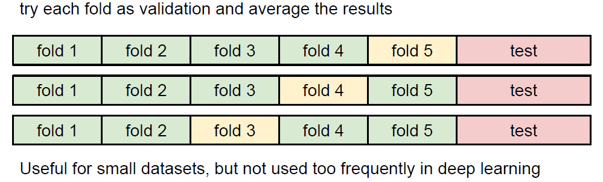

### 缺点和局限

基于像素距离的K近邻算法是无法被使用的，一个问题是两个很相似的图像的像素距离受多种因素影响可能会很大，与相似的图片距离可能和不相似的图片差不多：

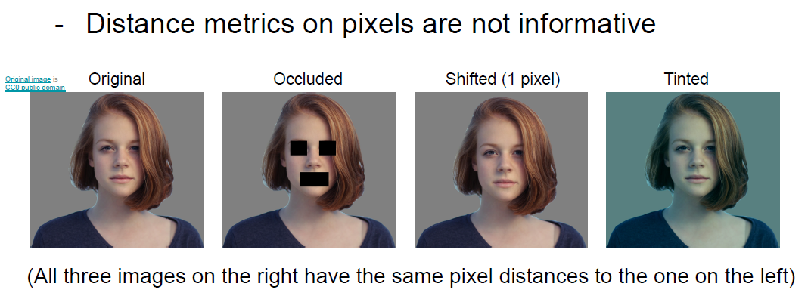

另一个问题直接对图像计算距离会碰到维度灾难：

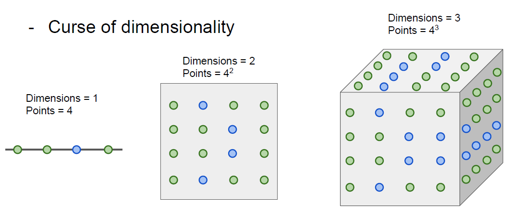

## Linear Classifier

上一节提到的K近邻分类器可以看作是一种非参数（No-Parametric）化的模型，而线性分类器是一种参数化的方法，原理很简单，就是把图像拉平了然后做一个仿射变换：

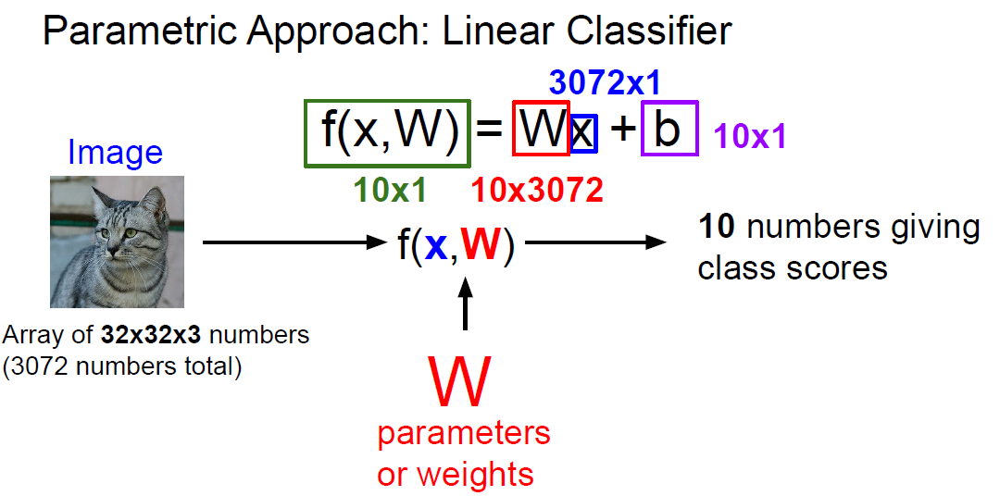

### Interpreting a Linear Classifier

#### Visual Viewpoint

可以把线性分类器的权重 $W$ 看作是一种 “匹配模板”，十类的每一类都对应于一个模板，下图可视化了各类的模板权重：

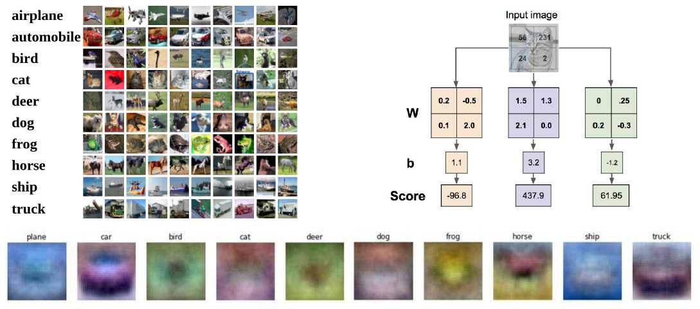

从各个模板可以看出从模板的角度看线性分类器有很强的可解释性，但是同时也反映出线性分类器的一个问题，即**只有一个模板可能考虑不到识别对象的多样性**，比如car的权重近似于是一辆红色黑窗的车子，但是显然不是所有的车子都是这个样子的，只是说训练集的数据中的车子更多是这样的，再看horse的权重图，下半部分是草坪，但是有马的图片背景未必就是草坪。

#### Geometric Viewpoint

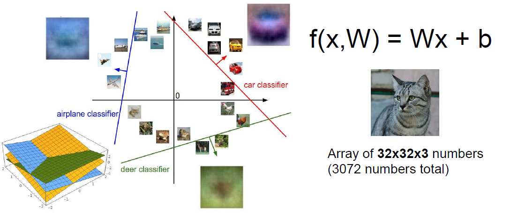

从几何角度，对每一个类别的权重可以看做一个超平面将样本分为“属于该类”和“不属于该类”两类，有点类似于软间隔支持向量机。

### Hard cases for a linear classifier

线性分类器会遇到一个不可避免的问题就是样本空间线性不可分：

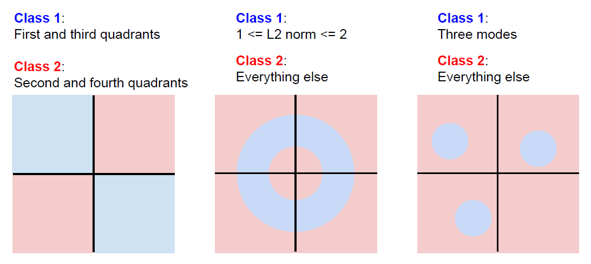

### Choose a good $W$

显然 $W$ 的求解是一个优化问题，首先我们需要定义损失函数：

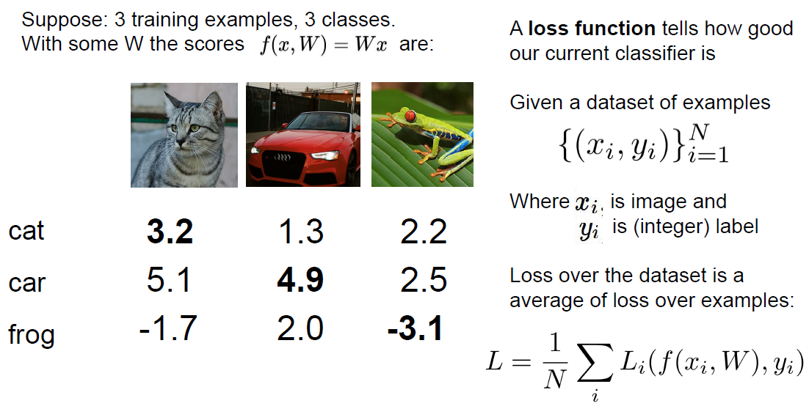

然后使用一些优化算法求解比如梯度下降法。

#### Multiclass SVM loss

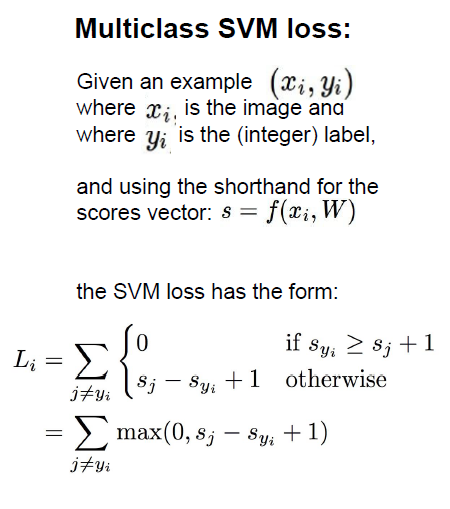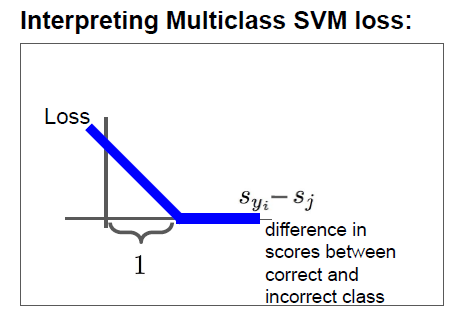

这里提到的Multiclass SVM loss由软间隔SVM的hinge loss得来，即对于标签 $y_i$ 以外的类别 $j$ ，如果该类别的分数 $s_j$ 超过了 $s_{y_i} - 1$，那么我们就要计算对应价值的损失。

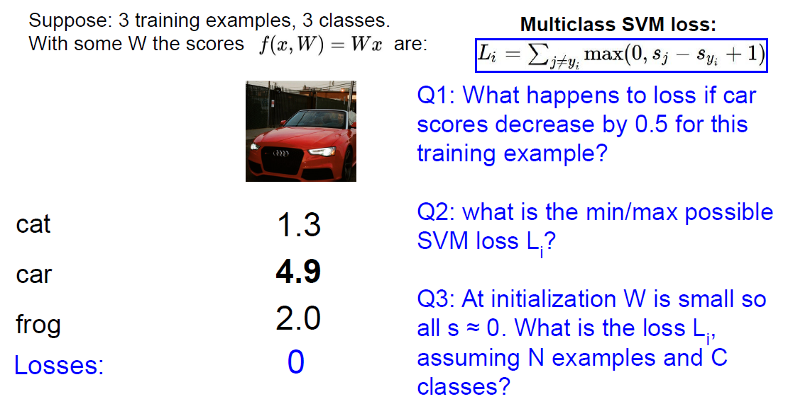

- **A1**：这个损失函数的特点是当分数只有细微波动的时候损失值是不会变化的，比如上面的car的分数从4.9变成4.4不会使loss改变；
- **A2**：显然最小的loss可以为0，而由于hinge函数左边是线性函数，loss最大值为正无穷大；
- **A3**：如果初始权值都近似为0，即各类别得到的分数都接近，这就是hinge函数中的常数1发挥作用的时候了，此时单个样本的loss接近于 $C-1$ ，$N$ 个样本的损失是 $N(C-1)$；

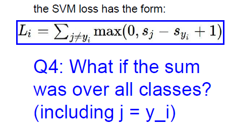

- **A4**：显然此时单个样本的loss会增加1（不考虑系数 $C$ 的情况），但显然加这一个对结果并不会有任何影响，只是说loss的最小值将不为0，也就是说即使全部分类正确loss也不为0，这不太符合直觉。

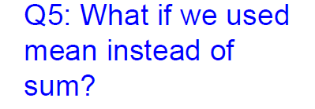

- **A5**：类似A4，结果不会发生任何改变，我们并不在乎loss函数的绝对数值。

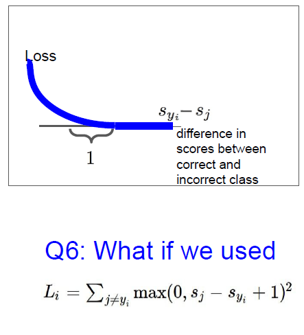

- **A6**：使用平方损失则改变了我们对一个错误的重视程度，从函数的斜率就可以看出，当错误值比较低的时候效率小于1，相对于原先的线性函数我们倾向于容忍错误，而当错的比较离谱的时候斜率大于1甚至会接近无穷大，这相当于告诉优化算法你必须赶紧回到正轨上，在实际任务中我们需要根据任务特点来设计损失函数。

### Softmax classifier

相比于上一小节讲到的使用SVM loss优化的线性分类器，更常用的一个线性分类器是Softmax classifier，也叫**多元逻辑回归（Multinomial Logistic Regression）**。

类似于逻辑回归，其使用softmax函数将线性分类器的输出映射到[0, 1]，即将数值（logits)变为概率(probabilities）：

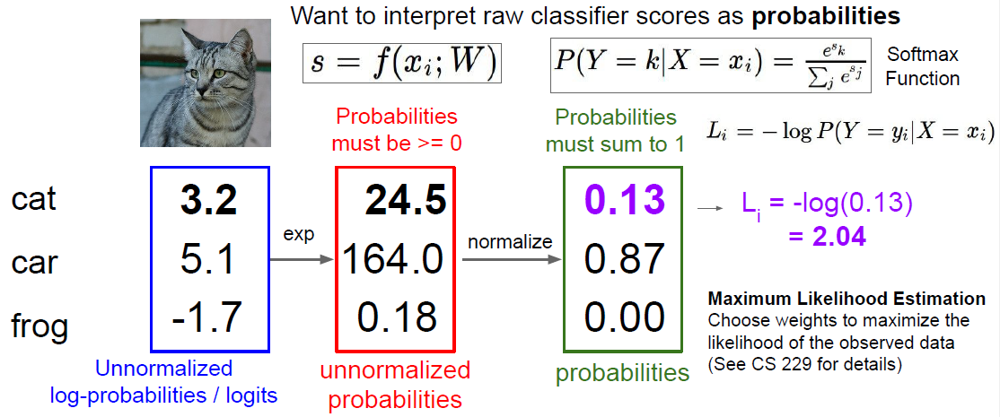

另外我们使用交叉熵（cross entropy）函数作为损失函数，可以从最大似然估计的角度理解，也可以从KL散度的角度理解，即度量两个分布的相似程度：

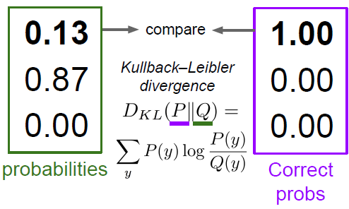

交叉熵 $CE(P,Q)$等于信息熵 $H(P)$ 和KL散度 $D_{KL}(P\|Q)$ 之和：
$$
CE(P, Q) = H(P) + D_{KL}(P\|Q)
$$
$H(P)$ 只和训练集标签有关，显然和直接用KL散度从结果上没有区别，不过用交叉熵减少了计算量，通常会将softmax和log一起算以避免指数上溢和

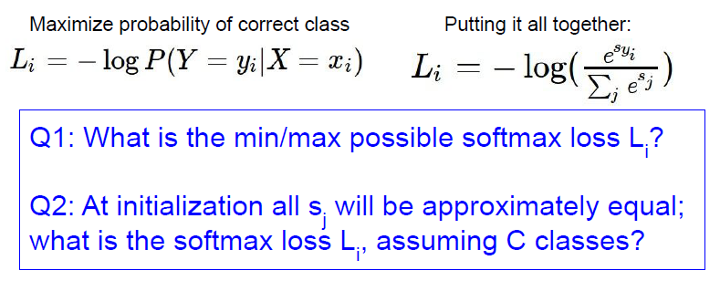

- **A1**：$[0, +\infin)$，不过上界和下届都很难接近；
- **A2**：所有的分数近似相等，那么预测结果就是 $C$ 维向量 $[\frac{1}{3}, \frac{1}{3}, \frac{1}{3}, \cdots]$ ，loss就是他和独热向量的交叉熵 $-\log(1/C) = \log(C)$。

相较于SVM loss，交叉熵损失函数对错误的容忍度要更低一些，即你几乎无法使得交叉熵损失为0。