# Regularization and Optimization

## Regularization

考虑一个简单的线性模型 $f(x, W) = Wx$ 和一个线性损失函数 $L$，假设我们找到一个 $\hat{W}$ 使得 $L = 0$，显然 $2\hat{W}$ 也能使 $L = 0$， 也就说能最小化损失函数 $L$ 的解是不唯一的，那么我们该如何选择呢？

根据奥卡姆剃刀法则，我们希望学到的模型能够尽可能地简单，因而我们希望权重稀疏一点，即在损失函数上添加正则项：

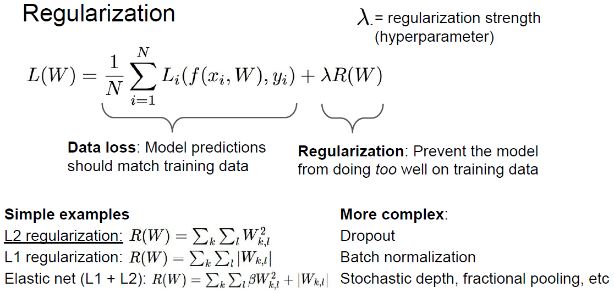

从机器学习的角度看，Data loss就是模型的经验风险，而Regularization就是模型的结构风险。

正则化主要有以下几个作用：

- 表达权重的归纳偏好：

  

  L2正则化通常倾向于让权重均匀分散分布，而L1正则化则倾向于使权重稀疏（其实相当于一个假设参数服从拉普拉斯分布一个服从高斯分布）；

  > 可以参考：https://www.zhihu.com/question/37096933

- 使得模型更简单从而有更好的泛化能力；

- 通过增加**曲率（curvature）**来帮助优化（存疑）。

## Optimization

梯度下降法是训练模型通用性最强的算法之一，其原理是使得权重往损失函数对权重的梯度的负方向进行更新，即向损失函数下降的最陡峭的方向更新。

在计算机中计算梯度有两种方式：

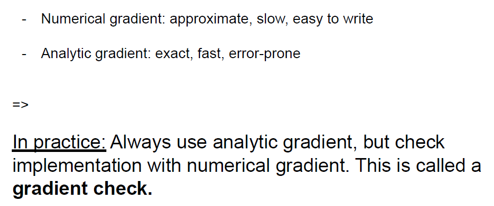

显然使用解析梯度是更为高效准确的方式，不过由于需要人工的先验知识容易出错，数值梯度往往用来检查解析梯度是否计算正确。

理论上我们应该用整个训练集的平均梯度作为移动方向，这称为**批量梯度下降法（Batch Gradient Descent）**，但是由于这样计算成本太高，通常取一个小的batch比如32/64/128，称为**小批量梯度下降法（Mini-bach Gradient Descent）**，用单个样本进行更新则叫做**随机梯度下降法（Stochastic Gradient Descent）**，通常也把直接用梯度进行更新的朴素策略叫做SGD。

### Problem

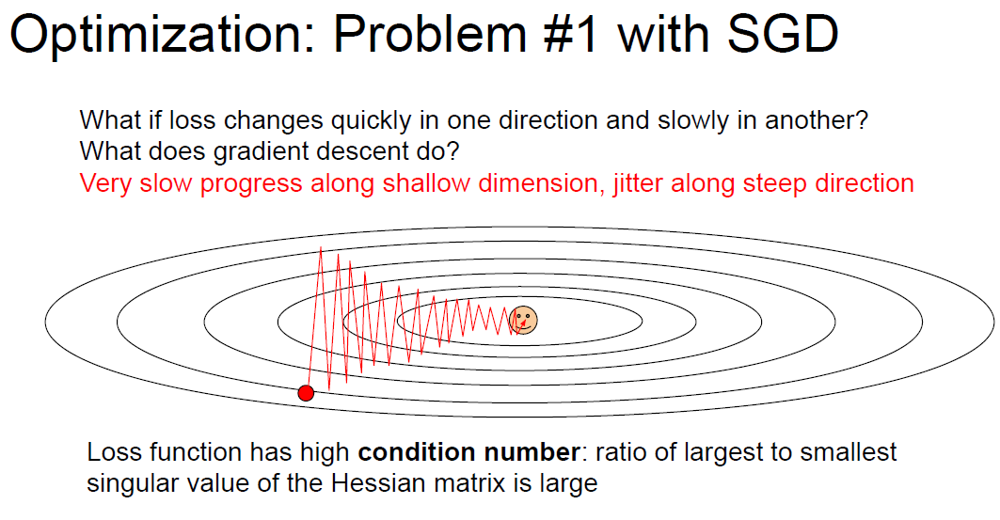

损失函数往往是很曲折的曲面，因而下降的过程可能抖动严重，就像我们在凹凸不平的山路上开车一样。

在高维空间里鞍点出现的几率更大。

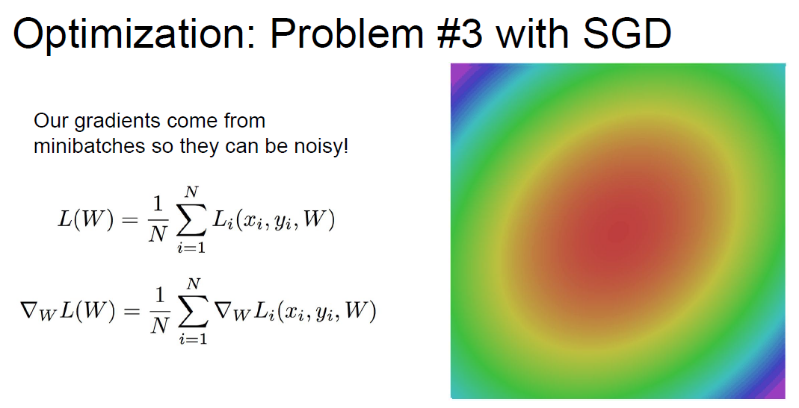

由于我们通常使用mini-batch，有可能会被数据集中的噪声影响陷入局部最优。

### Optimizer

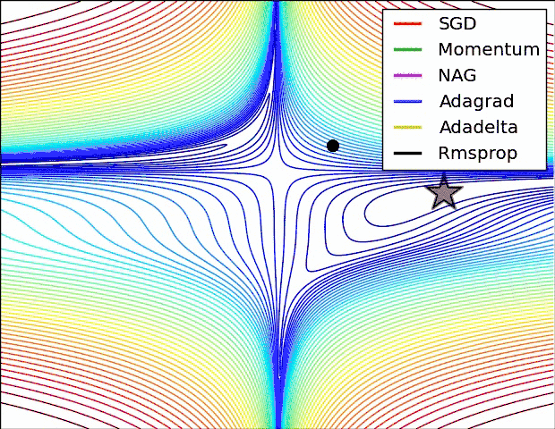

#### SGD+Momentum

最简单的一个优化策略是使用**动量（Momentum）**：

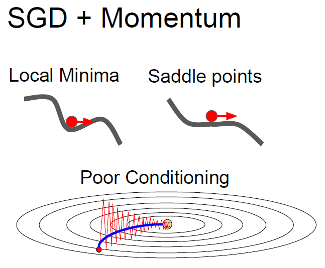

可以将其理解为惯性，Momentum的想法很简单，就是多更新一部分上一次迭代的更新量，来平滑这一次迭代的梯度。从物理的角度上解释，就像是一个小球滚落的时候会受到自身历史动量的影响，所以才叫动量（Momentum）算法。这样做直接的效果就是使得梯度下降的的时候转弯掉头的幅度不那么大了，于是就能够更加平稳、快速地冲向局部最小点：

具体通过记录过去的移动方向实现：

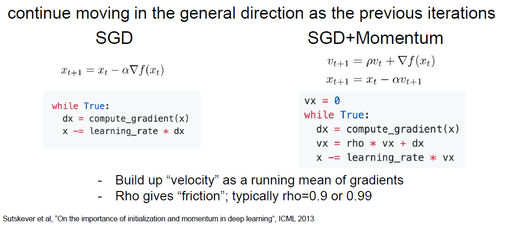

你可以会见到不同的实现形式，不过思想都是相同的：

#### Nesterov Momentum

**Nesterov Accelerated Gradient（NAG）**的改动在于他不是直接使用历史梯度和当前地图的矢量和，而是先走历史梯度，然后使用新的位置的梯度进行更新：

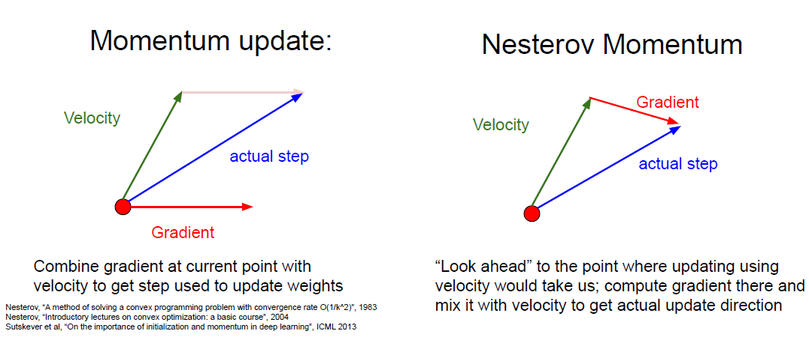

我们可以使用换元法对NAG的形式进行变形：

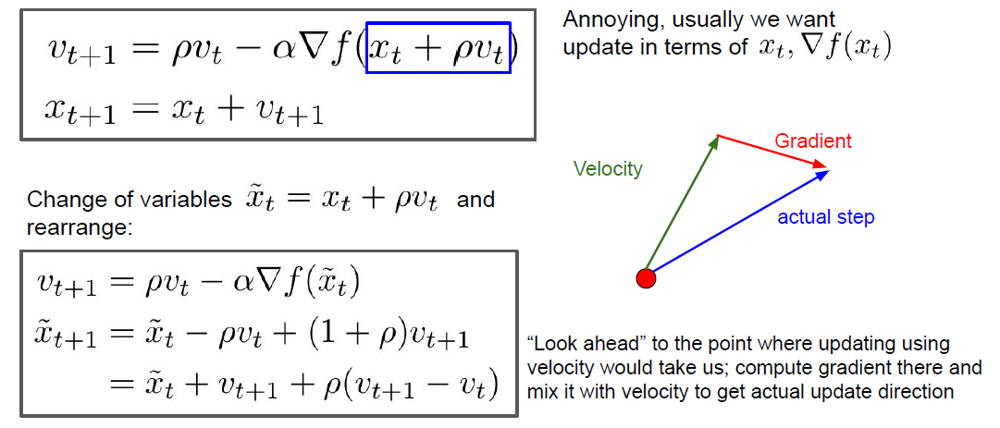

可以看到，NAG相当于是多了一个近似二阶微分项 $\rho (v_{t+1} - v_t)$ ，这也是为什么说NAG相比于原始的Momentum可以加速收敛的原因。

#### AdaGrad

AdaGrad相比原来的Momentum做了一个很简单改进，每次更新时使用过去梯度的平方和的平方根进行缩放（也叫**二阶动量矩**），即通过指数滑动平均实现所谓自适应学习率：

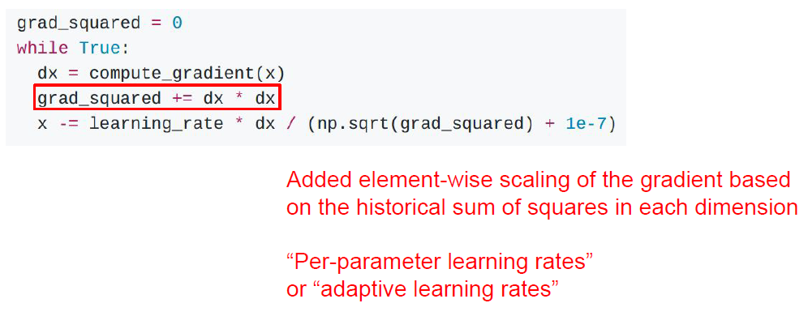

> 注意 `dx * dx` 仍然是一个向量，可以理解成对各方向的移动步长做正则化。

直观上看，在“平坦”的区域，梯度比较小，移动步长会变大（因为分母小于1），而在“陡峭”的区域，梯度比较大，累计梯度大于1，移动步长变小。

长远来看，最终累计梯度趋近于无穷大，最后移动步长会趋近于0，这也是一个缺点，有可能还没走到极小值点就停下来了。

#### RMSProp

RMSProp（Root Mean Squared Prop）又称为**“Leaky AdaGrad”**，其相比AdaGrad只作了很小的改动，即使得累计梯度适当“遗忘”一部分，从而不至于走向无穷大：

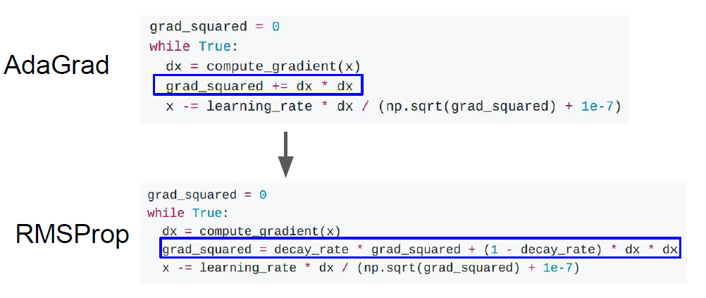

> Adadelta是AdaGrad的另一种变体， 主要区别在于前者减少了学习率适应坐标的数量。 此外，广义上Adadelta被称为没有学习率，因为它使用变化量本身作为未来变化的校准，和RMSProp除了没有学习率外思想类似。

#### Adam

Adam的名字来源于自适应矩估计**Adaptive moment estimation**，结合了momentum和adagrad，算法伪代码如下：

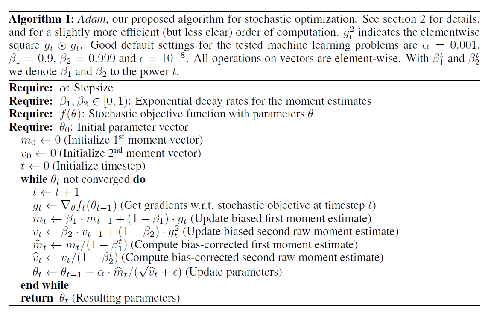

> 可以通过将伪代码最后3行换成：
> $$
> \begin{aligned}
> \alpha_t &= \alpha \cdot \sqrt{1-\beta_2^t}/(1-\beta_1^t) \\
> \theta_t &\leftarrow \theta_{t-1} - \alpha_t\cdot m_t / (\sqrt{v_t} + \hat{\epsilon})
> \end{aligned}
> $$
> 以减少计算量（太精细了，就减少了一次除法）。

Adam算法更新规则的一个重要特征就是它会很谨慎地选择步长的大小，假定 $\epsilon = 0$，则在时间步 $t$ 和参数空间上的有效下降步长为：
$$
\Delta_t = \alpha \cdot \hat{m_t} / \sqrt{\hat{v_t}}
$$
有效下降步长有两个上界：

- 在 $(1 - \beta_1) > \sqrt{1-\beta_2}$ 的情况下，满足 $|\Delta_t| \le \alpha \cdot (1 - \beta_1) / \sqrt{1-\beta_2}$；

  > 该种情况只会发生在梯度极端稀疏时：除了当前时间步之外其余时间步的梯度都为0，对于没什么稀疏的情况，有效步长会更小；

- 否则满足 $|\Delta_t| \le \alpha $。

  > 当 $(1 - \beta_1) = \sqrt{1-\beta_2}$ 我们有 $|\hat{m}_t / \sqrt{\hat{v_t}} |< 1$ 因此有 $|\Delta_t | < a$，在更普遍的场景，因为 $|\mathbb{E}[g] / \sqrt{\mathbb{E}[g^2]}| \le 1$ 我们有 $\hat{m}_t / \sqrt{\hat{v_t}} \approx ±1$

因此有效步长的大小的上界近似等于学习率 $\alpha$，即 $\left|\Delta_{t}\right| \lessapprox \alpha$，这可以理解为围绕当前参数值建立一个*信任区域（trust region）*，超过这个信任区域，当前梯度估计不能提供足够的信息。

我们可以将 $\hat{m_t} / \sqrt{\hat{v_t}}$ 称为**信噪比（signal-to-noise ratio, SNR）**，当SNR很小的时候我们的步长也很小，这很符合直觉，小的信噪比意味着更多对当前方向的不确定性，因而不应该朝该方向走太远，当靠近最优解时SNR将趋近于0，这起到了一种自动退火的作用。

另外有效步长不随梯度的缩放而发生改变：
$$
\frac{c\cdot \hat{m_t}}{\sqrt{c^2\cdot \hat{v_t}}} = \frac{\hat{m_t}}{\sqrt{\hat{v_t}}}
$$

若不考虑moment的去偏，实现如下：

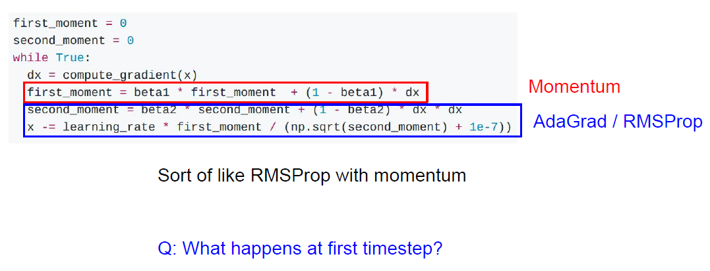

**A**：moment初始化为0，导致moment的估计偏向于0，特别是在开始的时间步里，当衰减率很小即$\beta_s$ 趋近于1时这个现象更明显，因而需要做出修正：

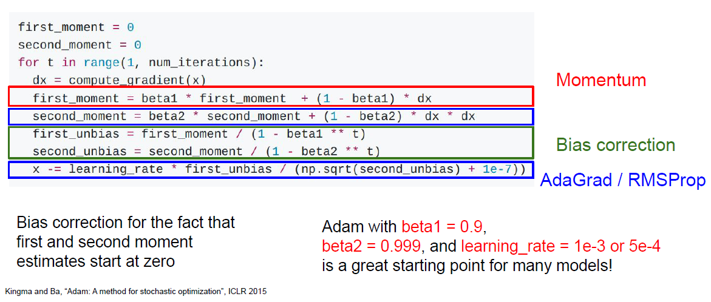

下面证明去偏的正确性。以 $v_t$ 为例，使用递归展开 $v_{t-1}$ 可得：
$$
v_t = (1 - \beta_2) \sum_{i=1}^t \beta_2^{t-i}\cdot g_i^2
$$
于是有：
$$
\begin{aligned}
\mathbb{E}[v_t] &= \mathbb{E}\bigg[ (1-\beta_2) \sum_{i=1}^t\beta_2^{t-i} \cdot g_i^2\bigg] \\
&= \mathbb{E}[g_t^2] \cdot (1-\beta_2) \sum_{i=1}^t\beta_2^{t-i} + \zeta \\
&= \mathbb{E}[g_t^2] \cdot (1-\beta_2^t) + \zeta
\end{aligned}
$$

> 这里是认为不同时刻梯度的期望是相同的，即 $\mathbb{E}[g_t^2] = \mathbb{E}[g_{t-1}^2] = \cdots = \mathbb{E}[g_0^2]$。

### Learning rate schedules

我们通常称梯度下降法的超参数变化系数 step size 为**学习率（Learning rate）**，梯度下降的步长不仅可以靠一些optimizer来自适应调整，也可以直接通过人为调整学习率来实现。

> 当然很多时候使用固定的学习率配合adam优化器也能工作的很好。

#### Learning rate decays over time

一个简单的策略是让学习率逐时间递减，可以按固定的epoch周期或是某种递减函数（例如cosine）递减：

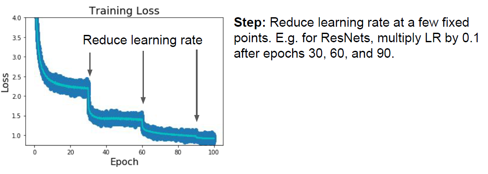

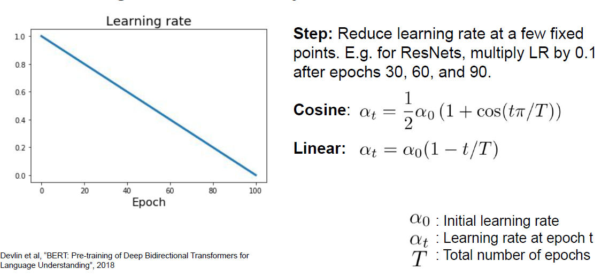

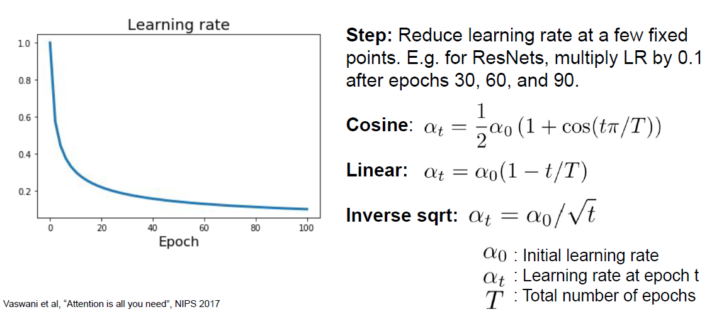

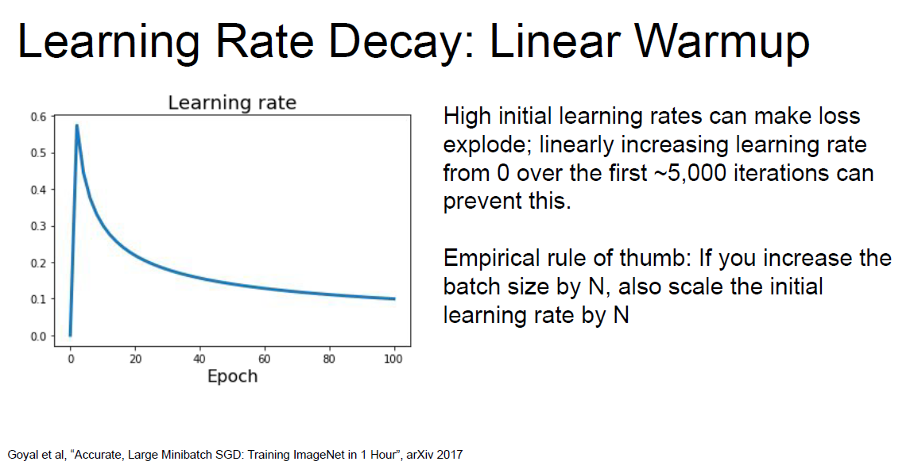

### 其他优化方法

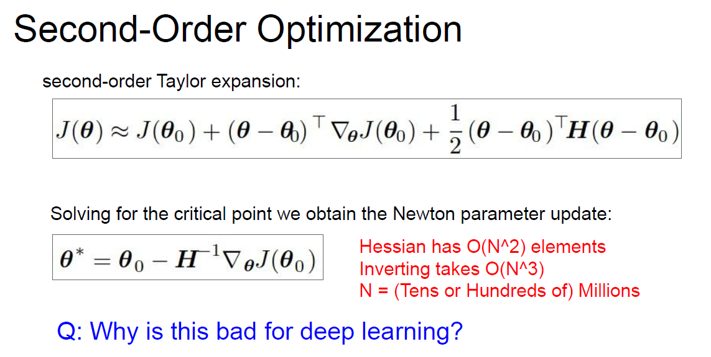

牛顿法显然不能直接用，也许能使用的有拟牛顿法等：

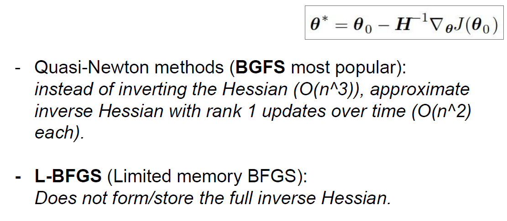

