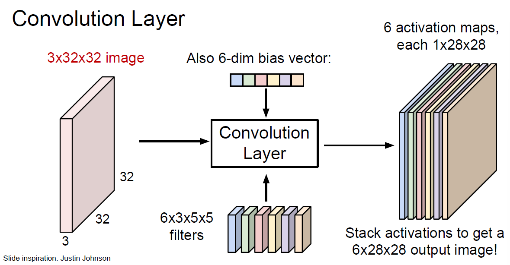
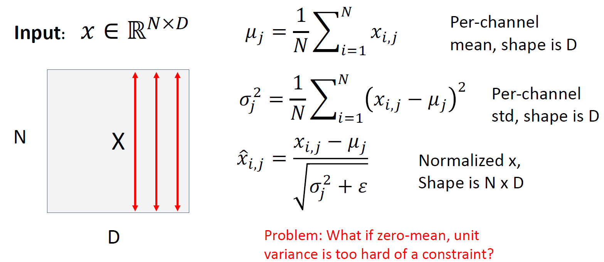

# Image Classification with CNN

## Background

回顾之前我们使用线性分类器和多层感知机完成图像分类任务的过程，我们直接将图像拉平，将其每个像素点（准确地说是每个通道的像素点）当作特征：


在机器学习中还有个常见的做法是做特征提取，即提取出图像中的有用特征：


常用的方法有颜色直方图、HoG、Bag of Words等：


## Convolutional Neural Networks

### 基本原理

回顾一下全连接层：


上图的全连接层其实可以看作是通道数为3072的$1 \times 1$ feature map，对应的权重 $W$ 可以看成是10个 $3072\times 1 \times 1$ 的**卷积核（filter）**，从这个角度就很容易扩展到通常使用的卷积层了，即增加**空间维（spatial dimensions**）也就是宽高维：


整张feature map共用一个卷积核，在特征图上移动做点积，即所谓**权重共享**，每个patch做点积后得到一个标量，不同位置的patch对应不同位置的标量，这一定程度上保留了图像的空间结构，即所谓**局部连接**，一个卷积核最终得到一个单通道的activation map：


显然多个卷积核就可以得到多个通道的activation map，通常每个卷积核还会有一个标量作为bias：



 你也可以把上面的activation maps当成是一个 $28\times 28$ 的grid，每个点是一个六维向量。

显然可以将该操作推广到多个样本上，对每个样本都做卷积就是：


显然卷积本质上做的还是线性变换，因而堆叠多个卷积层我们需要在中间加上非线性激活函数：


我们可以对比线性分类器、MLP以及卷积核学到的特征：


我们注意到与线性分类器和MLP不同的是，卷积核学习的不是关于一个图像的模板，而是一些小而局部的特征的模板。

卷积的过程就像是信号处理中的卷积，即信号和滤波器的点积：


> 从模板匹配的角度看神经元激活，似乎也体现了输入零中心化和方差固定的重要性，否则对于任意一个模板，我们可以使得输入各值尽可能大以换取神经元激活。

希望在卷积后不改变特征图大小可以使用全0填充：


另外池化层也是卷积神经网络的重要组成部分，常用的有最大池化和平均池化：


> 这里有个有意思的点，最大池化（注意不是平均池化）实际上已经引入了非线性，那是不是说有Max Pool的情况下激活函数就不是必要的呢？


### 平移等变性和平移不变性

**不变性（invariance）**就是目标发生了变换，但是你依然可以识别出来。在图像任务中，我们希望图像中的目标即使被平移、被旋转或者被缩放，模型都可以识别出来图像的目标。

所以**不变性**有下面几种：

- 平移不变性：translation/shift invariance
- 旋转不变性：rotation invariance
- 尺度不变性：scale invariance
- 光照不变性：illumination invariance

在图像分类任务中，平移不变性就是图像中的目标不管被移动到哪个位置，模型给出的标签应该都是相同的。

**平移不变性**对应的有一个概念是**平移等变性（translation equivariance）**，这个是用在图像的目标检测或实例分割中的，如果输入图像中的目标进行了平移，那么最终检测出来的候选框应该也相应的移动。


通常的观点是卷积层提供了一定的平移等变性而池化层提供了一定的平移不变性。

- 卷积层提供的平移等变性可能会收到padding填充的影响，也有人认为这一定程度上增加了网络的表达能力（不过padding的主要作用我个人觉得还是尽可能保留信息）；
- 池化层提供的平移不变性同样很脆弱，它只能保持局部的不变，使用全局池化层（大多流行网络结构如ResNet都使用）可以更好的保持全局的平移不变性。

如何更好的保持平移不变性可以对池化过程进行改进：https://zhuanlan.zhihu.com/p/77543304。

### 感受野

感受野顾名思义就是输入图像中能影响当前输出的区域大小，或者你可以理解成当前神经元可以“感知”到的输入图像区域。它通常会随着网络的深度线性增加：


我们当然希望当前输出能尽可能多地“感知”到输入图像，这对于分辨率很高的输入图像而言可能需要很深的网络，解决的办法是使用更大的**卷积步长（stride）**，最后得到感受野计算公式为：
$$
RF_{l+1} = RF_l + (\text{kernel\_size}_{l+1} - 1) \times \text{feature\_stride}_l
$$
详见：[感受野](C:\Users\leexi\Desktop\StudyLibrary\lxh_Notebooks\Maching_Learning_Notebook\深度学习\卷积神经网络CNN\感受野.md)。

### LeNet

目前我们已经有了以下组件（不包括还未介绍的Normalization）：


依靠它们我们可以搭建最经典（1998）的卷积神经网络LeNet-5：


其主要设计思想是随着前向传播减少特征图大小即Spatial size的同时增加特征通道数，最后将卷积得到的特征使用全连接层进行分类。

### Normalization

仅仅使用上面的技术在训练深层网络时会遇到难以收敛的问题，因而需要用到Normalization技术：


#### Batch Normalization

最常见的Normalization技术是BN，其想法很简单：


即减少随着网络层加深出现的“internal covariate shift”。

> 原文描述："We define Internal Covariate Shift as the change in the distribution of network activations due to the change in network parameters during training."
>
> 将每一层的输入作为一个分布看待，由于底层的参数随着训练更新，导致相同的输入分布得到的输出分布改变了。
>
> 而机器学习中有个很重要的假设：IID独立同分布假设，就是假设训练数据和测试数据是满足相同分布的，这是通过训练数据获得的模型能够在测试集获得好的效果的一个基本保障。那么，细化到神经网络的每一层间，每轮训练时分布都是不一致，那么相对的训练效果就得不到保障，所以称为层间的covariate shift。
>

具体来说，BN分为缩放和再缩放两个步骤。

缩放使得输出分布均值为0，方差为1（未必是正态分布）：



均值0方差1的约束过于严格，再缩放给了网络自己学习均值和方差的机会：


> 有可能会学到原本均值和方差使其在期望上像一个恒等映射，也可能会学到别的有益特征。

在测试阶段我们不使用测试集的均值的方差进行归一化，而是使用训练集的均值和方差进行归一化，因为测试集可能很小，使用测试集容易受噪声点影响，而根据独立同分布假设训练集比较合适。

- 由于测试时无需更新权重，等价于一个简单的线性缩放，可以和卷积操作融合而不增加额外的开销；
- 对于卷积，spatial维上共用一个均值和方差：


通常将BN放置在卷积层或者全连接层之后（也有放在之前的）。

另外对于一些其他的任务和模型比如RNN、Transformer等往往会用到一些其他类型的Nomalization，这里不作展开：


> 
>
> layer Normalization比较灵活，不同任务处理不一样：
>
> ```python
># NLP Example
> batch, sentence_length, embedding_dim = 20, 5, 10
> embedding = torch.randn(batch, sentence_length, embedding_dim)
> layer_norm = nn.LayerNorm(embedding_dim)
> # Activate module
> layer_norm(embedding)
> # Image Example
> N, C, H, W = 20, 5, 10, 10
> input = torch.randn(N, C, H, W)
> # Normalize over the last three dimensions (i.e. the channel and spatial dimensions)
> # as shown in the image below
> layer_norm = nn.LayerNorm([C, H, W])
> output = layer_norm(input)
> ```
> 
> 

### 其他

此外还有几种别的特殊卷积结构比如1x1卷积、3D卷积、转置卷积等，这里不展开。
