# Neural Networks and Back propagation

## 基本原理

之前我们讲到，从模板匹配的角度看线性分类器，相当于是为每一类都配置了一个模板，显然只使用一个模板是不可能有太好的泛化能力的，考虑使用多个模板，很直观的想法能得到如下的拓扑结构：

这样模板数量就为隐藏层的输入数量乘上输出层某一神经元的数量，看上去很美好，实际上若仅仅使用线性变换的叠加得到的将仍是线性变换：
$$
w_{3}(w_{11}x_1+w_{21} x_2)+w_{4}(w_{12} x_1 + w_{22} x_2) \\
=(w_{3}w_{11} + w_{4}w_{12})x_1+(w_3w_{21} + w_4 w_{22}) x_2
$$

因而需要在神经元处添加非线性映射，通常称为**激活函数（activation function）**，上图表示最简单的全连接神经网络即我们常说的**多层感知机（Multi-layer Perception, MLP）**。

不过更重要也是更根本的添加隐藏层的原因是为了解决线性不可分问题，单层神经网络如逻辑回归、感知机等模型，本质上都属于广义线性分类器，即他们的**决策边界是线性的**，这点可以从逻辑回归模型的决策函数看出，决策函数 $Y=\text{sigmoid}(wx + b)$：

- 当 $wx+b>0$ ，$Y>0.5$；

- 当 $wx+b$ <0，$Y<0.5$ 

以 $wx+b$ 这个超平面可以区分开不同标签的样本，可见决策边界是线性的：

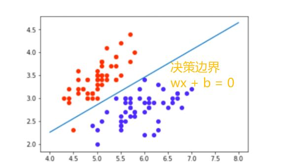

> 可以去[playground](https://playground.tensorflow.org/#activation=relu&batchSize=10&dataset=spiral&regDataset=reg-plane&learningRate=0.01&regularizationRate=0&noise=0&networkShape=8,8,6&seed=0.53560&showTestData=false&discretize=false&percTrainData=50&x=true&y=true&xTimesY=false&xSquared=false&ySquared=false&cosX=false&sinX=false&cosY=false&sinY=false&collectStats=false&problem=classification&initZero=false&hideText=false)体验一下MLP。

因此我们需要至少添加一个隐藏层，相当于是将输入数据做一个非线性映射使其落在线性可分空间。

> 通用近似定理：如果一个多层感知机具有线性输出层和至少一层隐藏层，只要给予其足量的隐层神经元，它可以以任意精度近似任何一个从有限维空间到另一个有限维空间的Borel可测函数。

从之前“模板数量”的角度理解，隐藏层单元越多模型的拟合能力就越强（从通用近似定理的角度也是这样的）：

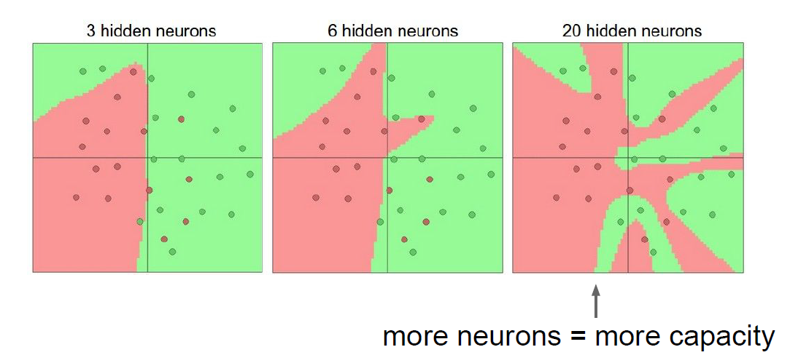

可以看到，随着神经元数量的增加，网络似乎发生了过拟合，但是我们不能将此作为减少神经元数量的理由（因为我们需要强拟合的能力），神经网络同样可以通过对参数正则化来抑制过拟合：

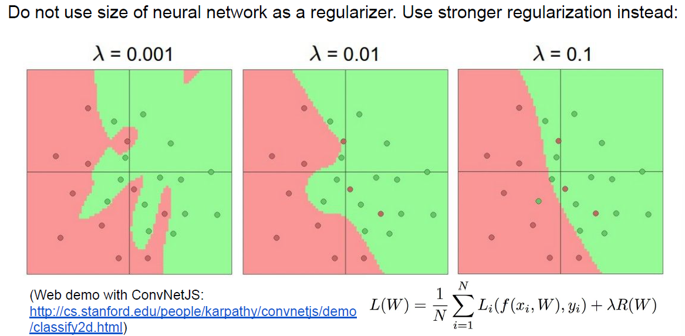

## 计算图和反向传播

### 背景

我们同样是使用梯度下降法来更新神经网络的权重，然而与其他机器学习模型不同的是，神经网络的参数量非常之多对每个参数都算一遍导数显然是不现实的（即使通过链式法则算解析梯度也不现实）：

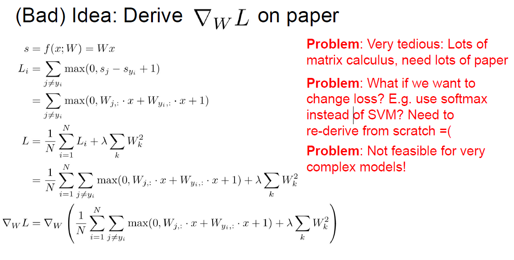

更好的解决方案是根据前向传播构建**计算图（Computational graphs）**，然后通过**反向传播（Back propagation）**算法更新梯度（用到了动态规划的思想减少计算量）：

### 利用计算图进行反向传播

#### Backprop with Scalars

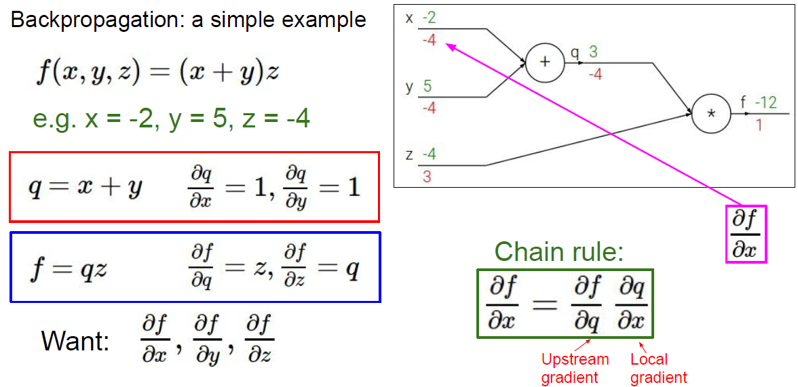

对于标量引用链式法则十分简单，就是上游梯度乘上本地梯度，同一表达式可能能生成不同的计算图，一般选择每个结点的本地梯度都能被简单表达的（即尽可能展开）：

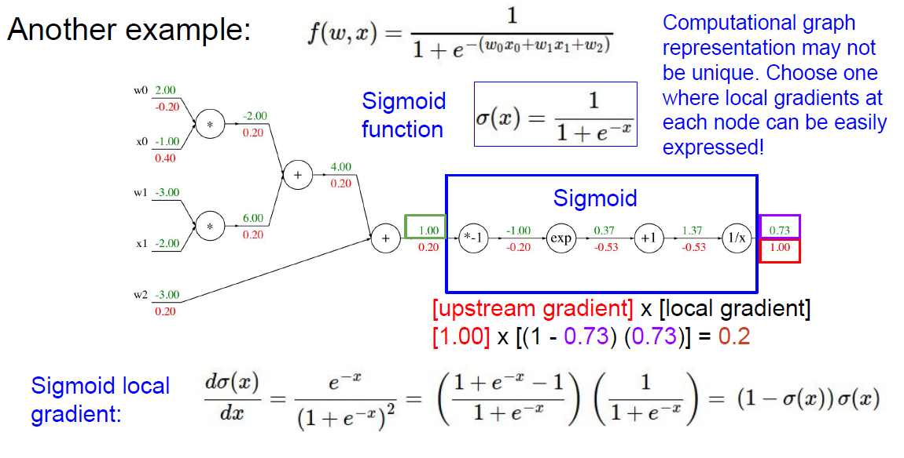

> 完全展开是为了我们看上去简单，有时候为了计算效率可以合并一些没有参数的计算图结点。

#### Backprop with Vectors/Matrices/Tensors

首先我们回顾一下向量求导的定义：

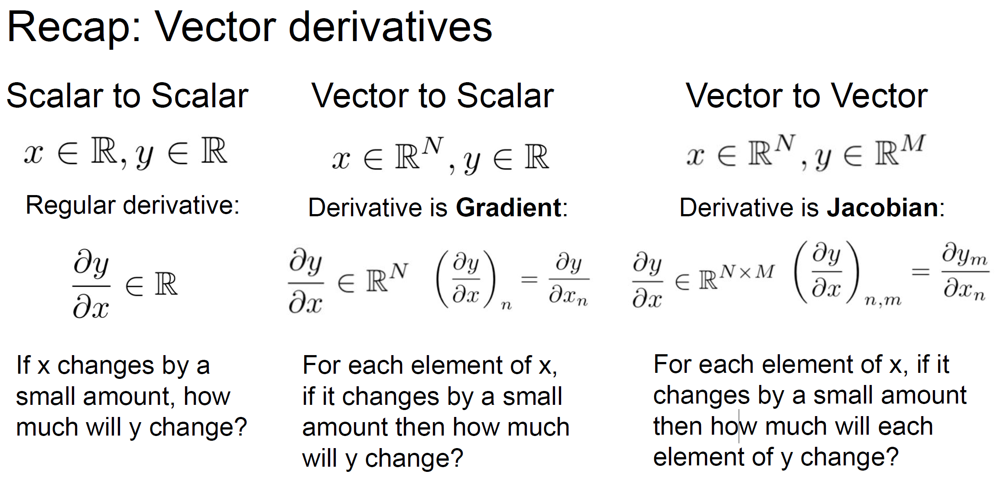

可以看到向量的导数本质上还是由标量的导数值决定的。

> 需要注意的是，无论变量是标量还是张量，前向传播的终点或者说反向传播的起点也就是loss都是标量。

我们可以用雅可比矩阵来表示向量对向量的导数并将其应用于反向传播：

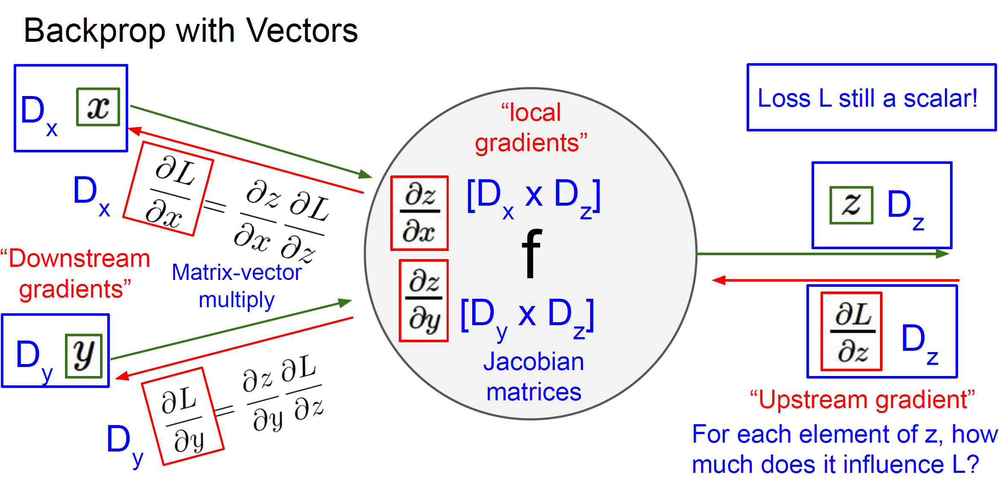

以relu函数为例：

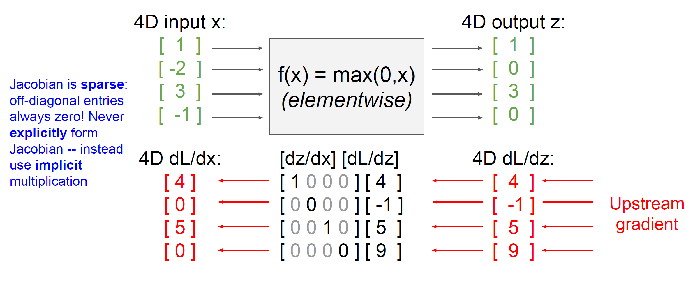

我们注意到很多时候Jacobian矩阵是非常稀疏的，因而我们在大多数情况下都不会显式的使用Jacobian矩阵来进行运算，我们同样可以推广到在矩阵或者张量上的广义雅可比矩阵：

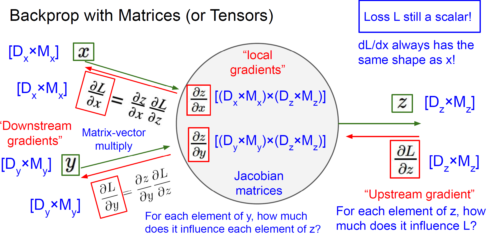

我们可以看到，若输入是矩阵或者张量的话，雅可比矩阵将会膨胀到一个可怕的大小，存储这样的雅可比矩阵无异于天方夜谭：

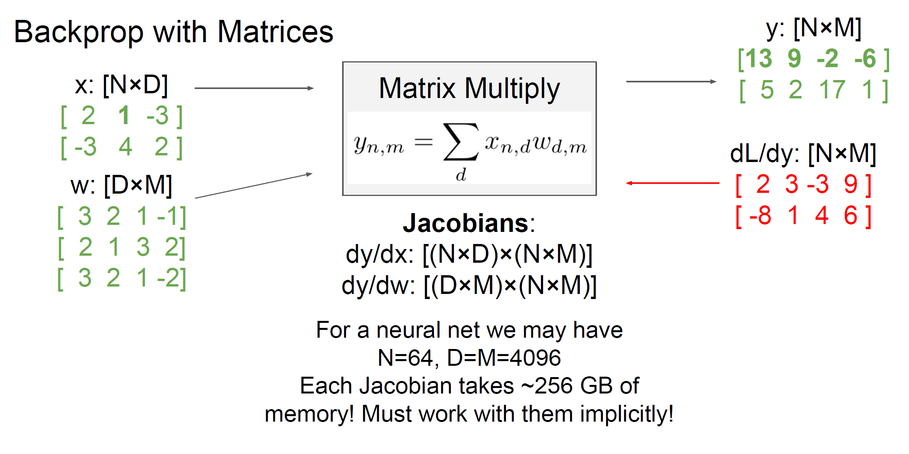

因而我们需要去找其隐式表达，通常我们会从标量对标量的角度去试图发现规律（当然有时候能利用到很多矩阵论的技巧）：

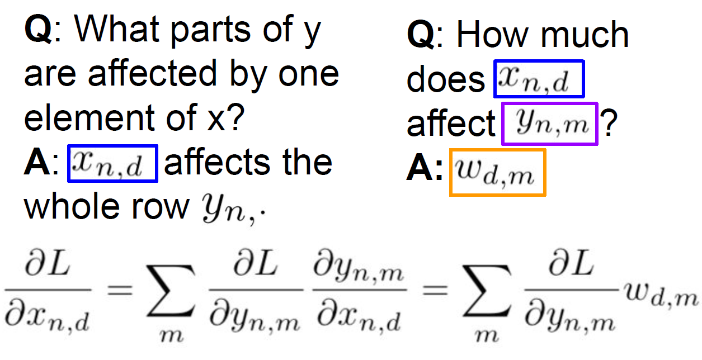

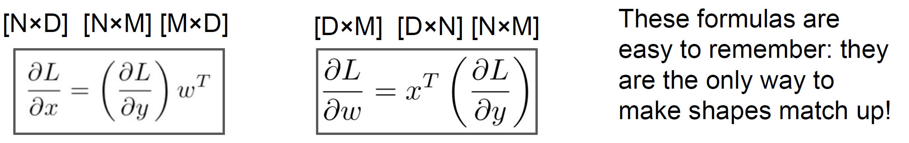

> 注意从后往前传播到当前结点时，假设当前结点的输出shape为 $(N, M)$ ，upstream的shape肯定也为 $(N, M)$ ，因为后面那一坨雅可比矩阵累乘起来就等价于标量（loss）对当前输出求导。
