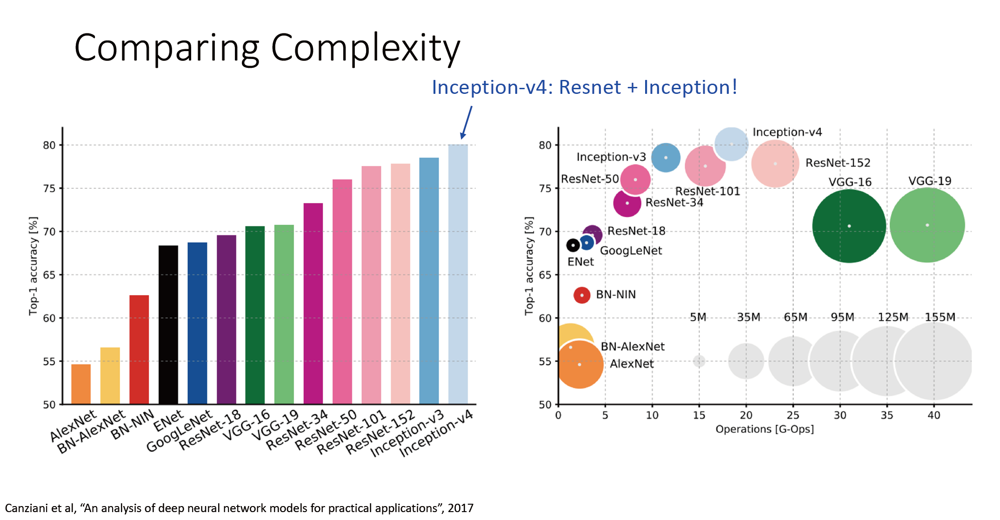
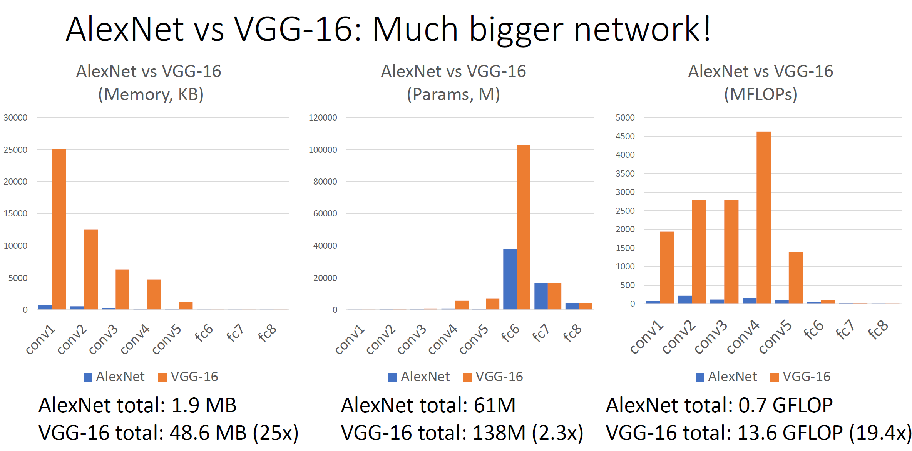
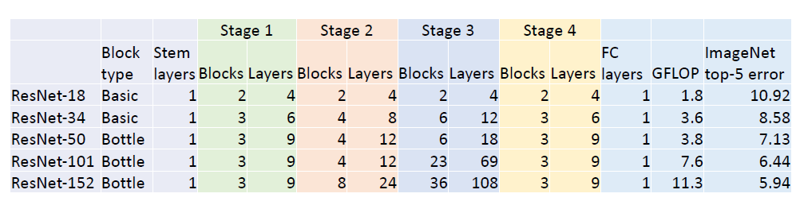
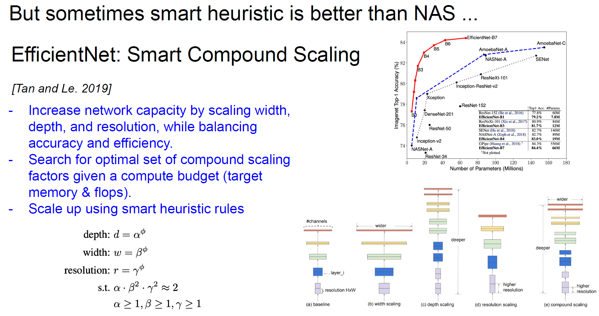

# CNN Architectures

## AlexNet

AlexNet是通常意义上的第一代深度神经网络，其首次在图像分类任务上展现了深度神经网络的强大性能，可以说是深度学习时代的开端。

AlexNet网络的第一层是一个有着 $11 \times 11$ 的大卷积核的卷积层，我们以该层为例介绍网络常见性能度量指标的计算。

> 这里忽略了AlexNet中使用到的一些目前不常用的技术比如分GPU训练，局部相应归一化等。

另外AlexNet是较早使用relu的神经网络，同时还带来了**dropout**这一防止过拟合的技术并在后面的网络结构中被广泛使用。

### Memory

需要调用的内存（通常是显存）大小主要来自于存储feature map，对于图像而言就是 $\text{channel} \times \text{height} \times \text{width}$，通常每个元素用单精度浮点数存储：

> 当然真正算显存占用时第一个要算的应该是输入图像吧。

### Params

参数量主要来自于网络的可训练权重：

### FLOPs

FLOPs（floating-point operations）即浮点计算量，注意不要和浮点计算速度FLOPS（floating-point operations per second）弄混，由于许多硬件可以做到在同一流水级实现乘法和加法，因此通常将一次乘法和加法（通常是 $wx+b$）运算算作一次浮点操作，对于卷积运算来说，就是输出特征图大小和得到特征图中每个元素需要的计算量之积：

### 其余计算

第一层卷积层后面跟着的是池化层，该层没有参数，内存占用和卷积层类似，同样取决于特征图大小，而flop由于与卷积层相比太小而可以忽略不计：

最后是全连接层的计算：

可以看到全连接层参数量很大，但是计算量并不高。

### 关于Model总显存占用的计算

正常来讲，显存的占用主要是Model本身和每一层的output。

计算方式为：

如上图所示，以 input size为 $224\times 224$ 的ImageNet（架构使用VGG16）来讲，VGG16的参数量为138M，需要显存138∗4/1024/1024=528MB （乘以4是32位的float需要占用4个字节）。如果我们使用SGD，那还需要额外再加一份，如果还使用了momentum，那还要再加一份。所以SGD with momentum下，整个模型需要 1.54GB 的显存（若是Adam，因为有二阶的动量，所以还要再加一份）。

再考虑每层输出所占用的内存，换句话说，batch size 为1的话，需要 58.12MB显存，而训练时候需要有forward和backward，就需要乘以 2，果batch size 为128的话，就再乘以128，这样乘完大概是 128∗58.12∗2=14.5GB。

模型参数占用和特征图占用两个加起来大概需要 16GB 显存。

### 性能分析

与LeNet一样，AlexNet也是采用了大小逐层减小，通道数逐层增加的策略：

我们可以观察到卷积部分占了内存占用和计算量的大头，而全连接部分占了参数量的大头：

事实上不只是AlexNet有这一特点，许多经典的网络结构都有这一特点，后面的一些高效的轻量级网络也是针对这些特点来进行优化的。

## ZFNet

ZFNet则是在AlexNet提出一年后的ImageNet比赛冠军，其相对于AlexNet仅仅是增大了网络的规模：

相较于AlexNet通过第一个卷积层将输入图像下采样了四倍，ZFNet只下采样了两倍，得到的更高分辨率的特征图意味着更高的计算量和更大的感受野（对于后面的网络层来说）；另外后面的卷积层的filters数量也增加了很多。

从AlexNet改进到ZFNet给我们的启示是更大更深的网络往往会工作的更好。

## VGG

### 网络结构

与AlexNet以及ZFNet的网络结构通过每层反复人工试错得到不同，VGG有他自己的设计范式，这也是VGG带来的一个很大的创新：

VGG让我们可以不用花费过多精力在调整每一层的网络结构上，从而可以更简单的构建更深的网络。

### VGG设计理念

- **All conv are $3 \times 3$ stride 1 pad 1**

首先这样的卷积层设计不会改变特征图的大小，另外为什么VGG只使用 $3\times 3$ 的卷积核呢？我们比较一个 $5 \times 5$ 的大卷积核和两个 $3 \times 3$ 的小卷积核的参数量核计算量：

很明显这两种选项有着相同的感受野，而后者的计算量和参数量比前者少了不少，同时我们可以通过在两个卷积层直接添加ReLU等非线性激活函数来增加非线性，所以我们可以看到VGG中处处是这种堆叠的小卷积核卷积层。

- **All max pool are $2\times 2$ stride 2. After pool, double channels**

由于卷积层不改变特征图大小，我们需要依靠池化来下采样，池化使得特征图宽高减半的同时使得通道数加倍，让我们看看因此产生的变化：

我们看到FLOPs没有随着池化而改变，这正是VGG的一个设计思想：希望**每一层的计算量相同**。

可以看到由于VGG网络中由于特征图大小和通道数都比AlexNet大很多，所以其是个比AlexNet大很多的网络，这也再次证明了网络越大越深，效果就越好，

### 训练技巧

事实上VGG提出时Batch Normalization还未被提出，因此训练一个深层神经网络是困难和难以收敛的，作者当时先训练了较浅的网络（VGG11），然后在该网络基础上添加新层训练才成功训练出了VGG16和VGG19。

## GoogLeNet

GoogLeNet和VGG是同年比赛的冠亚军，不过可以看到GoogLeNet并没有占到太大的优势。

Google作为一家商业公司，它没有盲目的仅仅试图通过增大网络规模来获得更好的效果，出于移动端部署等方面的考虑，他们十分关注网络的效率：

### Stem network

回顾AlexNet，VGG等网络，昂贵的计算量主要来源于起初的高分辨率特征图，因而GoogLeNet使用一个结构简单的stem network来进行快速下采样：

降到同样的分辨率（$28 \times 28$）,整个主干网络的成本和VGG前四层比起来可以说是微不足道

### Inception Module

我们前面提到VGG通过只使用 $3\times 3$ 的卷积核来解决卷积核大小这一超参数的调节问题，而GoogLeNet则从另一个角度出发，设计了一种包含多种不同大小卷积核的Inception模块：

> 这里池化层放卷积层前面，我猜主要原因是减少计算量吧，毕竟 $1\times 1$ 卷积层会增加通道数。

### Global Average Pooling

秉承着尽可能减少计算量和参数量的思想，GoogleNet借鉴了NiN，使用了全局平均池化层处理卷积部分得到的特征图：

### Auxiliary Classifiers

GoogLeNet同样遇到了深度网络难以收敛的问题，和VGG不同，它采用辅助分类器来帮助网络收敛：

不过有了BN后渐渐地不需要此类trick了。

## ResNet

和AlexNet一样，ResNet是深度学习领域里程碑式的一个作品，不仅仅是因为他进一步降低了ImageNet上的分类错误率，并在各项主要任务上遥遥领先，更因为他**将网络加深到了一个前所未有的深度（152）**，而之前的网络最多就20多层。

### Residual

通过Batch Normalizaiton我们可以训练数10层的神经网络，但是如果我们想要变得更深呢？实践证明单纯地加深网络会使得网络陷入**欠拟合**之中：

可以看到即使在训练集上深层网络也比不过浅层网络，发生了明显的过拟合。

但是理论上说深层网络的性能应该是不弱于浅层网络的，因为深层网络中的一些层如果学习成为了恒等映射那就和浅层网络等价。

所以这其实是一个优化难题，我们很难将深层网络优化至恒等映射，因此一个直觉是改变网络结构以影响其归纳偏好，让它更容易学得恒等映射：

注意若中间的卷积层改变了特征图的通道数，shortcut上需要加 $1\times 1$ 卷积来调整通道数。

### Highway Network

其实大概在ResNet提出前4个月有研究者提出了一个十分类似的结构叫做Highway Network[1]，借鉴LSTM也是试图解决深度神经网络难以训练的问题，但是最后在精度上没有得到提升。

其形式为：
$$
y = H(x, W_H) \cdot T(x, W_T) + x\cdot (1 - T(x, W_T))
$$
当 $T(x, W_T) = 0.5$ 时，其形式等价于缩放后的residual：
$$
y = 0.5H(x, W_H) + 0.5 x
$$
但是kaiming[2]讨论尝试过这些结构，发现都不如residual work，也就是说即使是缩放都会影响性能，这可能也是highway不work的一个原因，另一个原因可能类似LSTM，复杂的门控单元反而加大了其训练的难度。

> [1] Highway Network：Srivastava, R.K., Greff, K. and Schmidhuber, J., 2015. Training very deep networks. In *Advances in neural information processing systems* (pp. 2377-2385).
>
> [2] 对多种残差结构的分析：He, K., Zhang, X., Ren, S., & Sun, J. (2016, October). Identity mappings in deep residual networks. In *European conference on computer vision*(pp. 630-645). Springer, Cham.

### Residual Network

ResNet的网络结构设计思路借鉴了VGG和GoogLeNet，首先借鉴VGG采用 $3\times 3$ 的小卷积核，并且也是分阶段地加倍通道数和减小特征图大小，不过这里是直接将第一个卷积层的步长设为2来减小特征图大小；

采用与GoogLeNet同样激进的stem来下采样输入图像（变为原图的 $1/4$）：

另外同样使用全局平均池化层来降低全连接层的参数量：

ResNet可以以较高的计算效率（相对于VGG）同时达到很高的精度：

### Basic Block & Bottleneck Block

之前ResNet-18和ResNet-34都用的是Basic Block，要获得更深的网络可以使用计算效率更高的Bottleneck：

> Bottlenect这里是4C是因为原文中将Basic Block增大到Bottleneck后通道数增加到了四倍（除了每个stage第一个residual块的输入是2C）：
>
> 
>
> 这里ResNet-50的FLOPs略高于ResNet-32是因为前者在shortcut上的FLOPs更大（之前提到的为了使得x和f(x)通道数一致而增加的 $1\times 1$ 卷积）。

将ResNet-34中的Basic Block替换成Bottleneck就得到了ResNet-50：

不过这个设计仍有问题，就是由于最后一个ReLU，实际上无法学到恒等映射（其实我觉得好像不算relu不就是恒等映射了吗），更换操作顺序得到：

不过这么做对效果的提升十分轻微，实际中也不是经常使用。

## ResNeXt

既然使用一个Bottleneck效果很好，为什么不多用几个呢？这就是ResNeXt的思想：

我们看到，通过将中间那层卷积层的特征图按通道分组处理，我们可以得到多个并行的bottleneck，注意这里 $Gc \ne C$ ，这几个参数是通过解上述方程得来的。

上面将 $Gc$ 分成 $G$ 的做法等价于**分组卷积（Grouped Convolution）**：

使用分组卷积可以降低 $G$ 倍的计算量：

MobileNet中使用的所谓深度可分离卷积中的Depthwise Convolution实际上就是 $G = C_{in}$ 的分组卷积：

可以看到在同等计算量下增加分组数是可以提高精度的：

## SENet

参考：https://zhuanlan.zhihu.com/p/47494490

SENet是最后一届ImageNet比赛的获胜者，一个SE block的过程分为Squeeze（压缩）和Excitation（激发）两个步骤。其中Squeeze通过在Feature Map层上执行Global Average Pooling得到当前Feature Map的全局压缩特征向量，Excitation通过两层全连接得到Feature Map中每个通道的权值，并将加权后的Feature Map作为下一层网络的输入。从上面的分析中我们可以看出SE block只依赖与当前的一组Feature Map，因此可以非常容易的嵌入到几乎现在所有的卷积网络中：

论文中主要对比了ResNet-50以及在其中的每一层之后添加了SE blocks之后的在运行性能的各方面的指标：

- 从计算性能的方向分析：ResNet-50需要约3.86GFLOPS，而SE-ResNet-50仅仅多了0.01个GFLOPS。

- 从预测速度上来看，运行一个ResNet-50的时间是190ms，SE-ResNet-50的运行时间约209ms，多了10%。

从参数数量上来看，SE-ResNet-50比ResNet-50的2500万个参数多了约250万个，约占10%。而且作者发现ResNet-50的最后几层的SE blocks可以省掉，但是性能影响并不大，这样的网络参数仅多了4%。

## DenseNet

DenseNet鼓励特征重复使用，另外有些人提到的显存占用过大问题实际上是实现问题而非网络本身问题。

## Mobile Net

轻量级网络，使用分组卷积（即Depthwise Convolution）和 $1\times 1$ 卷积（即Pointwise Convolution）代替普通卷积以减少计算量：

类似的还有MobileNetV2，ShuffleNet，ShuffleNetV2等。

> 低FLOPs未必就有低推理时间，还可能收到显存访问的影响，**大部分时候，对于GPU，算力瓶颈在于访存带宽。而同种计算量，访存数据量差异巨大，**Depthwise Convolution似乎就有这一缺点：https://www.cvmart.net/community/detail/2015。

## Neural Architecture Search

不采用人工试错而是机器搜索是设计神经网络的一个新方向：

目前也取得了不错的进步：

我认为目前可能是受限于免费午餐定理以及NAS需要的巨额成本，大家还是用经典网络结构比较多。

## EfficientNet

## 总结

不要自己轻易去尝试设计网络结构：

