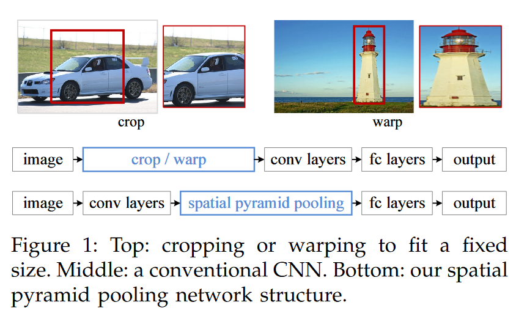
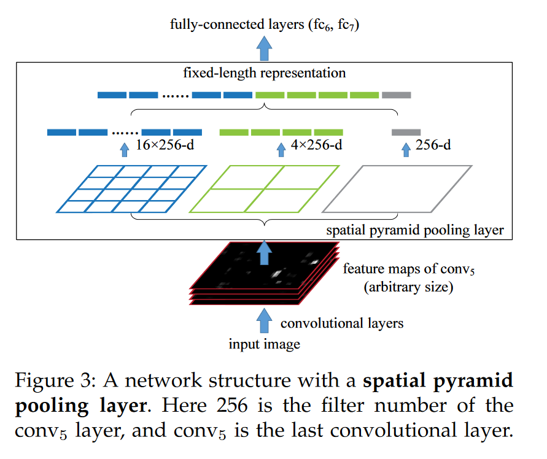

# CNN Architectures (other)

## SPPNet

### Background

大多数CNN架构在训练和测试时都使用一个固定的输入图像大小，因而我们常常需要对原始图像进行裁剪或者扭曲，而前者会损失部分图像信息，后者则会使得图像中的物体发生几何形变造成失真。

我们知道，使得CNN需要固定size输入的结构并不是卷积层而是全连接层，于是本文提出了spatial pyramid pooling（SPP），它接受任意大小的特征图，并给出固定大小的输出，这样就可以解决全连接层的固定输入问题，从而使得网络可以在不同大小的特征图上运行。

### The Spatial Pyramid Pooling Layer

可以看到，SPP和传统的池化方法不同，传统池化方法依靠滑动窗口，其中滑动窗口的数量取决于特征图大小，而SPP则将特征图划分成固定数量的spatial bin，因而能产生固定大小的输出。

> 当然了使用全局平均池化或者全局最大池化也能做到这点。

### Multi-size Training

既然SPP可以使得网络能接受任意大小的输入，那么我们就可以使用不同大小和缩放比的图像对网络进行训练。

当然原文在实现的时候由于用的是caffe框架，caffe框架只能接受固定大小的输入， 因而他是采用两个输入大小不同的网络（180和224）共享参数交替训练实现的，用pytorch应该就不用这么多此一举了。

