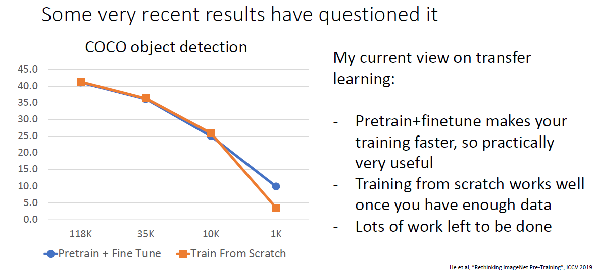

# Training Neural Networks

## One time setup

### Activation Fucntions

见之前做的[笔记](C:\Users\leexi\Desktop\StudyLibrary\lxh_Notebooks\Maching_Learning_Notebook\深度学习\训练和测试技巧\激活函数.md)。

### Data Preprocessing

见之前做的[笔记](C:\Users\leexi\Desktop\StudyLibrary\lxh_Notebooks\Maching_Learning_Notebook\深度学习\训练和测试技巧\数据预处理.md)。

### Weight Initialization

见之前做的[笔记](C:\Users\leexi\Desktop\StudyLibrary\lxh_Notebooks\Maching_Learning_Notebook\深度学习\训练和测试技巧\权重初始化.md)。

### Regularization

#### Add Term to the Loss

在损失函数中添加惩罚项是最直接的regularization方法：

#### Dropout

> 2012年AlexNet就开始用了。

为了减少推理时间往往采用inverted dropout：

> Pytorch实现的就是inverted dropout。

Dropout通常用在参数量较大的全连接层，AlexNet、VGG都是如此使用的，但是现在的流行架构如ResNet通常会使用全局平均池化来降低参数量，因而都不使用dropout策略：

#### A Common Pattern

我们可以看出regularization的一个普遍模式是提高训练过程中的随机性，然后在评估过程消除这种随机性来增强泛化能力。

上面提到的dropout明显是这种模式，另外Batch Normalization其实也是这种模式，训练过程中的随机性由不同minibatch的随机统计量（均值和方差）带来，测试时则通过使用训练集的均值和方差来消除这种随机性。

目前流行的网络架构大多只使用L2和Batch Normalization来作为正则化手段。

#### Data augmentation

事实上数据增强也可以看做是增加训练过程随机性（正则化）的一种手段：

最常用的数据增强方法是随机缩放和裁剪：

以及改变图像像素：

有时候需要引入人工经验选择性地进行数据增强（比如识别左右手肯定不能用翻转）：

### Other Example

采用上述模式的除了Dropout、Batch Normalization、Data Augmentation还有很多更新的技术，下面简单介绍。

1. 首先是dropconnect，和drop十分类似，只是它是随机取出神经元间的权重而非神经元：

2. 还有小数池化，训练时对特征图的不同区域它采用不同的池化大小，因而它的期望池化大小是一个小数：

   

3. 对于残差网络，我们可以在训练时随机丢弃一些残差块，即所谓随机深度，作者们引入了一个“反直觉”的方法，即在我们可以在训练过程中任意地丢弃一些层，并在测试过程中使用完整的网络：

   

4. 更常用的一种策略叫做cutout，就是训练时随机将图像中某些区域置0，测试时使用完整图像：

   

5. 还有一种更疯狂的策略是训练时将图像“混合”（当然这个概率是从beta分布采样的，因而实践中往往不是0.6和0.4而更可能是0.9和0.1这样的）：

   

## Training dynamics

### Learning Rate Schedules

使用比较简单的优化器比如SGD，SGD+Momentum的时候通常会使用学习率衰减策略，但是像Adam这种具有自适应学习率调整功能的学习器往往不用也可以取得不错的效果。

### Early Stopping

### Choosing Hyperparameters

#### Grid Search & Random Search

通常使用Random Search效果要好一些，还有一些疯狂的尝试比如对超参数做梯度下降、对训练集做梯度下降，不过目前由于其所需的巨大计算量而并不常用。

不同的超参数之间对性能的影响往往也有着一定的相关性：

### Without tons of GPUs

大部分人是没有那么多GPU来做超参数搜索的，因而我们通常都是使用一些人工经验来选择超参数。

1. 第一步是检查初始loss，即关闭weight decay（L2 Regularization），检查一下未训练好的模型的loss是否计算正确：

   

2. 第二步是关闭weight decay，尝试过拟合一小部分训练集，如果无法过拟合训练集说明网络结构或者超参数设置可能有问题：

   

3. 再开启weight decay，在整个训练集上尝试一个能在约100个迭代内让loss明显下降的学习率：

   

4. 进一步在1-5个epoch上调参：

   

5. 调好之后在不使用学习率衰减策略下train较长的epoch（10到20个）进行微调：

   

6. 观察学习曲线，可以根据曲线做一些调整，比如加大epoch，更改学习率衰减策略等：

   

> 大多数情况下训练集和验证集精度都是有gap的，没有gap通常意味着没有完全拟合（虽然很反直觉，但是训练集往往有噪声）。

7. 不满意的话回到步骤5继续调整。

有时候还会通过查看权重更新和学习率的比率来观察训练是否正常：

## After training

### Model Ensembles

有时候未必要训练一个模型进行集成，而是可以使用特定的学习率策略然后取一次训练中多个checkpoint进行集成：

你还可以使用训练过程中的权重的滑动平均来作为测试权重，这在生成模型中非常常用：

### Transfer Learning

迁移学习我们都很熟悉，他解决了CNN需要大量数据训练的问题，当你手头数据量较小时将预训练模型当作特征提取器就可以取得很好的效果：

如果你手头数据量较大，可以进一步进行微调以获得更好的效果：

通常使用在ImageNet进行训练的预训练模型，这也是我们为什么十分关注网络架构在ImageNet上的效果，因为往往在ImageNet上取得良好效果的模型迁移到其他任务上也能工作的更好：

但是同样对于迁移学习的效果也有一些质疑，原因是假如你有一个很大的数据集，从头开始训练获取可以取得比迁移学习更好的效果：

尽管如此，即使在数据量很大的情况，预训练模型仍然是一种很好的权重初始化策略：

### Distributed Training

一种简单的分布式方式是串行训练（不过效率很低，用pipeline加速的话可能还好）：

AlexNet当时采用了将模型分块并行训练的方式，但是这样在训练的过程中，两块GPU需要不断通信：

更通用的方式是将每个模型在GPU上复制一遍，然后将Batch中的数据分批并行训练：

甚至可以通过这种方式在不同服务器上训练同一模型：

类似于batch size和学习率的关系，可以在增加GPU数量的同时增大学习率：

不过过高的学习率有时候会带来loss爆炸，因而常采用warm up的学习率策略：

不过尽管如此和单GPU上训练仍会有所不同，比如Batch Normalizaiton等问题：

总之通过加大GPU这种暴力的手段，确实可以在很快的时间内完成大数据集的训练：

