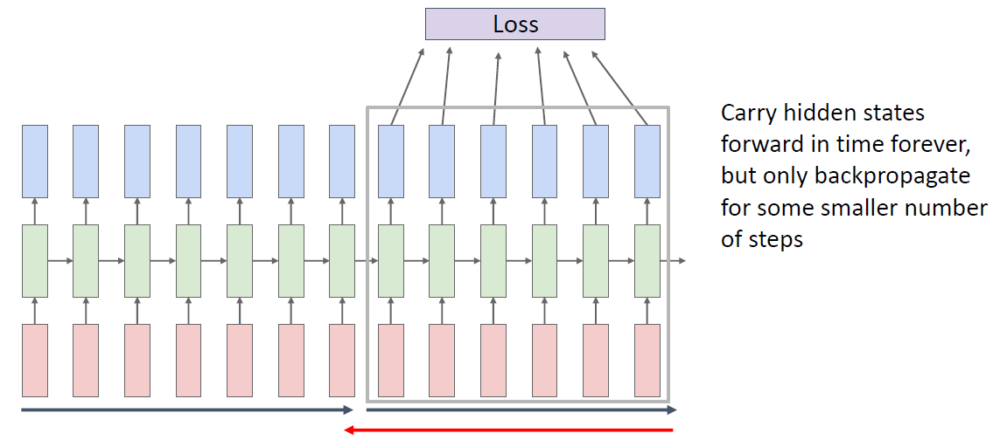

# Recurrent Neural Networks

## Background

神经网络可以处理不同的任务：

- **Image classification: **可以看作是one to one的任务，即 Image -> label；
- **Image Captioning: **可以看作是one to many的任务，即 Image -> sequence of words；
- **Video classification**：可以看作是many to one的任务，即 Sequence of images -> label；
- **Machine Translation: **可以看作是many to many的任务，即 Sequence of words -> Sequence of words；
- **Per-frame video classification: **可以看作另一种many to many的任务，即 Sequence of images -> Sequence of labels。

 其中许多设计到many的任务由于many往往是有时序关系的，因而适合用RNN来建模。

## Recurrent Neural Networks

### 基本概念

因为是很普及的概念，下面就简单介绍下，详细的可以看之前做的[笔记](C:\Users\leexi\Desktop\StudyLibrary\lxh_Notebooks\Maching_Learning_Notebook\深度学习\循环神经网络RNN\RNN及其变种介绍.md)。

最简单的RNN形式就是MLP在时间轴上扩展了一下

计算图比较占显存：

### Sequence to Sequence（seq2seq）

采用编码器解码器架构，主要为了解决输入和输出形式不一样（比如长度不一样）的问题：

#### Language Model

一个经典的例子是语言模型（按字符建模），其训练和测试过程如下：

对于NLP任务通常不使用独热码而是使用一个嵌入层将输入嵌入为稠密向量：

#### Image Captioning

一个更复杂的例子是自动给图像取标题，它结合了CNN和RNN：

将CNN（通常使用预训练模型）提取到的特征作为RNN的初始状态，然后根据输入符号`<START>`开始生成，直到模型输出结束符号`<END>`。

### Backpropagation Through Time

通常把RNN上的传播称为Backpropagation Through Time（BPTT），因为计算图是按时间展开的：

直接计算BPTT对于很长的序列保存梯度需要很大的内存，常用的一种做法是截断BPTT，即每搁一段时间就截断一次计算图，即把原本的大计算图分解成了许多小计算图（当然这样不可避免的会造成误差，即TBPTT计算的是近似梯度）：

### LSTM

使用Vanilla RNN结构可能会遇到梯度爆炸和梯度消失的问题：

对于梯度爆炸可以使用梯度裁剪策略来解决，对于梯度消失则只能更换RNN架构。

**Long Short Term Memory（LSTM）**是一种常用的用于解决梯度消失的架构，相较于Vanilla RNN，它还在内部维护了一个隐变量cell state：

此外还增加了额外的几个门控单元：

- Vanilla RNN的 $h_t$ 在这里变成了新加入的信息 $g_t$；
- 并使用输入们 $i_t$ 和遗忘门 $f_t$ 来控制细胞状态 $c_t$ 对新加入的信息的吸收程度和对旧信息的保留程度；
- 隐藏状态 $h_t$ 则由细胞状态产生并通过输出门控制输出的比例。

由于使用线性累加更新细胞状态，因而可以有效抑制梯度消失：

这一结构被highway以及后面的resnet借鉴（也许没借鉴，但是思路确实比较类似）：

### Other

类似于MLP的隐藏层，RNN也可以进行堆叠增加深度：

当然还有很多同样可以克服梯度消失的变种，比如GRU，另外也有人尝试搜索别的RNN架构试图寻找由于LSTM的，事实证明LSTM是一种足够好的架构（虽然未必是最好的）：

显然LSTM的可解释性比生成出来的结构要强的多：

