#  Attention

## Sequence-to-Sequence with RNNs and Attention（Bahdanau注意力）

使用RNN处理seq2seq任务往往采用上一章简单介绍的编码器-解码器结构，首先我们希望通过编码器来对整个输入进行编码，形象地说就是对整个句子的内容进行总结，我们称这个**固定长度的总结为context $c$**；然后通常解码器也是由RNN组成，其需要一个初始状态 $s_0$，因而我们希望通过编码器获得两个状态：

- 对于 context $c$ 通常使用编码器最后一个时间步的状态；
- $s_0$ 可以简单设为与 $c$ 一样，也可以通过mlp来预测获得（输入我估计是 $h_t$ 之类的）。

我们看到，下图中解码器在每一个时间步都使用相同的context向量来获得编码信息，当我们的序列不是很长的时候这是合理的，但是如果我们的输入序列很长的话，**使用一个固定长度的context向量可能难以表示这个长序列的完整信息**。

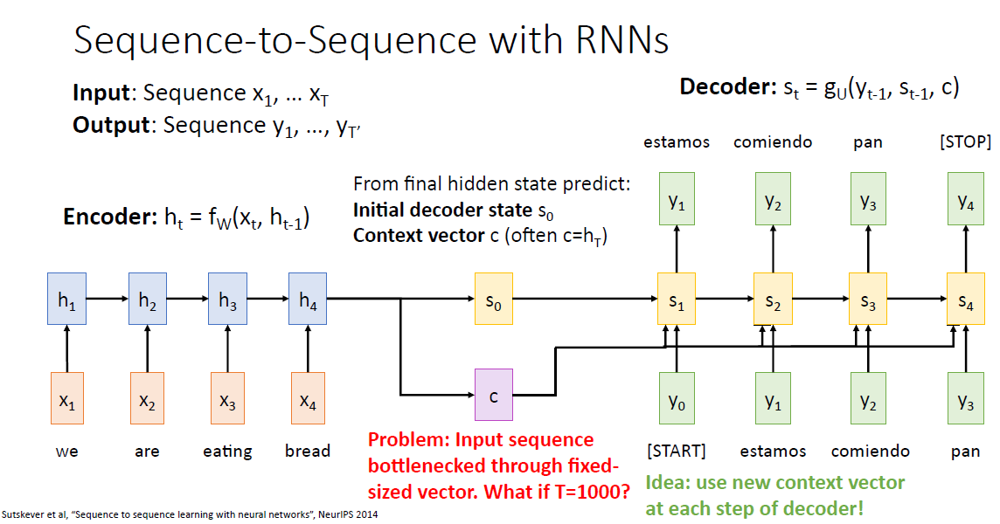

解决该问题的很简单的一个想法就是在解码器的不同时间步使用不同的context向量，这样可以选择性地获取输入序列对于当前时间步较为重要的信息，即在不同的时间步我们关注输入序列的不同部分。

> 这十分符合我们人类的直觉，以人类进行英译汉任务为例，在翻译当前单词时我们通常也只关注对应的上下文而不是整个文档。

我们通常使用attention机制来实现上述方案，我们将 $s_{t-1}$ 作为query，$h_i$ 作为key和value（注意 $h_i$ 指的是解码器各个时间步的输出组成的向量），在每个时间步都通过注意力机制获得新的context：

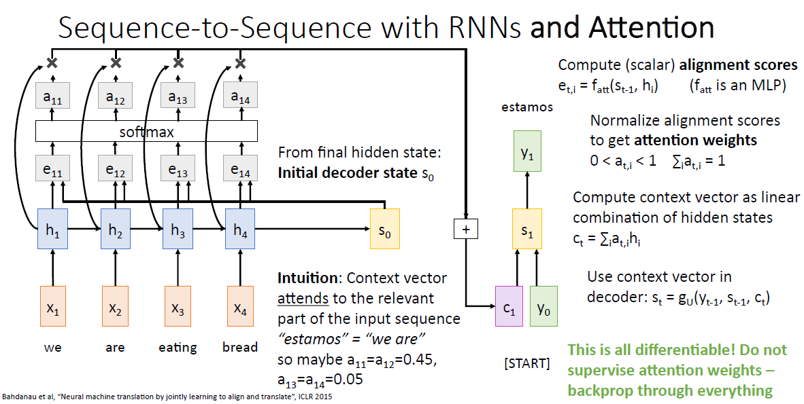

> 所以实际上每次影响context的也只有 $s_{t-1}$ 而已，$h_i$ 都是一样的。

也有地方把这种机制叫做Bahdanau注意力（显然是因为该论文第一作者的名字）。

我们可以通过可视化每一个查询得到的注意力得分观察注意力机制：

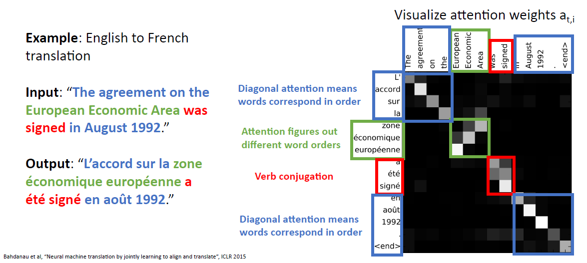

可以看到通过训练，我们的注意力机制能够成功地习得不同语言的语法对应关系。

## Image Captioning with RNNs and Attention

我们注意到上一节的注意力机制在**查询的时候并没有利用到键值对的时序关系**，也就是说注意力机制并不仅仅只能应用在sequence数据上，同样可以应用在别的数据比如图像上：

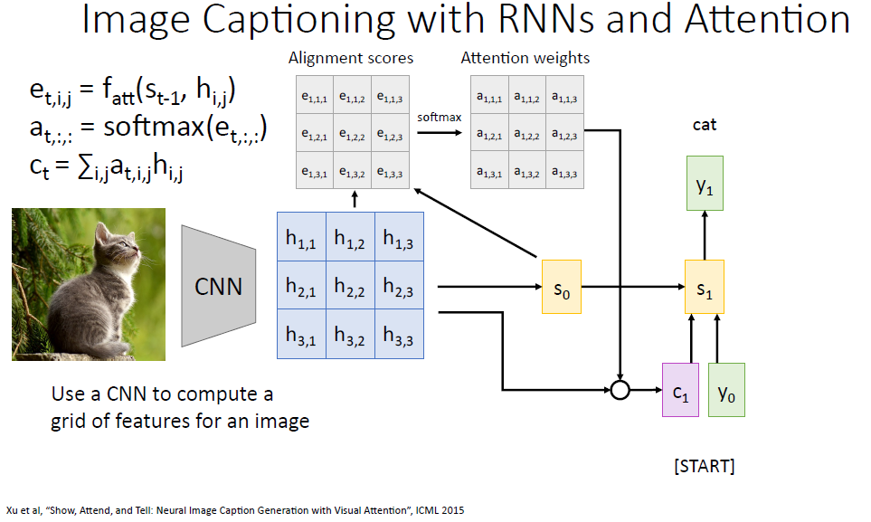

可以看到使用的是和上一节完全一样的方法，只不过是把sequence换成了image。

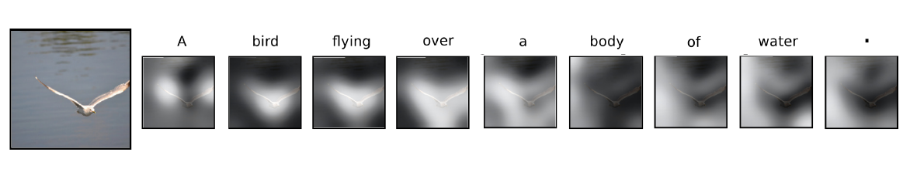

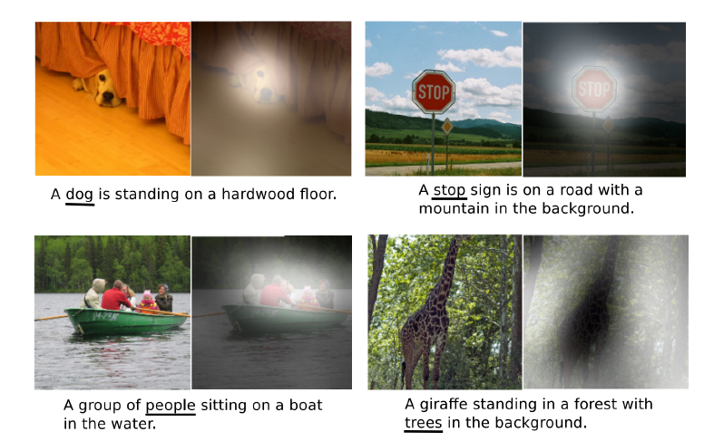

可以看到注意力机制同样学到了图像和语言的对应关系。

> 这其实和人眼的机制是类似的，人眼在视线范围内实际上同一时间也只能看到一小部分高清区域，因而我们需要不断转动眼球。

同理可以推广到更多类型的数据上：

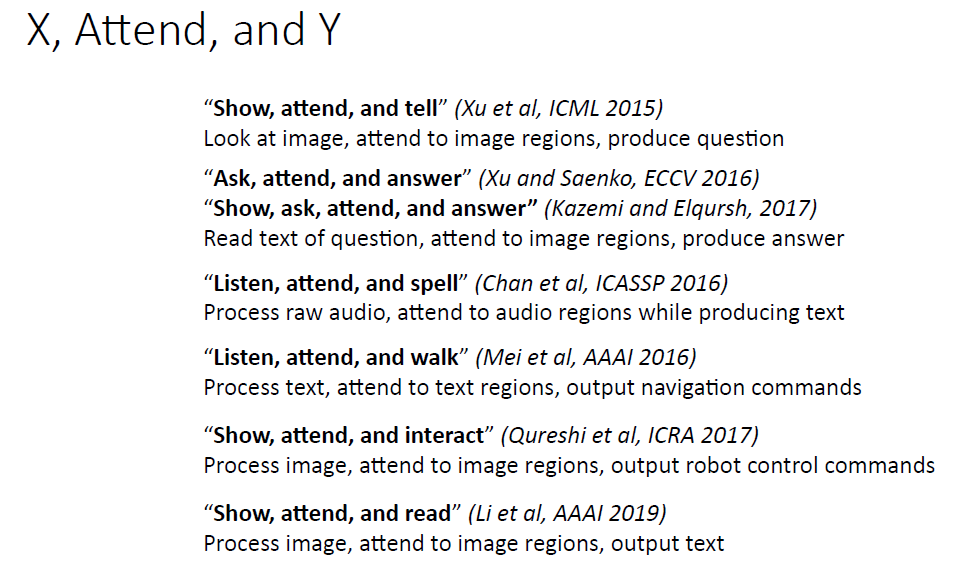

当我们执行一种类型的数据到另一种数据的转换时，都可以考虑使用attention机制。

## 基础Attention机制

### 注意力评分函数

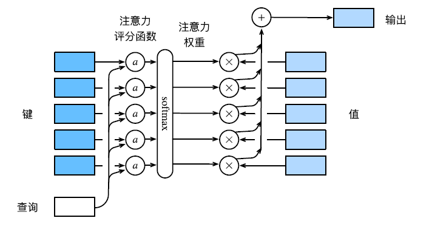

用数学语言描述，假设有一个查询 $\mathbf{q}\in \mathbb{R}^q$ 和 $m$ 个键值对 $(\mathbf{k}_1, \mathbf{v}_1), \cdots, (\mathbf{k}_m, \mathbf{v}_m)$，其中 $\mathbf{k}_i \in \mathbb{R}^k$, $\mathbf{v}_i \in \mathbb{R}^v$，注意力汇聚函数 $f$ 就被表示成value的加权和：
$$
f(\mathbf{q},(\mathbf{k}_1, \mathbf{v}_1),\cdots,(\mathbf{k}_m, \mathbf{v}_m)) = \sum_{i=1}^m \alpha(\mathbf{q},\mathbf{k}_i)\mathbf{v}_i \in \mathbb{R}^v
$$
其中查询 $\mathbf{q}$ 和键 $\mathbf{k}_i$ 的注意力权重（标量）是通过注意力评分函数 $a$ 将两个向量映射成标量，再经过softmax运算得到的：
$$
\alpha\left(\mathbf{q}, \mathbf{k}_{i}\right)=\operatorname{softmax}\left(a\left(\mathbf{q}, \mathbf{k}_{i}\right)\right)=\frac{\exp \left(a\left(\mathbf{q}, \mathbf{k}_{i}\right)\right)}{\sum_{j=1}^{m} \exp \left(a\left(\mathbf{q}, \mathbf{k}_{j}\right)\right)} \in \mathbb{R}
$$
将注意力汇聚的输出计算可以作为值的加权平均，选择不同的注意力评分函数 $a$ 会带来不同的注意力汇聚操作。通常使用缩放的“点-积”注意力评分函数的计算效率更高而加性注意力可能会带来更强的拟合能力。

#### 掩蔽softmax操作

正如上⾯提到的，softmax操作⽤于输出⼀个概率分布作为注意⼒权重。在某些情况下，并⾮所有的值都应该被纳⼊到注意⼒汇聚中。例如，有时为了⾼效处理⼩批量数据集，某些⽂本序列被填充了没有意义的特殊词元。为了仅将有意义的词元作为值来获取注意⼒汇聚，我们可以指定⼀个有效序列长度（即词元的个数），以便在计算softmax时过滤掉超出指定范围的位置。

另外在处理文本序列时，有时候逻辑上我们是不能知道后面的时间步的信息的（RNN的串行处理避免了这一点），因而需要使用mask阻止attention机制获得后面时间步的信息。

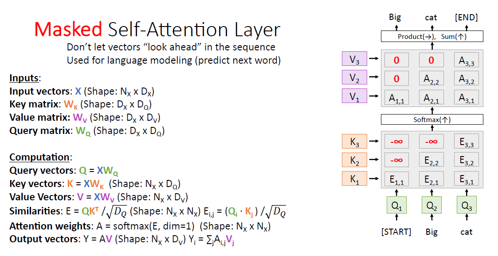

#### 加性注意力

一般来说，当查询和键是不同长度的张量时，我们可以使用加性注意力作为评分函数。给定单个查询 $\mathbf{q} \in \mathbb{R}^q$ 和键 $\mathbf{k} \in \mathbb{R}^k$，**加性注意力（additive attention）**的评分函数为：
$$
a(\mathbf{q},\mathbf{k}) = \mathbf{w}_v^\mathrm{T}  \tanh(\mathbf{W}_q \mathbf{q}+ \mathbf{W}_k \mathbf{k})
$$
其中可学习的参数是 $\mathbf{W}_q \in \mathbb{R}^{h\times q}$ 、$\mathbf{W}_k \in \mathbb{R}^{h\times k}$、$\mathbf{W}_v \in \mathbb{R}^{h}$，可以看到加性注意力做的就是将查询和键连结起来后输入到一个包含 $h$ 个隐藏层单元的MLP中，使用tanh作为激活函数，并且禁用偏置项。

> 我个人觉得要写成和缩放点积注意力统一的形式的话这里不应该写 $\mathbf{W}_q$ 和 $\mathbf{W}_k$ 出来，因为后面会发现到处都会使用线性投影来变换维度，这里只是使用线性投影让query和key的维度相同用于直接相加而已，后面点积注意力同样可以这么操作。

```python
class AdditiveAttention(nn.Module):
    """加性注意⼒"""
    def __init__(self, key_size, query_size, num_hiddens, dropout, **kwargs):
        super(AdditiveAttention, self).__init__(**kwargs)
        self.W_q = nn.Linear(query_size, num_hiddens, bias=False)
        self.W_k = nn.Linear(key_size, num_hiddens, bias=False)
        self.W_v = nn.Linear(num_hiddens, 1, bias=False)
        self.dropout = nn.Dropout(dropout)

    def forward(self, queries, keys, values, valid_lens):
        # 在维度扩展后，
        # queries的形状：(batch_size，查询的个数，1，num_hidden)
        # key的形状：(batch_size，1，“键－值”对的个数，num_hiddens)
        # 使⽤⼴播⽅式进⾏求和，每个query都要和所有key计算注意力分数
        queries, keys = self.W_q(queries), self.W_k(keys) 
        features = W_q.unsqueeze(2) + W_q.unsqueeze(1)
        # self.w_v仅有⼀个输出，因此从形状中移除最后那个维度。
        # scores的形状：(batch_size，查询的个数，“键-值”对的个数)
        scores = self.W_v(torch.tanh(features)).squeeze(-1)
        self.attention_weights = masked_softmax(scores, valid_lens)
        # values的形状：(batch_size，“键－值”对的个数，值的维度)
        return torch.bmm(self.dropout(self.attention_weights), values)    
```

#### 缩放点积注意力

使用点积可以得到计算效率更高的评分函数，不过**点积操作要求查询和键具有相同的长度 $d$** ，假设查询和键的所有元素都是独立的随机变量，并且都满足零均值和单位方差，那么两个向量的点积的均值为0，方差为 $d$ 。
> 更详细的推导见:https://zhuanlan.zhihu.com/p/436614439,大致内容如下:
>
> 对于均值为0方差为1的变量 $A,B$,我们有:
> $$
> E[\sum_i^d a_i b_i] =\sum_i^dE[ a_i b_i]  =\sum_i^dE[ a_i ]E[b_i]= 0 \\
> Var[\sum_i^d a_i b_i] = \sum_i^d Var[a_i b_i] = \sum_i^d Var[a_i]Var[b_i] = d
> $$

对于高维输入，即 $d$ 很大的情况下，可能会产生很大的点积值从而将整个softmax推向梯度平缓区，使得收敛困难，即“梯度消失”。

> 可参考：https://www.zhihu.com/question/339723385及其评论（感觉不是所有观点都是正确的）。

为确保无论向量长度如何，点积的方差在不考虑向量长度的情况下仍然是1，我们将点积除以 $\sqrt{d}$ ，则缩放点积注意力（scaled dot-product attention）评分函数为：
$$
a(\mathbf{q}, \mathbf{k}) = \mathbf{q}^\mathrm{T}\mathbf{k} / \sqrt{d}
$$


```python
class DotProductAttention(nn.Module):
    """缩放点积注意⼒"""
    def __init__(self, dropout, **kwargs):
        super(DotProductAttention, self).__init__(**kwargs)
        self.dropout = nn.Dropout(dropout)
        # queries的形状：(batch_size，查询的个数，d)
        # keys的形状：(batch_size，“键－值”对的个数，d)
        # values的形状：(batch_size，“键－值”对的个数，值的维度)
        # valid_lens的形状:(batch_size，)或者(batch_size，查询的个数)
    def forward(self, queries, keys, values, valid_lens=None):
        d = queries.shape[-1]
        # 设置transpose_b=True为了交换keys的最后两个维度
        scores = torch.bmm(queries, keys.transpose(1,2)) / math.sqrt(d)
        self.attention_weights = masked_softmax(scores, valid_lens)
        return torch.bmm(self.dropout(self.attention_weights), values)
```

另外很显然就算是查询和键维度不同也可以用一个线性映射使其相同，因而许多地方将两种基础的attention形式Add[1]和Mul[2]写成如下形式:

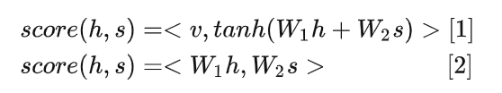

> 显然线性映射是必须的，不然你多头注意力学习个啥，上面没实现是因为调用点积注意力的模块在外面实现了，传进来的 $\mathbf{q}$ 和 $\mathbf{k}$ 就是经过了线性映射后的。

也有的地方称这种注意力评分为query和key之间的相似度，大致是因为评分：
$$
\begin{aligned}
\frac{\mathbf{q} \cdot \mathbf{k}}{\sqrt{d}} &= \frac{|\mathbf{q}||\mathbf{v}|\cos\theta}{\sqrt{d}} 
\end{aligned}
$$
的值主要由他两的余弦相似度 $\cos \theta$ 决定。

> 另外注意在训练时由于dropout的存在，两个相同的query未必会获得相同的结果。

### 多头注意力

在实践中，给定相同的query、key和value的集合时，外面希望模型可以基于相同的注意力机制学习到不同的行为，然后将不同的行为所为知识组合起来，捕获序列内各种范围的依赖关系（例如，短距离依赖和长距离依赖关系）。因此，允许注意力机制组合**使用query、key和value的不同子空间表示（representation subspace）**可能是有益的。

因而我们可以用独立学习得到的 $h$ 组不同的线性投影（linear projections）来变换query、key和value。

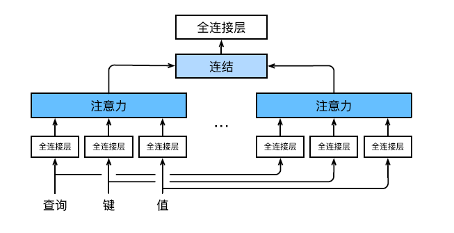

给定查询 $\mathbf{q} \in \mathbb{R}^{d_{q}} 、$ 键 $\mathbf{k} \in \mathbb{R}^{d_{k}}$ 和 值 $\mathbf{v} \in \mathbb{R}^{d_{v}}$ ，每个注意力头 $\mathbf{h}_{i}(i=1, \ldots, h)$ 的计算方法为：
$$
\mathbf{h}_{i}=f\left(\mathbf{W}_{i}^{(q)} \mathbf{q}, \mathbf{W}_{i}^{(k)} \mathbf{k}, \mathbf{W}_{i}^{(v)} \mathbf{v}\right) \in \mathbb{R}^{p_{v}},
$$
其中, 可学习的参数包括 $\mathbf{W}_{i}^{(q)} \in \mathbb{R}^{p_{q} \times d_{q}}, \mathbf{W}_{i}^{(k)} \in \mathbb{R}^{p_{k} \times d_{k}}$ 和 $\mathbf{W}_{i}^{(v)} \in \mathbb{R}^{p_{v} \times d_{v}}$, 以及代表注意力汇聚的函数 $f_{\circ} f$ 可 以是 10.3节中的加性注意力和缩放点积注意力。多头注意力的输出需要经过另一个线性转换, 它对应着 $h$ 个 头连结后的结果，因此其可学习参数是 $\mathbf{W}_{o} \in \mathbb{R}^{p_{o} \times h p_{v}}$ :
$$
\mathbf{W}_{o}\left[\begin{array}{c}
\mathbf{h}_{1} \\
\vdots \\
\mathbf{h}_{h}
\end{array}\right] \in \mathbb{R}^{p_{o}} .
$$
基于这种设计，每个头都可能会关注输入的不同部分，可以表示比简单加权平均值更复杂的函数。

实现的关键部分是使用转置函数使得多个头能够并行计算attention，**多头指的是用多个MLP，下面代码实现由于点积attention没有参数，可以用同一个**：

```python
def transpose_qkv(X, num_heads):
    """
    为了多注意⼒头的并⾏计算⽽变换形状
    输⼊X的形状:(batch_size，查询或者“键－值”对的个数，num_hiddens)
    最终输出的形状:(batch_size*num_heads,查询或者“键－值”对的个数, num_hiddens/num_heads)
    """
    X = X.reshape(X.shape[0], X.shape[1], num_heads, -1)
    # 输出X的形状:(batch_size，num_heads，查询或者“键－值”对的个数,
    # num_hiddens/num_heads)
    X = X.permute(0, 2, 1, 3)
    # 最终输出的形状:(batch_size*num_heads,查询或者“键－值”对的个数,
    # num_hiddens/num_heads)
    return X.reshape(-1, X.shape[2], X.shape[3])

def transpose_output(X, num_heads):
    """逆转transpose_qkv函数的操作"""
    X = X.reshape(-1, num_heads, X.shape[1], X.shape[2])
    X = X.permute(0, 2, 1, 3)
    return X.reshape(X.shape[0], X.shape[1], -1)

class MultiHeadAttention(nn.Module):
    """多头注意力"""
    def __init__(self, key_size, query_size, value_size, num_hiddens,
                 num_heads, dropout, bias=False, **kwargs):
        super(MultiHeadAttention, self).__init__(**kwargs)
        self.num_heads = num_heads
        self.attention = d2l.DotProductAttention(dropout)
        self.W_q = nn.Linear(query_size, num_hiddens, bias=bias)
        self.W_k = nn.Linear(key_size, num_hiddens, bias=bias)
        self.W_v = nn.Linear(value_size, num_hiddens, bias=bias)
        self.W_o = nn.Linear(num_hiddens, num_hiddens, bias=bias)

    def forward(self, queries, keys, values, valid_lens):
        # queries，keys，values的形状:
        # (batch_size，查询或者“键－值”对的个数，num_hiddens)
        # valid_lens　的形状:
        # (batch_size，)或(batch_size，查询的个数)
        # 经过变换后，输出的queries，keys，values　的形状:
        # (batch_size*num_heads，查询或者“键－值”对的个数，
        # num_hiddens/num_heads)
        queries = transpose_qkv(self.W_q(queries), self.num_heads)
        keys = transpose_qkv(self.W_k(keys), self.num_heads)
        values = transpose_qkv(self.W_v(values), self.num_heads)

        if valid_lens is not None:
            # 在轴0，将第一项（标量或者矢量）复制num_heads次，
            # 然后如此复制第二项，然后诸如此类。
            valid_lens = torch.repeat_interleave(
                valid_lens, repeats=self.num_heads, dim=0)

        # output的形状:(batch_size*num_heads，查询的个数，
        # num_hiddens/num_heads)
        output = self.attention(queries, keys, values, valid_lens)

        # output_concat的形状:(batch_size，查询的个数，num_hiddens)
        output_concat = transpose_output(output, self.num_heads)
        return self.W_o(output_concat)
```

### Self-Attention

#### 基本原理

自注意力机制顾名思义就是query、key、value全部使用同一个输入向量：

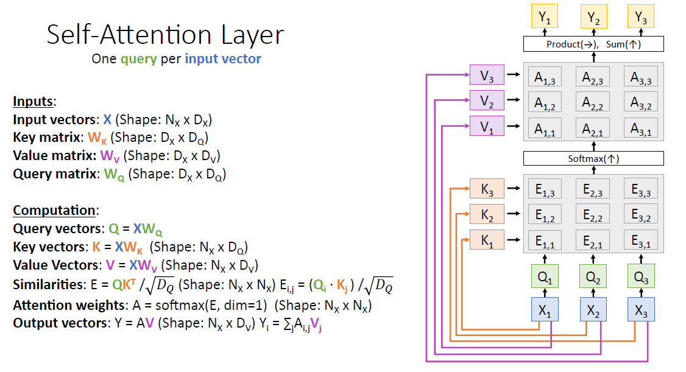

注意这里的 $Q$ 和 $K$ 使用不同的权重矩阵 $W_Q, W_K$ 生成，而不是直接使用 $X$ 进行自身的点乘：

- 一方面是为了解决输入句长与输出句长不一致的问题；
- 即使输入输出长度一致，直接拿 $X$ 和 $X$ 点乘的话，得到的attention score 矩阵是一个对称矩阵，显然会导致泛化能力很差。

#### 置换等变性

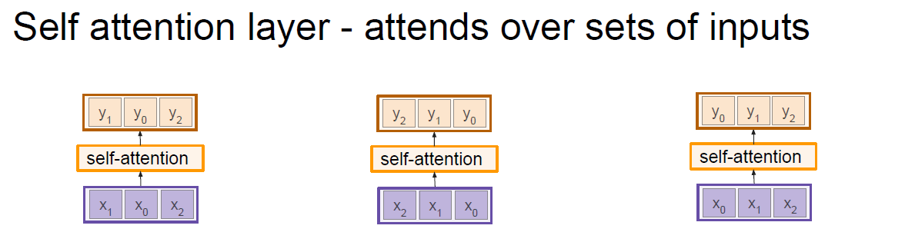

如图所示，self-attention有着所谓**置换等变性（Permutation equivariant）**，即更改输入的顺序，输出的顺序也会随着更改而值不发生改变，即对于两个self-attention变换 $f, s$ 满足：
$$
f(s(x)) = s(f(x))
$$
也就是说，self-attention层不关心输入的顺序！

#### 位置编码

但是有时候我们的输入往往是包含顺序信息的，比如语言或者是有序的图像特征，因而我们需要在输入中添加**位置编码（Positional encoding）**：

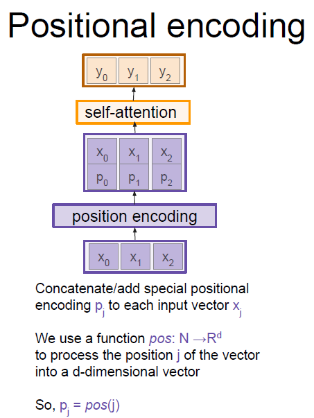

位置编码可以通过学习得到（Bert）也可以直接固定得到。固定编码常用的有建立查找表和使用正弦函数和余弦函数：


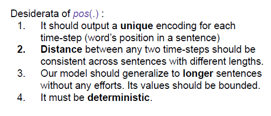

使用正弦和余弦函数的一个直觉是相邻整数的二进制表示，可以看到，相邻整数的二进制各位呈现周期性变化，其中高位的变化周期长而低位的变化周期短。

> 不同列的周期不一样，因此几乎不可能有相同的编码，解决的是第一点唯一性的问题。
>
> 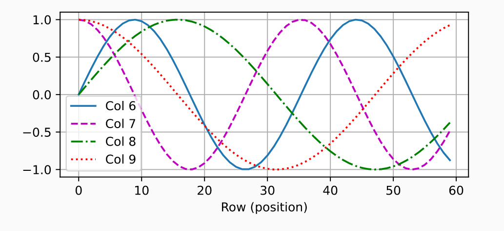

即在二进制表示中，较高比特位的交替频率低于较低比特位， 与下面的热图所示相似，只是位置编码通过使用三角函数在编码维度上降低频率。 由于输出是浮点数，因此此类连续表示比二进制表示法更节省空间。

> 这里的节省空间我的理解是不需要增加encoding dimension也能给任意长度的输入编码，实际上解决的是上面第三点有界性的问题。

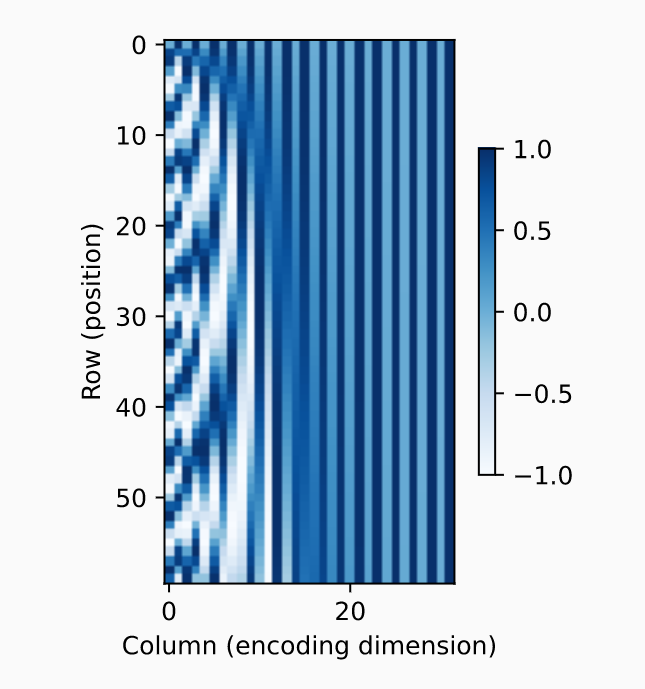

至于为什么用一个sin一个cos交替考虑到的是上面的第二点，保证相对位置信息与当前位置无关，即除了捕获绝对位置信息之外，上述的位置编码还允许模型学习得到输入序列中相对位置信息。 这是因为对于任何确定的位置偏移 $δ$，位置 $i+δ$ 处 的位置编码可以线性投影位置 $i$ 处的位置编码来表示。

这种投影的数学解释是, 令 $\omega_{j}=1 / 10000^{2 j / d}$, 对于任何确定的位置偏移 $\delta$, 任何一对 $\left(p_{i, 2 j}, p_{i, 2 j+1}\right)$ 都可以线性投影到 $\left(p_{i+\delta, 2 j}, p_{i+\delta, 2 j+1}\right)$ ：
$$
\begin{aligned}
&{\left[\begin{array}{cc}
\cos \left(\delta \omega_{j}\right) & \sin \left(\delta \omega_{j}\right) \\
-\sin \left(\delta \omega_{j}\right) & \cos \left(\delta \omega_{j}\right)
\end{array}\right]\left[\begin{array}{c}
p_{i, 2 j} \\
p_{i, 2 j+1}
\end{array}\right]} \\
&=\left[\begin{array}{c}
\cos \left(\delta \omega_{j}\right) \sin \left(i \omega_{j}\right)+\sin \left(\delta \omega_{j}\right) \cos \left(i \omega_{j}\right) \\
-\sin \left(\delta \omega_{j}\right) \sin \left(i \omega_{j}\right)+\cos \left(\delta \omega_{j}\right) \cos \left(i \omega_{j}\right)
\end{array}\right] \\
&=\left[\begin{array}{c}
\sin \left((i+\delta) \omega_{j}\right) \\
\cos \left((i+\delta) \omega_{j}\right)
\end{array}\right] \\
&=\left[\begin{array}{c}
p_{i+\delta, 2 j} \\
p_{i+\delta, 2 j+1}
\end{array}\right]
\end{aligned}
$$
**该 $2 \times 2$ 投影矩阵不依赖于任何位置的索引 $i$** 。

```python
class PositionalEncoding(nn.Module):
    """位置编码"""
    def __init__(self, num_hiddens, dropout, max_len=1000):
        super(PositionalEncoding, self).__init__()
        self.dropout = nn.Dropout(dropout)
        # 创建一个足够长的P
        self.P = torch.zeros((1, max_len, num_hiddens))
        X = torch.arange(max_len, dtype=torch.float32).reshape(
            -1, 1) / torch.pow(10000, torch.arange(
            0, num_hiddens, 2, dtype=torch.float32) / num_hiddens)
        self.P[:, :, 0::2] = torch.sin(X)
        self.P[:, :, 1::2] = torch.cos(X)

    def forward(self, X):
        X = X + self.P[:, :X.shape[1], :].to(X.device)
        return self.dropout(X)
```

#### ⽐较CNN、RNN和Self-Attention

假设目标都是将由 $n$ 个词元组成的序列（即有 $n$ 个时间步）映射到另一个长度相等的序列，其中的每个输入词元或输出词元都由 $d$ 维向量表示。具体来说，我们将比较的是卷积神经网络、循环神经网络和自注意力这几个架构的计算复杂性、顺序操作和最大路径长度。

顺序操作会妨碍并行计算，而任意的序列位置组合之间的路径越短，则能更轻松地学习序列中的远距离依赖关系 [[Hochreiter et al., 2001](https://zh.d2l.ai/chapter_references/zreferences.html#id67)]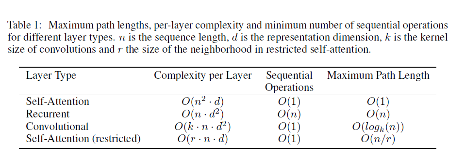

> 普通卷积的Maximum Path Length应该是 $O(n/k)$，dialted卷积的才是 $O(log_k(n))$。
>
> 原文定义：Hence we also compare the **maximum path length** between any two input and output positions in networks composed of the different layer types.
>
> To improve computational performance for tasks involving very long sequences, self-attention could be restricted to **considering only a neighborhood of size $r$** in the input sequence centered around the respective output position.

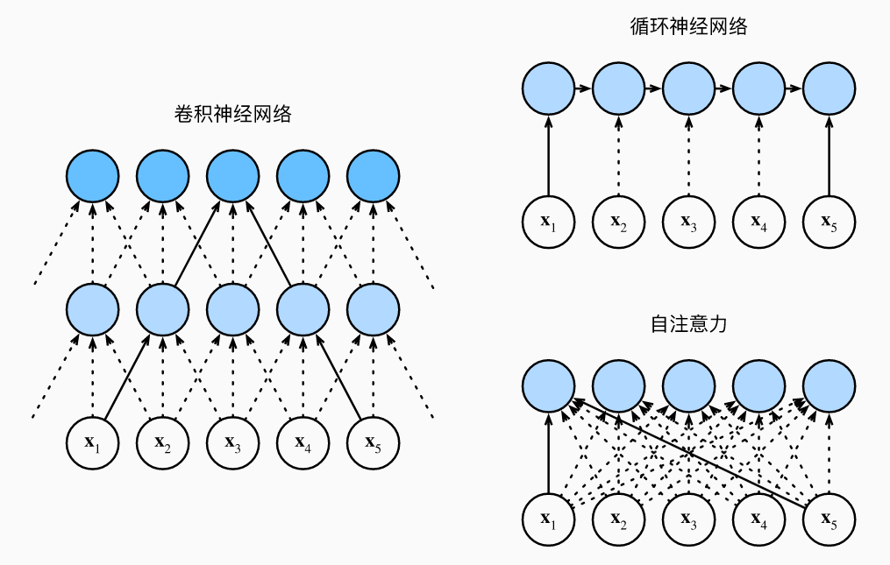

- 考虑一个卷积核大小为 $k$ 的卷积层。我们将在后面的章节中提供关于使用卷积神经网络处理序列的更多详细信息。目前, 我们只需要知道, 由于序列长度 是 $n$, 输入和输出的通道数量都是 $d$, 所以卷积层的计算复杂度为 $O\left(k n d^{2}\right)$ 。如图10.6.1所示, 卷积神经网络是分层的, 因此为有 $O(1)$ 个顺序操作, 最大路径长度为 $O(n / k)$ 。例如, $\mathbf{x}_{1}$ 和 $\mathbf{x}_{5}$ 处于图中卷积核大小为 3 的双层卷积神经网络的感受野内。

- 当更新循环神经网络的隐状态时, $d \times d$ 权重矩阵和 $d$ 维隐状态的乘法计算复杂度为 $O\left(d^{2}\right)$ 。由于序列长度为 $n$, 因此循环神经网络层的计算复杂度为 $O\left(n d^{2}\right)$ 。根据图10.6.1, 有 $O(n)$ 个顺序操作无法并行化, 最大路径长度也是 $O(n)$ 。

- 在自注意力中, 查询、键和值都是 $n \times d$ 矩阵。考虑缩放的”点一积“注意力, 其中 $n \times d$ 矩阵乘以 $d \times n$ 矩阵。之后输出的 $n \times n$ 矩阵乘以 $n \times d$ 矩阵。因此, 自注意力具有 $O\left(n^{2} d\right)$ 计算复杂性。正如我们在 图10.6.1中看到的那样, 每个词元都通过自注意力直接连接到任何其他词元。因此, 有 $O(1)$ 个顺序操作可以并行计算, 最大路径长度也是 $O(1)$ 。

总而言之, 卷积神经网络和自注意力都拥有并行计算的优势, 而且自注意力的最大路径长度最短。但是因为其计算复杂度是关于序列长度的二次方, 所以在很长的序列中计算会非常慢。

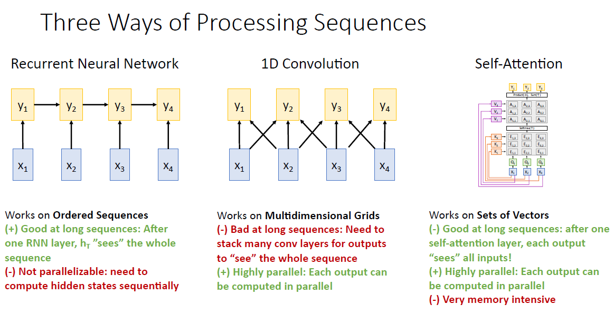

### 与全连接层的区别

> 参考：https://www.zhihu.com/question/320174043

Attention的最终输出可以看成是一个“在关注部分权重更大的全连接层”、但是它与全连接层的区别在于，注意力机制可以利用输入的特征信息来确定哪些部分更重要。

输入层有$A,B,C$三个特征向量，我们需要构造一层网络来确定三者的权重，然后加权求和得到输出$O$。也就是得到三个权重$w_A, w_B, w_C$，然后得到 
$$
O = w_A A + w_B B + w_c C
$$
这个式子形式上看上去确实是全连接层没错。然而如果用全连接层有什么问题呢？

**问题就在于在全连接层里， $w_A, w_B, w_C$是根据位置确定的。**我第一次给你三个数据$A,B,C$，然后你得出了$B$最重要，也就是让 $w_B$ 最大。然而我下次给你的顺序可能是$B, A, C$，这次$A$在刚才$B$的位置，如果你用全连接层来实现的话，得出的结果就会变成:
$$
O = w_A B + w_B A + w_c C
$$
这就变成了$A$最重要了，这显然不是我们想要的结果。

那么如何解决这个问题呢？我们就要根据实体自身的特征，而不是它们的位置来确定它们的重要程度。也就是说， $w_A, w_B, w_C$ 不该是固定的，而是要与$A,B,C$的值相关。简单考虑，也就是要定义一个函数$f$，令
$$
w_A = f(A), w_B = f(B), w_C = f(C)
$$
于是我们就给每个实体分配了一个与它们的位置无关的权重。**这里的函数$f$就是我们所说的注意力机制。**于是我们最终得出的输出为：
$$
O = w_A A + w_B B + w_C C = f(A) A + f(B) B + f(C) C
$$
可以看出，最终整合信息时加权求和的形式没有变，所以可能是这样才让人任意产生注意力机制与全连接层没有区别的疑惑。然而事实上**注意力机制的意义是引入了权重函数$f$，使得权重与输入相关，从而避免了全连接层中权重固定的问题。**

## 各种各样的新的Self-Attention机制
