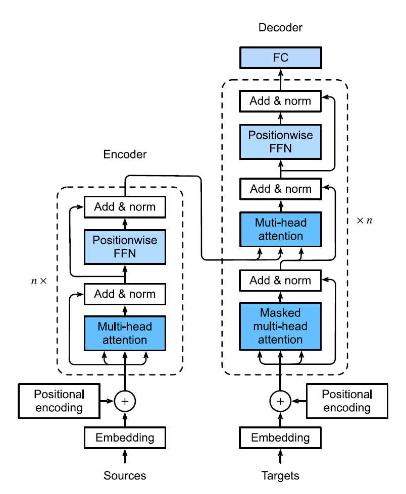
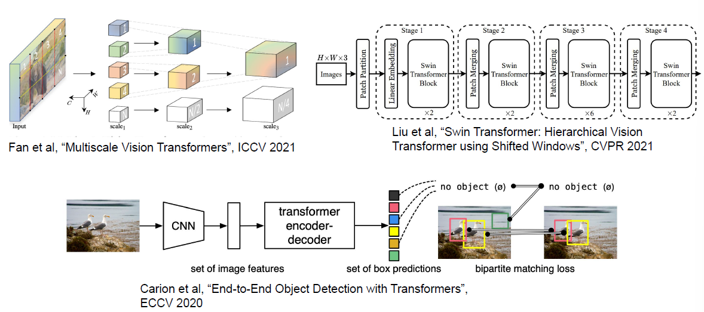
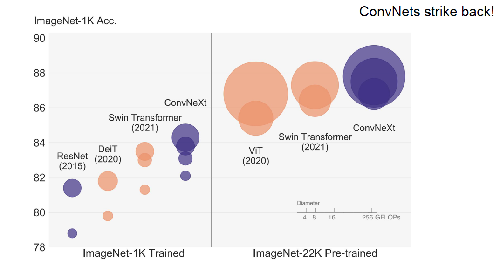
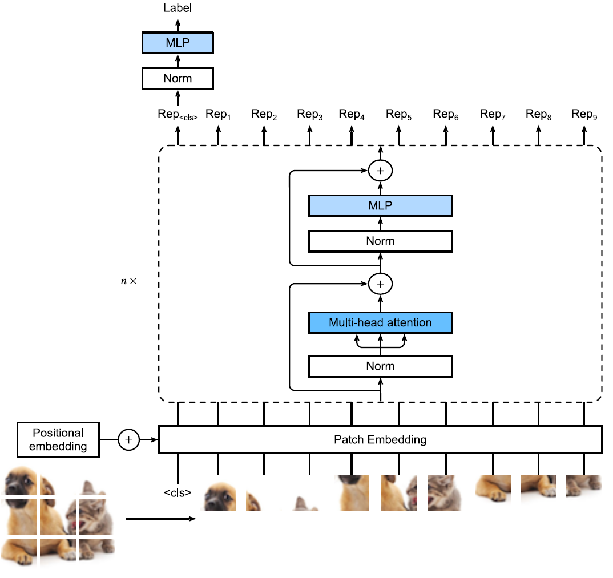
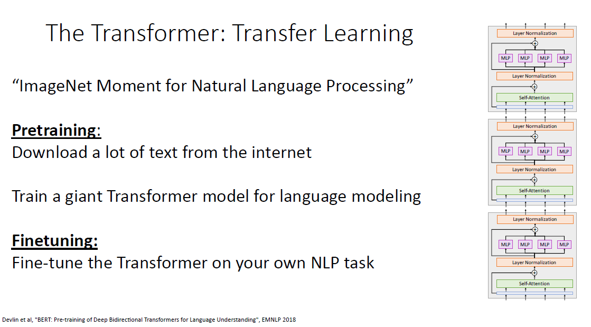
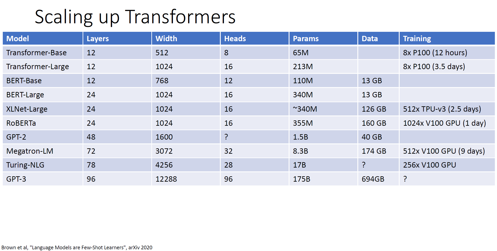

# Transformer

自注意力同时具有并行计算和最短的最大路径长度这两个优势。因此，使用自注意力来设计深度架构是很有吸引力的。对比之前仍然依赖循环神经网络实现输入表示的自注意力模型 [[Cheng et al., 2016](https://zh.d2l.ai/chapter_references/zreferences.html#id22), [Lin et al., 2017b](https://zh.d2l.ai/chapter_references/zreferences.html#id94), [Paulus et al., 2017](https://zh.d2l.ai/chapter_references/zreferences.html#id121)]，transformer模型完全基于注意力机制，没有任何卷积层或循环神经网络层 [[Vaswani et al., 2017](https://zh.d2l.ai/chapter_references/zreferences.html#id174)]。尽管transformer最初是应用于在文本数据上的序列到序列学习，但现在已经推广到各种现代的深度学习中，例如语言、视觉、语音和强化学习领域。

## Transformer-based

Transformer同样也是编码器-解码器架构的一个实例，不过其编码器和解码器是基于自注意力的模块叠加而成的：



可以看到大致设计如下：

- 编码器和解码器都由几个相同的模块层堆叠而成，他们都主要包括多头注意力层和基于位置的前馈网络（Position-wise Feed-Forward Networks）两类子层（sublayer）组成；
- 每个sublayer都使用了residual connection和layer normalization；
- 编码器的输入形状等于输出形状，即输入的每个位置都会对应一个相同维度的输出；
- 类似于常见的编码器解码器架构，解码器有一个注意力层将编码器的输出作为key和value，query则来自于前一个掩蔽自主注意力层，第一个掩蔽自主注意力层的输入来自于目标（测试时则来自于之前的输出），mask是为了保持自回归特性，即当前输出只和之前时间的输入有关（否则就是偷看答案了）。

```python
class EncoderDecoder(nn.Module):
    """编码器-解码器架构的基类"""

    def __init__(self, encoder, decoder, **kwargs):
        super(EncoderDecoder, self).__init__(**kwargs)
        self.encoder = encoder
        self.decoder = decoder

    def forward(self, enc_X, dec_X, *args):
        enc_outputs = self.encoder(enc_X, *args)
        dec_state = self.decoder.init_state(enc_outputs, *args)
        return self.decoder(dec_X, dec_state)
```

### 基于位置的前馈网络

所谓的Postion-wise Feed-Forward Networks很简单，就是对序列中**所有位置的表示进行变换时用的是同一个MLP**，这就是所谓position-wise，要实现这个也很简单，pytorch的`linear`层对于二维以上的张量，处理的时候除了最后一维以外默认都当成batch，比如 $(N, C, L)$ 他直接当成 $(N\times C, L)$ 做MLP，因而 $C$ 个不同的位置用的是同一个MLP。

在下面的实现中，输入`X`的形状（批量大小，时间步数或序列长度，隐单元数或特征维度）将被一个两层的感知机转换成形状为（批量大小，时间步数，`ffn_num_outputs`）的输出张量。

```python
class PositionWiseFFN(nn.Module):
    """基于位置的前馈网络"""
    def __init__(self, ffn_num_input, ffn_num_hiddens, ffn_num_outputs,
                 **kwargs):
        super(PositionWiseFFN, self).__init__(**kwargs)
        self.dense1 = nn.Linear(ffn_num_input, ffn_num_hiddens)
        self.relu = nn.ReLU()
        self.dense2 = nn.Linear(ffn_num_hiddens, ffn_num_outputs)

    def forward(self, X):
        return self.dense2(self.relu(self.dense1(X)))
```

FFN也可以理解成原本转换成 $(N, L, C)$ 后做1x1的卷积（只改变通道数 $L$ 而 $C$ 维度是共用卷积核的）。

### 残差连接和层规范化

这里在sublayer和残差相加之前还用到了dropout：

```python
class AddNorm(nn.Module):
    """残差连接后进行层规范化"""
    def __init__(self, normalized_shape, dropout, **kwargs):
        super(AddNorm, self).__init__(**kwargs)
        self.dropout = nn.Dropout(dropout)
        self.ln = nn.LayerNorm(normalized_shape)

    def forward(self, X, Y):
        return self.ln(self.dropout(Y) + X)
```

### 编码器

编码器很简单，就是堆叠由多头注意力和FFN的基本块，先定义基本块：

```python
class EncoderBlock(nn.Module):
    """transformer编码器块"""
    def __init__(self, key_size, query_size, value_size, num_hiddens,
                 norm_shape, ffn_num_input, ffn_num_hiddens, num_heads,
                 dropout, use_bias=False, **kwargs):
        super(EncoderBlock, self).__init__(**kwargs)
        self.attention = d2l.MultiHeadAttention(
            key_size, query_size, value_size, num_hiddens, num_heads, dropout,
            use_bias)
        self.addnorm1 = AddNorm(norm_shape, dropout)
        self.ffn = PositionWiseFFN(
            ffn_num_input, ffn_num_hiddens, num_hiddens)
        self.addnorm2 = AddNorm(norm_shape, dropout)

    def forward(self, X, valid_lens):
        Y = self.addnorm1(X, self.attention(X, X, X, valid_lens))
        return self.addnorm2(Y, self.ffn(Y))
```

然后定义编码器：

```python
class TransformerEncoder(d2l.Encoder):
    """transformer编码器"""
    def __init__(self, vocab_size, key_size, query_size, value_size,
                 num_hiddens, norm_shape, ffn_num_input, ffn_num_hiddens,
                 num_heads, num_layers, dropout, use_bias=False, **kwargs):
        super(TransformerEncoder, self).__init__(**kwargs)
        self.num_hiddens = num_hiddens
        self.embedding = nn.Embedding(vocab_size, num_hiddens)
        self.pos_encoding = d2l.PositionalEncoding(num_hiddens, dropout)
        self.blks = nn.Sequential()
        for i in range(num_layers):
            self.blks.add_module("block"+str(i),
                EncoderBlock(key_size, query_size, value_size, num_hiddens,
                             norm_shape, ffn_num_input, ffn_num_hiddens,
                             num_heads, dropout, use_bias))

    def forward(self, X, valid_lens, *args):
        # 因为位置编码值在-1和1之间，
        # 因此嵌入值乘以嵌入维度的平方根进行缩放，
        # 然后再与位置编码相加。
        X = self.pos_encoding(self.embedding(X) * math.sqrt(self.num_hiddens))
        self.attention_weights = [None] * len(self.blks)
        for i, blk in enumerate(self.blks):
            X = blk(X, valid_lens)
            self.attention_weights[
                i] = blk.attention.attention.attention_weights
        return X
```

### 解码器

https://zh.d2l.ai/chapter_attention-mechanisms/transformer.html下面有人说写错了，先不管，后头回来自己跑一遍看看。

==然后训练和测试其实没太搞懂或者说搞忘了，训练的输出是多个标签吗，测试的时候用一个query还是已知的输出（用一个query好像就不是自注意力了）==

mask机制或许可以参考：https://ifwind.github.io/2021/08/17/Transformer%E7%9B%B8%E5%85%B3%E2%80%94%E2%80%94%EF%BC%887%EF%BC%89Mask%E6%9C%BA%E5%88%B6/

## Transformers for Vision

### 背景介绍

Transformer架构虽然一开始是为seq2seq任务例如机器翻译提出来的，但是后来也渐渐地被应用在了其他NLP任务上。



卷积神经网络是CV曾经占主导地位的架构，研究者同样做了许多transformer在CV领域的尝试，transformer在视觉任务上表现出了比CNN更好的可扩展性（scalability）：当在更大的数据集上训练更大的模型时，vision transformer (ViTs) 的性能相较于 ResNet 有不小的提升，因而也渐渐地被应用在了各种各样的CV任务上。

在一些较小的主数据上ViT并不能表现出强于CNN的性能，这是因为ViT缺少卷积有的一些有用的原理比如平移不变性和局部连接，然而当在更大的模型或者更大的数据集上进行训练时，ViT可以表现出超越ResNet的性能，这展示了transformer在扩展性上的内在优势[[Dosovitskiy et al., 2021](https://d2l.ai/chapter_references/zreferences.html#id59)]；ViT的引入改变了CV领域建模图像数据的方式，也通过DeiT高效的训练策略展现出了强大的性能 [[Touvron et al., 2021](https://d2l.ai/chapter_references/zreferences.html#id449)]；平方级的计算复杂度使得ViT不太适合于高分辨率的图像，Swin transformer 解决了这一问题，并添加了一些类似卷积的先验，从而获得了SOTA的性能[[Liu et al., 2021](https://d2l.ai/chapter_references/zreferences.html#id448)]。所以CNN和Transformer两者的优势也在互相结合借鉴，其实很难说出优劣之分：




### 架构概览

ViT的架构大致如下：



- 对于一张shape为 $(c, h, w)$ 的图像，假定我们设置patch大小为 $(p,p)$ ，那么图像就被分成 $m = hw / p^2$ 个patch组成的序列，每一个patch都被拉平成一个长为 $cp^2$ 的向量，这样的话，image patch就可以被transformer encoder用与处理text sequence差不多的方式来处理；
- 另外使用一个特殊的 “`<cls>`" token 和 $m$ 个 flattened image patches 合并线性投影成一个 $m+1$ 长的向量序列，并和可学习的位置嵌入相加；
- 用于提取特征的transformer部分和前面的transformer encoder基本相同，只是Norm的位置等细节有所不同，将 $m+1$ 长度的输入序列转换成同样长度的 $m+1$ 输出特征，由于self-attention机制`<cls>`可以注意到所有的image patch，因而它查询得到的最终输出用于最后的分类。

### Patch Embedding

将图片分割成多个patch并对每个patch做线性投影的操作可以用kernel size和stride都为patch size的卷积操作实现：

```python
class PatchEmbedding(nn.Module):
    def __init__(self, img_size=96, patch_size=16, num_hiddens=512):
        super().__init__()
        def _make_tuple(x):
            if not isinstance(x, (list, tuple)):
                return (x, x)
            return x
        img_size, patch_size = _make_tuple(img_size), _make_tuple(patch_size)
        self.num_patches = (img_size[0] // patch_size[0]) * (
            img_size[1] // patch_size[1])
        self.conv = nn.LazyConv2d(num_hiddens, kernel_size=patch_size,
                                  stride=patch_size)

    def forward(self, X):
        '''
        输入 (N, C, img_size, img_size)
		输出 (N, (img_size//patch_size)**2, num_hiddens)
        '''
        # Output shape: (batch size, no. of patches, no. of channels)
        return self.conv(X).flatten(2).transpose(1, 2)
```

### Vision Transformer Encoder

首先是MLP，ViT的MLP和position-wise FFN略微有些不同，首先是激活函数被换成了GELU（可以理解成是ReLU的平滑版本），另外还加了两个dropout：

```python
class ViTMLP(nn.Module):
    def __init__(self, mlp_num_hiddens, mlp_num_outputs, dropout=0.5):
        super().__init__()
        self.dense1 = nn.LazyLinear(mlp_num_hiddens)
        self.gelu = nn.GELU()
        self.dropout1 = nn.Dropout(dropout)
        self.dense2 = nn.LazyLinear(mlp_num_outputs)
        self.dropout2 = nn.Dropout(dropout)

    def forward(self, x):
        return self.dropout2(self.dense2(self.dropout1(self.gelu(
            self.dense1(x)))))
```

ViT的encoder block也与之前的类似，只不过改变了norm的位置：

==这里实现可能有问题，和上面的图没对上==：

```python
class ViTBlock(nn.Module):
    def __init__(self, num_hiddens, norm_shape, mlp_num_hiddens,
                 num_heads, dropout, use_bias=False):
        super().__init__()
        self.ln1 = nn.LayerNorm(norm_shape)
        self.attention = d2l.MultiHeadAttention(num_hiddens, num_heads,
                                                dropout, use_bias)
        self.ln2 = nn.LayerNorm(norm_shape)
        self.mlp = ViTMLP(mlp_num_hiddens, num_hiddens, dropout)

    def forward(self, X, valid_lens=None):
        X = self.ln1(X)
        return X + self.mlp(self.ln2(
            X + self.attention(X, X, X, valid_lens)))
```

### Putting All Things Together

按架构图组合组件得到ViT：

```python
class ViT(d2l.Classifier):
    """Vision transformer."""
    def __init__(self, img_size, patch_size, num_hiddens, mlp_num_hiddens,
                 num_heads, num_blks, emb_dropout, blk_dropout, lr=0.1,
                 use_bias=False, num_classes=10):
        super().__init__()
        self.save_hyperparameters()
        self.patch_embedding = PatchEmbedding(
            img_size, patch_size, num_hiddens)
        self.cls_token = nn.Parameter(torch.zeros(1, 1, num_hiddens))
        num_steps = self.patch_embedding.num_patches + 1  # Add the cls token
        # Positional embeddings are learnable
        self.pos_embedding = nn.Parameter(
            torch.randn(1, num_steps, num_hiddens))
        self.dropout = nn.Dropout(emb_dropout)
        self.blks = nn.Sequential()
        for i in range(num_blks):
            self.blks.add_module(f"{i}", ViTBlock(
                num_hiddens, num_hiddens, mlp_num_hiddens,
                num_heads, blk_dropout, use_bias))
        self.head = nn.Sequential(nn.LayerNorm(num_hiddens),
                                  nn.Linear(num_hiddens, num_classes))

    def forward(self, X):
        X = self.patch_embedding(X)
        X = torch.cat((self.cls_token.expand(X.shape[0], -1, -1), X), 1)
        X = self.dropout(X + self.pos_embedding)
        for blk in self.blks:
            X = blk(X)
        return self.head(X[:, 0])
```

## Large-Scale Pretraining with Transformers

https://d2l.ai/chapter_attention-mechanisms-and-transformers/large-pretraining-transformers.html

后面补。



