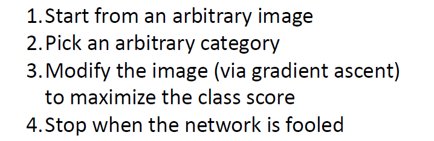

# Visual and Understanding

## Visualizing what models have learned

观察各网络层的权重或是输出是理解神经网络最直观的一种方式，我们可以从中窥见神经网络如何处理输入特征。

我们之前已经观察过了MLP第一层的权重，我们可以将其理解成“模板”：

### Visualizing  filters

而对于卷积神经网络我们同样可以观察第一层卷积层的权重：

我们注意到一件有趣的事情，无论是AlexNet还是ResNet等网络架构，其第一层卷积层的filter都十分类似，说明都学习到了类似的提取低层特征的能力，继续观察更深层网络的权重，其结果就相对较为抽象了：

### Visualizing final layer features

我们再看看神经网络最终提取到的特征，即输出层的输入是怎样的，对于AlexNet它是长为4096的向量，我们利用这些向量做KNN分类：

注意到和之前直接对图像使用KNN分类得到的结果不同，使用提取到的特征分类明显得到了更加准确的结果，尤其注意最后一行对狗的分类，其中狗的外貌以及所处的环境都十分不同，但是还是被正确分类了，说明通过CNN提取到的特征向量是比较相似的。

将特征向量使用t-SNE降维后可视化，发现各个类别都被较好地分开了：

> 更直观的结果可以看：http://cs.stanford.edu/people/karpathy/cnnembed/

### Visualizing activations

还可以通过观察激活函数的输出了解各网络层对输入图像的相应；

更直观地，选中某一层的特征图的某一通道，观察哪些与最大激活相关的图片patch：

## Understanding input pixels

### Identifying important pixels

可以通过遮挡图像区域观察对结果的变换以判断对应像素的“显著”程度：

### Saliency via backprop

但是上面的方法计算量太大了也不够直接，不如直接观察损失值对输入图像的梯度：

我们有时可以通过显著图发现分类器对图像的错误理解，比如下面的狼狗分类器看上去实际上只是学习到了如何分类有雪和没有雪的图片：

除了理解网络，我们还可以使用这样得到的saliency map帮助其他任务比如结合grabcut做分隔（当然我们这只是一种算saliency map）的方法：

### Guided backprop to generate images

当然还可以观察某一网络层输出对输入图像的梯度，这里有一个技巧，就是在反向传播的时候也过滤掉负梯度：

我的理解是只要能正向激活的（即梯度为正的），这样可以获得更清晰的可视化效果：

### Class Activation Mapping (CAM)

CAM其实就是将全局平均池化前的特征直接经过全连接层而不平均得到的张量：

CAM的不同通道对应着不同的类别：

不过这种方式只能对最后一层的输出特征图可视化，如果想要对中间层的输出做类似的事情可以求对应类别分数相对于中间层输出的梯度：

可视化效果相对于Guided Backprop会好一些：

不仅仅是分类问题，别的问题也可以用类似的方式进行可视化：

### Gradient ascent to visualize features

当然这种粗暴的方法生成的图像不是特别逼真，可以通过改进约束条件使其尽可能容易理解：

## Adversarial perturbations

很简单的方式就是对输入图像使用梯度下降更新，使得分类器分类错误：

> 可以将对抗样本用于扩充训练集，即所谓对抗训练：https://cloud.tencent.com/developer/article/1812038。

相比于上面简单的白盒攻击，其实黑盒攻击即寻找具有泛化能力的对抗攻击样本是更实用和有挑战性的方向：

## Style transfer

### Features inversion

就是把神经网络反着用来生成图像，当然要加一些约束项来提升生成图像的真实性：

显然越深的特征它就越难恢复：

### Deep dream

通过得到增强某一层神经网络提取到的特征就可以生成一些风格奇特的图像：

### Texture synthesis

对于比较简单的纹理使用传统方法其实就可以获得很好的效果：

可以用神经网络来做纹理合成，这里注意到越深的网络层获得的纹理对应的也是更high-level的语义：

### Neural style transfer

神经网络迁移实际上就是把一张图片的纹理特征融入到另一图片中：

Match features from content image and Gram matrices from style image：

当然上述结构只是实现风格迁移的一种方式，还有很多很多可以更快更好的实现风格迁移的方法。
